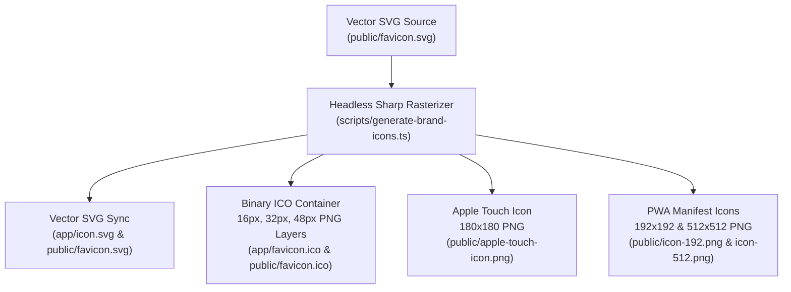
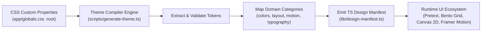

# Architecture

This document tracks the core, bleeding-edge technical decisions established during Phase 1 of the Portfolio Hub project.

## System Architecture & Directory Topology

The application structure maps App Router routes, Python backend core utilities, React UI components, developer experience utilities, and automation scripts:

```text
__tests__/                                 # Vitest unit/integration tests, Playwright E2E, & fuzzing
adr/                                       # Architectural Decision Records (ADRs)
app/                                       # Next.js 16 App Router routes, layouts & API endpoints
├── (routes)
│   ├── page.tsx                           # Portfolio Hub landing page & bento showcase
│   ├── layout.tsx                         # Global layout shell, Providers & Cmd+K palette portal
│   ├── arcade/                            # Interactive game cabinet sub-system
│   │   ├── clinical-chaos/page.tsx        # Clinical Trial Chaos simulation
│   │   ├── garmin-watch/page.tsx          # Garmin smartwatch telemetry engine
│   │   ├── laser-loon/page.tsx            # Arcade Laser Loon game route
│   │   ├── meme-vault/page.tsx            # Meme Vault interactive showcase
│   │   ├── quasi-puzzler/page.tsx         # Quasi-Perfect proof puzzler
│   │   ├── retro-labyrinth/page.tsx       # Retro Labyrinth game engine
│   │   └── working-with-duck/page.tsx     # Working With Duck simulation
│   ├── case-studies/                      # Dynamic editorial case studies
│   │   └── [slug]/page.tsx                # Case study narrative route
│   ├── crf/page.tsx                       # CRF Studio workspace route
│   ├── neuro/page.tsx                     # Neuroimaging 3D/slice viewer route
│   ├── proof/page.tsx                     # Formal proof AST workspace route
│   ├── schedule/page.tsx                  # Interactive calendar & schedule route
│   ├── simulator/page.tsx                 # Recruiter simulator route
│   ├── stack/page.tsx                     # System architecture & stack lab route
│   └── work/                              # Professional case study work routes
│       └── laser-loon/page.tsx            # Laser Loon work route & technical breakdown
├── api/                                   # Serverless API contracts & edge functions
│   ├── case-studies/route.ts              # Case study dynamic search & indexing endpoint
│   └── telemetry/route.ts                 # Anonymized sliding-window telemetry ingestion
└── core/                                  # Python Backend Core Engine & Utilities
    ├── analyzer_strategies.py             # Hybrid offline feature extraction & TF-IDF classification
    ├── crypto.py                          # Encrypted DB concurrency & SQLCipher security lifecycle
    └── resilient_file_ops.py              # Crash-resilient 2-phase file operations & rollback

components/                                # React UI Component Ecosystem
├── ui/                                    # Shared Micro-Interactions & Layout Primitives
│   ├── Breadcrumbs.tsx                    # Accessible navigation trail
│   ├── CaseStudyBentoCard.tsx             # Pretext-synchronized zero-reflow masonry bento card
│   ├── CopyButton.tsx                     # One-click clipboard utility trigger
│   ├── LayoutPrimitives.tsx               # Defensive container wrappers
│   ├── ModalContainer.tsx                 # Trapped-focus accessible modal frame
│   ├── NextPrevNav.tsx                    # Step navigation controls
│   ├── Tooltip.tsx                        # Floating contextual popover
│   ├── TracingBeam.tsx                    # Scroll-driven margin rail tracing physics
│   └── VirtualDPad.tsx                    # Mobile virtual controller interface
├── arcade/                                # Game canvas clients & cabinet wrappers
├── crf/                                   # CRF builder canvas, sidebars & export modals
├── neuro/                                 # 3D brain viewer, slice canvas & terminal
├── proof/                                 # Interactive truth tables & proof DAG canvas
├── providers/                             # React context providers (A11y, Audio, Persona, Search)
├── stack/                                 # Pretext benchmark lab & audio synth components
├── CaseStudyShowcase.tsx                  # Zero-whitespace bento grid scheduler container
├── CommandPalette.tsx                     # Cmd+K spotlight search palette portal
├── Navbar.tsx                             # Top navigation bar
└── Footer.tsx                             # Global footer & telemetry ticker

docs/                                      # Auto-generated TypeDoc markdown & technical specs
hooks/                                     # Custom React hooks (pretext, telemetry, sound, theme)
lib/                                       # Core TypeScript utilities, DX engine, & domain logic
portfolio/                                 # Extended project case studies & showcase content
prisma/                                    # Database schemas, migrations, & seed scripts
public/                                    # Static public assets, fonts, icons, & manifests
scripts/                                   # DX CLI tools, release gates, & benchmark scripts
types/                                     # Shared TypeScript interfaces & ambient declarations
```

## Next.js 16 & Turbopack

This application is built on **Next.js 16** using the **App Router** paradigm to leverage React Server Components for maximum performance and efficient data fetching.

We explicitly utilize **Turbopack** as the default bundler (`next dev --turbo`). Turbopack is now stable in Next.js 16, and provides significantly faster production builds and 5-10x faster Fast Refresh times during development compared to legacy Webpack configurations.

## Tailwind CSS v4 Configuration

This project implements the newest styling engine: **Tailwind CSS v4**.

Tailwind CSS v4 introduces a radical, **CSS-first configuration model**. As such:
- There is **no** `tailwind.config.js` or `tailwind.config.ts` file in this repository.
- All Tailwind utilities are loaded via the `@import "tailwindcss";` directive located at the top of `app/globals.css`.
- Any custom design tokens, colors, and typography (such as the Inter font) are managed natively via the new `@theme` and `@theme inline` CSS rules directly in `app/globals.css`.

## Asset Build Scripts & Design Token Compiler Pipeline

To eliminate hidden asset dependencies and provide zero-friction developer onboarding, asset generation and theme compilation workflows are exposed via standardized CLI commands.

### 1. Brand Icon Rasterization Pipeline

- **CLI Command:** `npm run build:icons` (or `npm run generate:icons` / `npx tsx scripts/dx.ts build:icons`)
- **Script Target:** `scripts/generate-brand-icons.ts`
- **Source Input Location:** Vector SVG artwork at `public/favicon.svg` (or `app/icon.svg`).
- **Build Pipeline & Output Asset Targets:**
  - **SVG Synchronization:** Reads source vector definitions and synchronizes `app/icon.svg` and `public/favicon.svg`.
  - **Multi-Resolution ICO Container:** Utilizes `sharp` to rasterize the source vector into 16x16, 32x32, and 48x48 PNG buffers, then constructs a valid binary Windows ICO file container stored at `app/favicon.ico` and `public/favicon.ico`.
  - **High-DPI iOS Touch Icon:** Rasterizes 180x180 PNG output targeting `public/apple-touch-icon.png`.
  - **PWA Web App Manifest Icons:** Rasterizes 192x192 and 512x512 PNG outputs targeting `public/icon-192.png` and `public/icon-512.png`.



### 2. Design Token Compiler Pipeline

- **CLI Command:** `npm run build:theme` (or `npm run generate:theme` / `npx tsx scripts/dx.ts build:theme`)
- **Script Target:** `scripts/generate-theme.ts` (executed automatically during `predev`, `prebuild`, `pretest`, and `dx clean`)
- **Source Input Location:** CSS custom properties declared within the `:root` block of `app/globals.css`.
- **Compiler Pipeline Stages:**
  - **AST / Regex Extraction:** Reads `app/globals.css` and isolates all `--var-name: value;` custom properties declared inside the `:root` selector.
  - **Domain Token Normalization:** Maps raw CSS strings into distinct domain categories:
    - `colors`: Palette colors (`background`, `foreground`, `surface-1`, `surface-2`, `border`, `brand-cyan`, `brand-blue`, `success`, `error`, `warning`).
    - `typography`: Font stack constants (`sans`, `mono`) and text metric objects (`font-size-sm`, `line-height-sm`).
    - `masonry`: LPT column scheduler thresholds (`layout-masonry-*`).
    - `layout`: Spatial and component dimensions (`layout-*`).
    - `breakpoints`: Viewport media query thresholds (`breakpoint-*`).
    - `motion`: Framer Motion spring physics configurations (`motion-spring-*-stiffness`, `motion-spring-*-damping`).
  - **Type Coercion & Validation:** Parses numeric string values into native JavaScript numbers, throwing actionable error diagnostics if malformed tokens are detected.
  - **TypeScript Manifest Emission:** Generates an immutable, auto-documented TypeScript module declaring `export const designManifest = { ... } as const;` and writes it directly to `lib/design-manifest.ts`.
- **Runtime Manifest Consumption:** `lib/design-manifest.ts` is imported across application components, Framer Motion animations, `@chenglou/pretext` text layout calculators, and Bento Grid schedulers, providing 100% type safety and eliminating runtime CSS custom property reads.



## Visual & Component Strategy

### "Copy-and-Paste" Component Model
For our visual micro-interactions and macro-layouts, we utilize a "copy-and-paste" component model sourced from [Aceternity UI](https://ui.aceternity.com/) and [Magic UI](https://magicui.design/). Rather than relying on heavy, monolithic npm packages, this approach allows us to own the source code for complex Framer Motion physics and Tailwind styling directly within our repository.

### Shared Utilities
The visual ecosystem relies on a shared `cn()` utility function located in `lib/utils.ts`. This function merges `clsx` and `tailwind-merge` to safely construct dynamic class strings and properly resolve conflicts within our Tailwind CSS v4 setup.

### Layout Engine Integration

Crucially, our visual components must interface with our advanced layout physics. Rather than relying on rigid row configurations in a standard CSS Grid, our **Zero-Whitespace Masonry Bento Grid (Issue #24)** completely decouples the grid's visual assembly from standard browser flow:
1. **Parent-Level Sizing calculations:** The parent component `CaseStudyShowcase` intercepts layout container updates using a single `ResizeObserver`.
2. **Dynamic Breakpoints:** Based on container bounds, it determines the active column count (3 columns on desktop, 2 on tablet, 1 on mobile) and computes the exact pixel column width.
3. **Pretext Height Predictions:** It loops over all active case study descriptions, querying Pretext for their exact text heights given the active width (subtracting card padding), and aggregates them with dynamic sub-component paddings to determine precise card heights.
4. **Greedy Column Scheduler:** Using an optimization schedule (greedy LPT-inspired scheduler), it routes each card into the vertical column that currently has the shortest accumulated height. 
5. **Zero-Reflow Assembly:** Columns are rendered as separate, self-contained flexbox columns (`flex flex-col gap-4`), ensuring mathematically perfect vertical layouts with absolutely zero vertical gaps, and allowing Framer Motion's `layout` mechanics to handle column-swapping transitions smoothly at 60FPS.

## Core Layout Engine: `@chenglou/pretext`

To achieve fluid, 60FPS animations and circumvent performance bottlenecks inherent in modern web browsers, this project utilizes custom React hooks powered by the `@chenglou/pretext` library.

### The Layout Thrashing Problem
Historically, using standard DOM measurements like `getBoundingClientRect` or `offsetHeight` forces the browser to synchronously recalculate the entire page geometry (a reflow). This layout thrashing can incur severe 30+ millisecond penalties. We utilize `pretext` to completely side-step this expensive operation for text-dense components by executing multiline text measurement entirely in userland JavaScript/TypeScript.

### The Two-Phase Architecture
Our layout hooks strictly enforce a two-phase layout mechanism to eliminate DOM reflows:
- **Phase 1 (Initialization):** The preparation function (`prepare` for raw text, `prepareRichInline` for styled segments) is invoked once to normalize whitespace, apply segmentation rules, and measure individual word widths using the native Canvas engine. These results are cached efficiently in memory.
- **Phase 2 (Execution):** The layout calculations represent the hot path. We hook this execution to a `ResizeObserver`. Whenever the container resizes, the hooks run pure arithmetic over the cached widths, recalculating the layout in under a millisecond without ever touching the DOM or allocating new memory.

### Rich Text & Monospace Code Chips (Issue #45)
To support dynamic typography in case study descriptions, we pioneeringly integrated the `@chenglou/pretext/rich-inline` sub-package:
1. **Markdown Tokenization:** The `parseMarkdownToRichItems` utility splits descriptions on formatting boundaries, capturing bold (`**`), italic (`*`), and code tags (`` ` ``).
2. **Inline Code Padding Calculations:** Inline code chunks are designated as atomic nodes (`break: 'never'`) and mapped to a monospace font. We allocate a deterministic `extraWidth: 12` horizontal padding variable to guarantee that the canvas engine precisely measures the width of our visually styled cyan code badges.
3. **Fragment Materialization:** Once lines are computed, the custom `PretextRichText` component maps each fragment back to its original source element by its `itemIndex` ref, rendering beautifully styled React elements (such as neon-tinted border chips and high-contrast bold texts) with mathematically perfect heights.

### Tailwind v4 Font Synchronization
To guarantee that the Canvas measurements perfectly align with the UI, we dynamically synchronize the Canvas API with our CSS-first Tailwind configuration. During Phase 1, the hooks extract the exact resolved font family string from the DOM root via:
`window.getComputedStyle(document.documentElement).getPropertyValue('--font-inter')`
This dynamically resolved string is passed directly into Pretext, ensuring mathematically perfect parity between the layout engine and Tailwind CSS v4 styling.

### SSR Safety Protocol

Because the native Canvas `measureText` API is strictly a browser-only feature, our layout engine implements a rigid Server-Side Rendering (SSR) safety boundary:
1. The Next.js `"use client"` directive is applied to `usePretextLayout.tsx` to prevent server-side execution.
2. During the initial Next.js SSR pass, the hooks bypass measurement and default to an `isReady: false` state with standard fallback heights.
3. Only after the component has safely mounted on the client (via `useLayoutEffect`), the component invokes the Canvas logic and updates the state to `isReady: true`. This prevents hydration mismatches and server crashes.

## Resilient GitHub Integration & Caching Layer (`lib/github.ts`)

To ensure rapid initial page loading and prevent hitting GitHub's strict rate limits (60 requests/hour for unauthenticated clients), we decoupled data collection into a dedicated, hardened API abstraction layer.

### Hybrid Caching Topology
1. **Server Contexts (Next.js App Router):** Calls to `getGitHubStats` utilize Next.js `unstable_cache` with a `revalidate` window of 3600 seconds (1 hour) tagged under `"github"`.
2. **Standalone / CLI Contexts (Seeding Pipeline & Builds):** When executed outside the active Next.js runtime environment (which lacks the full incremental cache layer), `unstable_cache` throws an `Invariant: incrementalCache missing` exception. The API client catches this error gracefully and automatically falls back to raw HTTP requests via `fetchRawGitHubStats`.

### Telemetry Hardening & Dev Diagnostics
- **Authenticated Fallback:** Inspects `process.env.GITHUB_TOKEN` to append authorized headers.
- **Fail-Safe Warnings:** Produces non-blocking terminal warnings in `development` environments if no token is detected, preparing developers for potential unauthenticated rate limiting.
- **Payload Sanitization:** Safely parses dynamic fields, maps commit strings (parsing only the first line of headers), handles index safety bounds, and formats language distribution bytes into precise, rounded percentages.

## Interactive CLI Terminal Sandbox Engine (`components/SandboxTerminal.tsx`)

For the Python SDK detail views, we built a fully functional interactive terminal CLI sandbox simulation. It is engineered with premium aesthetics and state-of-the-art interactive micro-interactions:

### 1. Pure React State Purity Compliance
Next.js 16/React 19 strict compiler pipelines enforce pure rendering rules. Traditional token generation (e.g. `Math.random()`) inside rendering functions results in hydration warnings. The Sandbox Terminal implements a pure static sequential ID counter (`idCounter` and `generateLogId()`) outside the component body, ensuring perfect render determinism.

### 2. Full Console Ergonomics
- **Curated Shortcuts:** Clickable quick-command badges instantly execute primary trials operations.
- **Command History Buffer:** Keeps an active array of typed queries, fully navigable using `ArrowUp` and `ArrowDown` keys.
- **Tab Auto-Completion:** Leverages custom key listeners (`e.preventDefault()`) to capture `Tab` triggers, matching inputs to registered SDK operations instantly.
- **Regex JSON Syntactic Highlighting:** Splits JSON outputs by line and matches tokens using strict regular expressions to style keys (`purple-400`), string values (`emerald-400`), booleans (`amber-500`), nulls (`red-400`), and numeric variables (`blue-400`) uniquely.

## Scroll-Driven Tracing Beam Physics (`components/ui/TracingBeam.tsx`)

To guide readers down deep-dive technical narratives, we engineered a custom Tracing Beam margin rail:
- **Scroll Hook Synchronization:** Hooks into Framer Motion `useScroll` tracking container viewport offsets (`scrollYProgress`).
- **Spring Smoothing:** Applies Framer Motion `useSpring` physics (stiffness `80`, damping `22`) to smooth scroll jitters and deliver a high-premium, elegant trailing line.
- **Pulsating Focus Head:** Positioned at the dynamic terminus of the visual line, utilizing localized CSS `@keyframes ping` animations to draw user focus.
- **Desktop Margin Shift:** Seamlessly shifts content container margins (`md:pl-8 lg:pl-12`) on larger viewports to accommodate the vertical rail without layout shifts.

## Serverless PostgreSQL & Connection Adapter Architecture (`lib/db.ts`)

To support serverless operational profiles, we transitioned the database core from a local SQLite setup to Neon serverless PostgreSQL.

### 1. WebSocket Pooling
Because serverless functions terminate database connections rapidly, standard TCP socket wrappers cause overhead. We configured Neon to use the native `ws` (WebSockets) package inside Node.js environments (`neonConfig.webSocketConstructor = ws`), enabling extremely low-latency pooling.

### 2. Dynamic Prisma Client Pooling
To prevent connection leaks across Next.js Hot Module Replacement (HMR) refreshes during development, the client caches the active connection inside a global object (`globalThis.prisma`). It instantiates a fresh connection pool only when the global instance is undefined.

## Interactive Case Study Feedback & Reaction Subsystem

To capture reader engagement and quantitative feedback on published technical post-mortems, the portfolio integrates an interactive feedback and quick reaction subsystem backed by Prisma PostgreSQL models and declarative Zod validation handlers.

### 1. Database Data Models & Relations

The interaction subsystem is structured around two dedicated Prisma models:

- **`CaseStudyFeedback` Model:**
  - `id`: Unique string primary key (`cuid`).
  - `caseStudySlug`: String slug linking feedback to the target case study.
  - `takeaways`: String storing a JSON-serialized array of key takeaway selections (e.g., `["architectural_narrative", "telemetry"]`).
  - `comments`: Free-form constructive user text feedback (3–2000 characters).
  - `connectionHash`: SHA-256 hash derived from the client's connection context (`IP:User-Agent`).
  - `createdAt`: Timestamp defaults to current date/time.
  - Indexes: Single-field indexes on `caseStudySlug` and `connectionHash`.

- **`CaseStudyReaction` Model:**
  - `id`: Unique string primary key (`cuid`).
  - `caseStudySlug`: String slug linking reaction to the target case study.
  - `reactionType`: String enum token (`"insightful"`, `"mind_blowing"`, `"actionable"`, or `"thorough"`).
  - `connectionHash`: SHA-256 hash derived from the client's connection context (`IP:User-Agent`).
  - `createdAt`: Timestamp defaults to current date/time.
  - Indexes: Single-field index on `caseStudySlug`, compound index on `[caseStudySlug, reactionType]`, and single-field index on `connectionHash`.

- **Relationship to Core `CaseStudy` Content:**
  - Feedback and reaction records maintain a decoupled slug-based relation (`caseStudySlug` matching `CaseStudy.slug`), eliminating foreign key constraints for fast serverless execution.

- **Privacy-Preserving Connection Hashing:**
  - Client identifiers (`connectionHash`) are generated using SHA-256 hashing (`crypto`) over normalized `ip:userAgent` strings.
  - Guarantees zero plain-text storage or logging of IP addresses or personal identifiable information (PII).

### 2. Feedback & Reaction API Endpoint Specification

#### `/api/case-studies/feedback` Route Handler

- **`GET /api/case-studies/feedback`**
  - **Query Parameters:** `slug` or `caseStudySlug` (string, required).
  - **Behavior:** Queries the 20 most recent feedback entries for the specified case study slug and determines whether the active client has already submitted feedback using `connectionHash`.
  - **Response Payload (200 OK):**
    ```json
    {
      "success": true,
      "caseStudySlug": "clinical-data-mapper",
      "hasSubmitted": false,
      "totalFeedback": 12,
      "feedback": [
        {
          "id": "clx...",
          "takeaways": ["architectural_narrative", "telemetry"],
          "comments": "Exceptional post-mortem detailing serverless migration.",
          "createdAt": "2026-08-18T10:00:00.000Z"
        }
      ]
    }
    ```
  - **Error Responses:** 400 Bad Request if `slug` query parameter is missing; 500 Internal Server Error.

- **`POST /api/case-studies/feedback`**
  - **Request Body Payload:**
    ```json
    {
      "caseStudySlug": "clinical-data-mapper",
      "takeaways": ["architectural_narrative"],
      "comments": "Comprehensive breakdown of serverless architecture."
    }
    ```
  - **Validation (`FeedbackSubmissionSchema`):** Validates `caseStudySlug` (non-empty string), `takeaways` (string array, min 1 item), and `comments` (string, min 3, max 2000 chars).
  - **Rate-Limiting & Duplicate Submission Protection:** Checks whether the same `connectionHash` has submitted feedback for the target `caseStudySlug` within a 1-hour sliding window. If found, returns HTTP 429 Too Many Requests (`{ "error": "Feedback already submitted for this case study. Please try again later." }`).
  - **Response Payload (201 Created):**
    ```json
    {
      "success": true,
      "message": "Feedback submitted successfully",
      "feedback": {
        "id": "clx...",
        "caseStudySlug": "clinical-data-mapper",
        "takeaways": ["architectural_narrative"],
        "comments": "Comprehensive breakdown of serverless architecture.",
        "createdAt": "2026-08-18T11:00:00.000Z"
      }
    }
    ```
  - **Error Responses:** 400 Bad Request (validation failure), 429 Too Many Requests (duplicate submission rate limit), 500 Internal Server Error.

#### `/api/case-studies/reactions` Route Handler

- **`GET /api/case-studies/reactions`**
  - **Query Parameters:** `slug` or `caseStudySlug` (string, required).
  - **Behavior:** Executes Prisma `groupBy` query on `reactionType` to aggregate reaction counts (`insightful`, `mind_blowing`, `actionable`, `thorough`) for the target case study slug, and fetches all reaction types registered by the active client `connectionHash`.
  - **Response Payload (200 OK):**
    ```json
    {
      "success": true,
      "caseStudySlug": "clinical-data-mapper",
      "counts": {
        "insightful": 14,
        "mind_blowing": 8,
        "actionable": 5,
        "thorough": 11
      },
      "userReactions": ["insightful", "thorough"]
    }
    ```
  - **Error Responses:** 400 Bad Request if `slug` parameter is missing; 500 Internal Server Error.

- **`POST /api/case-studies/reactions`**
  - **Request Body Payload:**
    ```json
    {
      "caseStudySlug": "clinical-data-mapper",
      "reactionType": "insightful"
    }
    ```
  - **Validation (`ReactionSubmissionSchema`):** Validates `caseStudySlug` (non-empty string) and `reactionType` (`enum`: `"insightful"`, `"mind_blowing"`, `"actionable"`, `"thorough"`).
  - **Idempotent Reaction Registration:** Idempotently inserts reaction record if no existing entry matches `caseStudySlug`, `reactionType`, and `connectionHash`, then returns updated aggregate counts.
  - **Response Payload (200 OK):**
    ```json
    {
      "success": true,
      "reactionType": "insightful",
      "counts": {
        "insightful": 15,
        "mind_blowing": 8,
        "actionable": 5,
        "thorough": 11
      },
      "userReactions": ["insightful", "thorough"]
    }
    ```
  - **Error Responses:** 400 Bad Request (validation error), 500 Internal Server Error.

## Safe Rich-Text Rendering Pipeline (Issue #35)

To prevent Stored Cross-Site Scripting (XSS) attacks when rendering complex HTML strings stored in the database's `architectural_narrative` field, we implement a secure HTML sanitization strategy (Option A):
- **isomorphic-dompurify:** We selected `isomorphic-dompurify` because it seamlessly resolves to standard `dompurify` in browser environments and transparently handles JSDOM simulation in Server-Side Rendering (SSR) / React Server Components (RSC).
- **Strict Security Allowlist:** Sanitization is handled by the dedicated `<RichNarrative className="..." html="..." />` component, which forces an audited allowlist:
  - Allowed Tags: `h2`, `h3`, `h4`, `p`, `code`, `pre`, `strong`, `em`, `a`, `ul`, `ol`, `li`
  - Allowed Attributes: `href`, `target`, `rel`, `class`
- **Hydration & Parsing Safety:** Strips malicious nodes (such as `<script>`, `<iframe/>`, or event triggers like ``) server-side to guarantee that browser parser states hydrations are safe and match server outputs identically.

## SEO, Open Graph & Crawling Optimization (Issue #36)

To optimize discovering technical showcase materials for recruiters and crawler bots, we integrate Next.js 16 native metadata features:
- **Canonical Alternates:** Automatically generates unique dynamic `<link rel="canonical">` elements on per-page view states using Next.js Metadata API.
- **Dynamic Case Study Serialization:** Implements custom `generateMetadata()` on `/case-studies/[slug]` routes to dynamically extract and construct SEO/Open Graph descriptions, article tags, and published timelines directly from Prisma database schemas.
- **Sitemap & Robots Automation:**
  - `app/sitemap.ts` programmatically compiles primary routes (`/arcade/*`, `/proof`, `/simulator`, `/schedule`) and Neon DB published case study slugs into a standards-compliant XML sitemap.
  - `app/robots.ts` restricts crawlers from access logs and internal compilation maps while routing standard bots directly to our primary indexing endpoints.

## Staggered Bento Skills & Scroll-Driven Career Timeline (Issue #37)

To deliver a premium, high-fidelity landing page showcase, we integrated dynamic telemetry metrics with fluid scroll animations:
- **Option B (In-Page Anchor Composition):** We chose Option B to maintain full compatibility with the existing navbar intersection observer and scroll-spy structure. This avoids separate page transitions, ensuring 60FPS seamless scroll navigations across `#case-studies`, `#about`, and `#contact`.
- **Dynamic Telemetry Language Aggregator:** In `app/page.tsx`, we dynamically combine individual repository languages fetched from the serverless Neon database/GitHub cache pipeline. Normalizing these values server-side generates a telemetry skills chip array without incurring rendering overhead.
- **Bento Skills Matrix:** Implements `<SkillsGrid />` using CSS Flex layout containing customized initials SVG badges and dynamic glowing progress meters mapped to current language metrics.
- **Scroll-Triggered Career Timeline:** We developed `<Timeline />` as a client-side component using Framer Motion. Timeline cards fade in and slide up using custom spring physics (`stiffness: 60, duration: 0.8`), aligned on a vertical gradient rail.
- **Accessible Contact Anchors:** Contact buttons are wrapped in semantic `<a>` tags featuring accessible descriptions (`aria-label`) and robust keyboard outline targets to guarantee a WCAG 2.1 AA compliant composition.

## Dynamic Open Graph Image & JSON-LD Structured Data (Issue #28)

To support rich social card visual motifs and compliant structural metadata representations for AI/search parsers, we implement dynamic image calculations and strict schema bindings:
- **Dynamic ImageResponse Routes:** Rather than statically exporting templates, we place `opengraph-image.tsx` inside `/case-studies/[slug]/`. It leverages the Next.js `ImageResponse` canvas compilation API running on a standard NodeJS runtime to guarantee pooled, safe connection fetches from serverless Neon PostgreSQL instances.
- **Visual Motif Design:** Programmatically compiles dynamic titles, primary languages, and category tag chips on a deep charcoal card featuring glowing radial ambient overlays in brand-cyan (`rgba(6, 182, 212, 0.08)`) and high-tech blue (`rgba(59, 130, 246, 0.05)`).
- **JSON-LD Schema Utility Layer (`lib/seo.ts`):** Establishes type-safe constructors for Schema.org formats:
  - **getPersonSchema:** Serializes professional developer profiles loaded site-wide in `app/layout.tsx`.
  - **getSoftwareSourceCodeSchema:** Serializes dynamic case study items in `app/case-studies/[slug]/page.tsx`, directly incorporating cached stars and forks telemetry fetched from the GitHub client.
- **XSS Sanitization Compliance:** Prevents stored script vectors from escaping structured data by programmatically replacing `<` bracket tags with unicode escapes (`\u003c`) inside the JSON-LD serialization pipeline.

## Dynamic Bezier Commit Sparkline Visualizations (Issue #44)

To visually showcase developmental pace metrics on dynamic case study cards, we engineered dynamic inline SVG sparkline timelines:
- **Cached Weekly Activity Fetching:** We extended the decoupled `lib/github.ts` API client to fetch weekly commit counts directly from GitHub's `/stats/commit_activity` endpoint. These metrics are stored in the cached `GitHubStats` payload, returning a 52-week activity integer array refreshed every 3600 seconds.
- **Resilient Fallback Generation:** To protect development environments and offline builds against API rate limit blocks, the client auto-generates a mock 52-week activity sine-wave pattern (`5 + sin(x/3) * 4`) mimicking active repo commit patterns.
- **Cubic Bezier Path Mapping:** The `<CommitSparkline />` component maps the 52-week dataset into a dynamic coordinate grid bounded inside `(0, 0)` and `(300, 60)`. It connects the points using mathematically smooth SVG cubic bezier commands (`C cp1X cp1Y, cp2X cp2Y, targetX targetY`), yielding zero jagged edges.
- **High-Tech Aesthetic HUD Graping:** The SVG path is styled with glowing linear gradients sweeping from cyan (`#06b6d4`) to blue (`#3b82f6`), coupled with stdDeviation blur filters and a fading, semi-transparent backdrop area fill.
- **Zero-Reflow Layout Constraints:** Swapping the bulky badges row for sparkline timelines increases bento grid paddings by `70px`. To ensure absolutely zero visual layout shifts (CLS) during client-side hydration, we synchronized the Pretext predicted layout limits from `390px` to `460px` across both `CaseStudyShowcase.tsx` and `components/ui/CaseStudyBentoCard.tsx`.

## Spotlight Cmd+K Command Palette Navigation Shell (Issue #43)

To deliver a premium, centralized navigation HUD accessible from any section of the portfolio, we engineered a unified command palette interface:
- **Dynamic Case Study Indexing API Route (`/api/case-studies`):** Queries Prisma database records serverless pools using a force-dynamic fetch handler. Selects and returns lightweight search tokens (`id`, `slug`, `title`, `primary_language`, `tags`) to keep initial connection payloads highly optimized.
- **Lazy-Loaded Dynamic Import (`ssr: false`):** To preserve strict compile-time server component purity and bypass hydration failures, the `<CommandPalette />` container is loaded dynamically inside the `app/layout.tsx` layout shell using Next.js `dynamic()` with server-side rendering disabled.
- **React Portals & Body Mounting:** Teleports the active React DOM nodes directly to the root layout's `document.body` layer using `createPortal`, isolating key events, animations, and stacking contexts from standard container bounds.
- **Rigorous Keyboard Listeners & Fuzzy Search:** 
  - Listens globally for trigger shortcuts (`Cmd+K` on macOS, `Ctrl+K` on Windows/Linux).
  - Integrates arrow keys (`ArrowUp`/`ArrowDown`) with modulo index wrapping to navigate search outcomes seamlessly.
  - Implements rapid, client-side fuzzy keyword matching against static navbar anchor channels, the UI developer sandbox, and dynamically loaded case studies.
- **Focus Trap, Scroll Locking, & State Restore:**
  - Automatically captures the pre-existing DOM active element upon opening the overlay (`originalFocusRef.current = document.activeElement`).
  - Imposes absolute focus traps inside the palette query input field using dynamic client timeouts.
  - Restricts parent viewport body scrollbars from reflowing by applying `document.body.style.overflow = "hidden"` while the dialog is active.
  - Returns browser focus perfectly back to the original triggering interactive element when closed via the backdrop click, selection confirm, or `Escape` key.
- **Screen Reader ARIA Accessibility:** Implements strict WCAG-compliant attributes (`role="combobox"`, `aria-autocomplete="list"`, `aria-controls="palette-results-list"`, `aria-expanded`, and descriptive `aria-label` tags) ensuring command inputs are accessible to assistive technologies.

## Serverless Telemetry Pipeline & Optimistic SWR Hook (Issue #46)

To capture and display user engagement metrics in real-time without introducing main-thread latency or degrading SEO crawler indexing speeds, we implemented an optimized telemetry pipeline:
- **Append-Only Schema Partitioning (`TelemetryEvent`):** Addressed transactional analytics overhead by storing events in a partitioned, append-only `TelemetryEvent` model indexed on `projectSlug` and `eventType`. This isolates metrics from case study core contents, allowing swift Neon Postgres DB writes.
- **Serverless Edge-Cached API Route (`/api/telemetry`):**
  - **GET**: Computes high-performance aggregate database counts (`groupBy` grouping views and clicks) on demand. The response payload is wrapped in edge-level cache headers (`Cache-Control: public, max-age=10, s-maxage=60, stale-while-revalidate=600`) to let CDNs cache aggregated counts and bypass database requests.
  - **POST**: Commits dynamic transactional views (`page_view`) and clicks (`project_click`) into serverless pools.
- **Anonymized IP Sliding-Window Rate Limiter:** To safeguard the Neon database from spam and DoS attempts without harvesting PII, the API route processes client IPs, hashes them instantly using a native SHA-256 digest wrapper (`crypto`), and checks request timestamps against a sliding 60-second limit (max 100 req/min).
- **Instant Stale-While-Revalidate (SWR) Client Sync:**
  - The client `useTelemetry()` hook extracts stats from `localStorage` immediately upon DOM initialization, ensuring the Bento grid mounts instantly with **zero Cumulative Layout Shift (CLS)**.
  - Launches a non-blocking background SWR fetch to synchronize metrics with live datastores.
  - Features an **Optimistic UI state mutator**: increments local counters instantly on clicks and views before waiting for the network API to resolve.
- **Resilient Offline HUD Sync Warning:** If background updates are blocked by network drops, the SWR cache silently maintains local variables. To inform developers/users of cached-only states without interrupting layout integrity, the UI renders a small, pulsing orange warning indicator next to active view totals.
- **Isolated Client-Side Tracker Boundary (`TelemetryTracker`):** Embedded `<TelemetryTracker slug={slug} />` inside Server dynamic pages. It manages client-side mount hooks (`useEffect` with React strict-mode double-run prevention refs) to trigger dynamic `page_view` records without making the parent route a Client Component.
- **Zero-Reflow predicted height boundaries:** Adjusted masonry grid Pretext column precalculation paddings from `460` and `170` to `484` and `194` across both `CaseStudyShowcase.tsx` and `components/ui/CaseStudyBentoCard.tsx`. This perfectly maps layout spacing constraints on both server pre-renders and dynamic client loads.

## Backend Core Package Utilities (app/core/)

The Python backend core package utilities power air-gapped document ingestion, encrypted storage, and forensic data classification:

- **`app/core/crypto.py` (Encrypted Database Concurrency & Lifecycle):**
  - Manages SQLCipher database encryption keys, concurrent session pooling, and cryptographically secure key derivation routines.
  - Ensures zero-plaintext persistence for sensitive clinical trial registries and audit records across thread boundaries.
- **`app/core/resilient_file_ops.py` (Crash-Resilient Two-Phase Operations):**
  - Implements atomic staging, SHA-256 pre/post relocation verification, and shadow copy generation.
  - Automatically triggers rollback recovery if disk writes fail or hash mismatches occur during file movements.
- **`app/core/analyzer_strategies.py` (Hybrid Offline Feature Extraction):**
  - Combines sparse TF-IDF keyword scoring with dense ONNX embeddings for document taxonomy categorization.
  - Evaluates clinical domain rules and compliance policies with deterministic confidence scoring without external cloud dependencies.

## Automated Specification & API Synchronization Engine

To guarantee that technical specifications, API documentation, and internal architectural guidelines evolve in lockstep with codebase mutations without developer friction, we implemented a zero-drift synchronization architecture:

- **Schema-Driven API Contracts (`lib/schemas.ts` & `openapi.json`):**
  - All API routes (`/api/telemetry`, `/api/telemetry/sync`, `/api/case-studies`) define declarative Zod contracts.
  - The OpenAPI generator (`scripts/generate-openapi.ts`) compiles these schemas into OpenAPI 3.0 specifications.
  - Automated route discovery enforces 100% route coverage, failing verification if any handler in `app/api/**/route.ts` lacks specification coverage.
- **TypeDoc Markdown Parity & API Documentation Compilation (`docs/`):**
  - Public hooks, types, and library symbols automatically compile to Markdown documentation via the explicit CLI command `npm run compile-docs`.
- **Local Documentation Drift Verification (`scripts/check-drift.ts`):**
  - Contributors run `npm run check-docs-drift` prior to committing to detect uncommitted documentation mutations or undocumented API routes.
  - `scripts/check-drift.ts` verifies zero uncommitted modifications and zero untracked documentation files.
- **DX Doctor Invariant Verification & One-Command Auto-Remediation:**
  - `npm run dx doctor` and `npm run verify` check documentation and API parity alongside 9 core architectural invariants.
  - Running `npm run doctor:fix` automatically synchronizes `openapi.json` and recompiles TypeDoc markdown files.
- **Strict Hygiene Boundaries:**
  - Brainstorming notes, intermediate agent traces, and temporary scratchpad directories (`.agents/`, `scratch/`, `tmp/`) are excluded from markdown linting and repository tracking to preserve documentation integrity.

## Defect Remediation & Root-Cause Quality Architecture

To maintain high stability across complex domain simulation and calculation engines, the repository implements a proactive defect eradication framework:

- **Multi-Layer Defect Detection Pipeline:**
  - **Static AST & Computational Guards:** Scans AST parsers and mathematical engines for unguarded division-by-zero, cyclic graph traversals, and unchecked recursion limits.
  - **Runtime Observability & Path Sanitization:** Sentry error hooks and `lib/error-sanitization.ts` intercept production exceptions while scrubbing absolute filesystem paths and stack traces.
  - **Targeted Property & Boundary Fuzzing:** Automated regression harnesses assert state machine determinism and numerical stability across edge-case parameter combinations.
- **Legacy Computational Engine Hardening:**
  - **Proof AST Solver (`lib/proof-utils.ts`):** Enforces cycle-safe evaluation and max-depth guards on propositional ASTs to prevent stack overflow on deeply nested formulas.
  - **CRF Clinical Evaluator (`lib/crf/ast-evaluator.ts`):** Guarantees zero-divisor protection and safe token evaluation for anthropometric and oncology clinical formulas.
  - **Garmin Telemetry Engine (`lib/garmin-engine.ts`):** Defends against zero-duration pace divisions, negative heap allocation readings, and thermal boundary overruns.
  - **Deterministic Duck State Machine (`lib/working-with-duck-engine.ts`):** Guards out-of-bounds drag coordinates, eliminates illegal concurrent states, and isolates item hazard interactions.
- **Strict Red-Green Remediation Protocol:**
  - Every reported defect requires an isolated reproduction test in `__tests__/` written before patching.
  - Fixes must eradicate the root architectural flaw rather than masking symptoms.
  - Continuous CI verification via `__tests__/defect-remediation-regression.test.ts` guarantees zero regression drift.

## Responsive Layout Integrity, Stacking Isolation & Defensive CSS Architecture

To eliminate visual clipping, text overlapping, and unmanaged z-index escalation across variable screen sizes (320px mobile to 4K desktop) and dynamic localized content (+40% text expansion), the codebase adheres to a strict defensive CSS architecture:

- **Semantic `<PageLayout />` Sizing Standard:**
  - Standardizes all routes on `min-h-dvh` (Dynamic Viewport Height) and `overflow-x-hidden`.
  - Preserves single global `<main id="main-content">` landmark in `app/layout.tsx` for full WCAG AA accessibility compliance without duplicate nested landmarks.
  - Enforces intrinsic flexible container bounds (`min-h-*`, `h-auto`) rather than rigid fixed heights (`h-48`, `h-64`) to accommodate dynamic text wrapping.
- **Flexbox/Grid Defensive Neutralization (`min-w-0` / `min-h-0`):**
  - Overrides CSS `min-width: auto` on flex and grid children hosting text or truncation badges to prevent layout blowouts and neighbor squishing.
  - Enforces `break-words` on prose/headings and `text-token-break` (`overflow-wrap: anywhere; word-break: break-word;`) on long URLs/hashes.
- **Stacking Context Isolation & Standardized Elevation Scale:**
  - Applies CSS `isolation: isolate` (`.section-isolate`) to multi-layered composite sections, preventing internal z-indexes from bleeding into sibling components.
  - Replaces arbitrary `z-[9999]` inflations with a bounded 4-tier elevation scale (`-z-10` background, `z-10` content, `z-40` fixed nav, `z-50` dialogs/modals).
- **Component Independence via Container Queries (`@container`):**
  - Card modules (`BentoGrid`, `PretextCard`, `ProjectTeaserGrid`, `CaseStudyShowcase`) declare `@container` contexts, allowing internal typography, padding, and flex flows to adapt relative to parent column width.
- **Dynamic Content & Zoom Stress Invariant:**
  - Verified via `__tests__/defensive-css-stress.test.tsx` simulating +40% elongated strings, 100-character unbroken tokens, and 200% font scaling.

### Four-Layer Production Layout Validation Protocol

To guarantee that layouts remain resilient across all devices, viewports, and edge-case copy, the portfolio enforces a 4-layer validation strategy:

1. **The DevTools "Stress-Test" Routine:**
   - **The 320px Squeeze:** Viewport dragged down to 320px (iPhone SE standard minimum). Asserts zero text clipping and zero horizontal page scrolling.
   - **The 200% Zoom Check (WCAG 1.4.4):** Desktop browser zoomed to 200%. Elements must naturally re-stack and expand vertically without overlap.
   - **Content Fuzzing:** Live DOM edit tests with 100-character unbroken URLs, 3x tripled localized text length, and empty card states.
2. **The Horizontal Overflow Detector (`right > clientWidth`):**
   - Automated evaluation across all DOM nodes:
     ```javascript
     document.querySelectorAll('*').forEach(el => {
       if (el.getBoundingClientRect().right > document.documentElement.clientWidth) {
         console.log('Overflowing element:', el);
         el.style.outline = '2px solid red';
       }
     });
     ```
3. **Automated Visual & Multi-Viewport Regression (Playwright):**
   - Matrix testing across Mobile 320px, Mobile 375px, Tablet 768px, and Desktop 1440px in `__tests__/e2e/visual.spec.ts`.
4. **Real-Device Verification Checklist:**
   - **iOS Safari Dynamic Viewport:** Validates `min-h-dvh` bottom clearance beneath floating browser bars.
   - **Android System Font Scaling:** Verifies vertical container expansion under system-level "Largest" font size.

## Standalone Deployment Operations & Synthetic Monitoring

The deployment pipeline integrates Automated Canary Analysis (ACA) and continuous synthetic user probing to safeguard production rollouts and enable rapid failure triage:

- **Automated Canary Release Gates (`scripts/canary-analyzer.ts`)**: Evaluates real-time telemetry against baseline error budgets, enforcing 0.5% 5xx error limits, 800ms p95 latency ceilings, 25% relative latency regression limits, and 2.0x Sentry exception spike ratios before traffic cutover.
- **Automated Rollback Dispatch**: Automatically prepares and posts JSON payloads (`AUTOMATED_CANARY_ROLLBACK`) to infrastructure webhooks when canary analysis triggers `ROLLBACK_REQUIRED`.
- **Scheduled Synthetic Journey Monitoring (`.github/workflows/synthetic-probes.yml`)**: Continuous 30-minute crons executing Playwright headless probes across 5 critical user journeys (Landing Pretext layout, Command Palette discovery, Proof Assistant DAG studio, Arcade canvas lifecycle, and Telemetry API schemas).

Detailed operational evaluation commands, webhook payload structures, custom target URL overrides, and step-by-step failure triage runbooks are maintained in [**`DEPLOYMENT.md`**](DEPLOYMENT.md).


