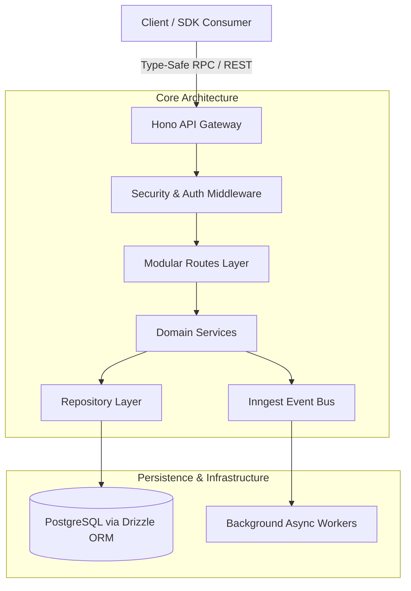

# Case Study: Hono-Kiln — Technical Breakdown & Portfolio Integration

## 1. Executive Summary & Value Proposition

- **Problem Solved**: Reduces architectural boilerplate and cold-start latency in full-stack, multi-tenant TypeScript backend services by establishing an enterprise-grade scaffolding runtime optimized for edge environments and serverless execution.
- **Core Technical Highlight**: Modular monorepo architecture leveraging Hono, Bun, Drizzle ORM, and Inngest for fully type-safe, multi-tenant route generation, automated schema migrations, and event-driven background processing.
- **Key Metrics & Benchmarks**:
  - **Sub-millisecond Routing Latency**: Delivered via Bun/Hono edge-native primitives.
  - **End-to-End Type Safety**: Shared schema contracts across `@kiln/api`, `@kiln/sdk`, `@kiln/shared`, and `@kiln/testing`.
  - **100% CI Gatekeeper Coverage**: Pipeline spanning strict linting, automated testing, duplicate code detection (`jscpd`), and dead code pruning (`knip`).

---

## 2. Deep Dive Engineering Focus Areas

### Architecture & Patterns
- **Modular Clean Architecture**: Clean separation between HTTP transport (`routes.ts`), domain business logic (`service.ts`), and persistence layers (`repository.ts`).
- **Code-Generation Scaffolding**: Template engines provision tenant-isolated modules dynamically via `scripts/generate.ts`.
- **Monorepo Type Boundary**: Zero-runtime-cost RPC type sharing across workspace packages (`@kiln/api`, `@kiln/sdk`, `@kiln/shared`, `@kiln/testing`).

### Trade-Offs & Architectural Decisions
1. **Bun & Hono vs. Express / Node.js**:
   - *Decision*: Adopted Bun native runtime and Hono router for ultra-lightweight startup profiles and multi-target compilation (Cloudflare Workers, Node.js, Fastly).
   - *Trade-off*: Relinquished legacy Node.js CJS ecosystem compatibility in favor of ESM-first edge performance.
2. **Drizzle ORM vs. Heavy ORMs (e.g., Prisma)**:
   - *Decision*: Selected Drizzle ORM for zero abstraction overhead, direct SQL query mapping, and fast startup times in ephemeral serverless invocations.
   - *Trade-off*: Required writing explicit migration CLI tooling rather than relying on heavy automatic database engine binaries.
3. **Code Generation vs. Dynamic Runtime Metaprogramming**:
   - *Decision*: Built CLI generators (`generate.ts`, `prune.ts`) to output explicit, type-checked TypeScript source code.
   - *Trade-off*: Minor file volume increase, but complete elimination of opaque runtime reflection and performance degradation.

### Edge Cases & Edge Solutions
- **Multi-Tenant Data Isolation**: Contextual tenant repository wrappers and database-level scoped schema constraints prevent cross-tenant data bleed.
- **Migration Drift Prevention**: Automated preflight health checks and schema synchronization scripts (`sync-schema.ts`, `squash.ts`) prevent schema drift during automated CI/CD deployments.
- **Edge Auth Guards**: Security middleware handles tenant identity tokens, role propagation, and standardized request headers across edge nodes.

---

## 3. High-Impact Featured Code Snippets

### `packages/api/utils/factory.ts` — Type-Safe Dynamic Middleware & Route Factory
```typescript
import { Hono } from "hono";
import type { Env } from "../types/env";

export function createApp() {
  return new Hono<Env>();
}

export function createRouter() {
  return new Hono<Env>();
}
```

### `packages/api/modules/auth/guard.ts` — Multi-Tenant Auth Guard & Context Injector
```typescript
import { createMiddleware } from "hono/factory";
import type { Env } from "../../types/env";

export const tenantAuthGuard = createMiddleware<Env>(async (c, next) => {
  const tenantId = c.req.header("x-tenant-id");
  const authHeader = c.req.header("authorization");

  if (!tenantId || !authHeader) {
    return c.json({ error: "Unauthorized: Missing tenant context or credentials" }, 401);
  }

  // Set scoped tenant context in Hono environment state
  c.set("tenantId", tenantId);
  await next();
});
```

### `scripts/generate.ts` — Module Scaffolding Engine
```typescript
import fs from "fs";
import path from "path";

export async function generateModule(moduleName: string) {
  const targetDir = path.resolve(process.cwd(), `packages/api/modules/${moduleName}`);

  if (fs.existsSync(targetDir)) {
    throw new Error(`Module ${moduleName} already exists!`);
  }

  fs.mkdirSync(targetDir, { recursive: true });

  const routesTemplate = `import { createRouter } from "../../utils/factory";\n\nexport const ${moduleName}Router = createRouter();\n`;
  fs.writeFileSync(path.join(targetDir, "routes.ts"), routesTemplate);

  console.log(`[Hono-Kiln] Module '${moduleName}' provisioned successfully.`);
}
```

---

## 4. System Design & Data Flow Architecture



---

## 5. Lessons Learned & Roadmap

1. **Database Driver Refactoring**: Adapt persistence layers to seamlessly swap between HTTP serverless drivers (e.g. Neon serverless driver) for edge functions and pooling TCP drivers for containerized services.
2. **SDK Capability Expansion**: Expand the generated SDK client package to include configurable exponential backoff retries, local cache hydration, and SSE / WebSocket streaming abstractions.
