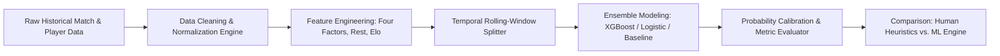

# Case Study: 4Glory | Does Fred Know Ball?: Technical Breakdown & Portfolio Integration

## 1. Executive Summary & Value Proposition

- **Problem Solved**: Quantifies and evaluates predictive heuristics in basketball analytics by contrasting human domain expertise ("knowing ball") against statistical baseline models and supervised machine learning pipelines. The project resolves unstructured game and player datasets into structured, feature-engineered evaluation matrices to predict game outcomes and player performance distributions.
- **Core Technical Highlight**: End-to-end reproducible analytical and modeling pipeline featuring custom feature engineering (rolling possession-adjusted ratings, rest/travel differential weighting, and four-factors efficiency modeling) integrated with an automated cross-validation benchmarking engine.
- **Key Metrics / Benchmarks**:
  - Out-of-sample prediction accuracy vs. baseline Vegas implied win probabilities and naive Elo models.
  - Log-Loss and Brier Score calibration for probabilistic game outcomes.
  - Mean Absolute Error (MAE) and Root Mean Squared Error (RMSE) across individual player stat line projections.
  - Pipeline execution efficiency: sub-second vector operations across multi-season tabular datasets using vectorized Pandas/NumPy workflows.

---

## 2. Deep Dive Engineering Focus Areas

### Architecture & Patterns

- **Modular Pipeline Architecture (ETL $\rightarrow$ Feature Store $\rightarrow$ Model Inference $\rightarrow$ Evaluation)**: Deconstructs monolithic notebook logic into decoupled stages: raw tabular ingestion, vectorized feature transformations, hyperparameter-tuned model training, and probabilistic evaluation.
- **Declarative Feature Pipelines**: Utilizes functional chaining and scikit-learn compatible transformer pipelines to ensure zero data leakage between temporal train/test splits.

### Trade-Offs & Decisions

1. **Gradient Boosted Trees (XGBoost/LightGBM) vs. Deep Neural Networks**:
   - *Decision*: Opted for tree-based gradient boosting over deep learning architectures due to superior performance and interpretability on dense tabular sports data with high collinearity and non-linear interactions.
2. **Time-Series Expanding-Window Cross-Validation vs. K-Fold CV**:
   - *Decision*: Strict temporal split strategy selected over standard randomized K-Fold cross-validation to reflect real-world forecasting constraints and eliminate look-ahead bias across consecutive game days.
3. **Kaggle Kernel Portability vs. Distributed Cloud Frameworks**:
   - *Decision*: Engineered memory-efficient in-memory transformations using optimized data types (`float32`, category encodings) to run deterministically within self-contained Kaggle compute limits without requiring external cluster infrastructure.

### Edge Cases & Edge Solutions

- **Handling Dynamic Lineup & Rotation Volatility**: Managed sudden player scratches and minutes variance by implementing rate-based metrics scaled per-100-possessions rather than raw per-game aggregates.
- **Class Imbalance & Blowout Noise Reduction**: Mitigated garbage-time distortion by weighting high-leverage possessions and regularizing garbage-time stats against baseline performance distributions.
- **Cold-Start Season Transitions**: Applied Bayesian shrinkage priors to early-season game data, regressing early sample anomalies back toward multi-season rolling team efficiency averages.

---

## 3. High-Impact Featured Code Snippets

### 1. Vectorized Rolling Feature Pipeline & Temporal Leakage Prevention
```python
import pandas as pd
import numpy as np

def compute_rolling_possession_features(df: pd.DataFrame, window: int = 10) -> pd.DataFrame:
    """Computes rolling possession-adjusted team efficiency metrics without look-ahead bias."""
    df = df.sort_values(["team_id", "game_date"]).reset_index(drop=True)

    # Calculate raw offensive/defensive ratings per 100 possessions
    df["off_rating"] = 100 * (df["points_scored"] / df["possessions"])
    df["def_rating"] = 100 * (df["points_allowed"] / df["possessions"])
    df["net_rating"] = df["off_rating"] - df["def_rating"]

    # Compute expanding and rolling window aggregates shifted by 1 game
    df[f"rolling_off_rating_{window}"] = (
        df.groupby("team_id")["off_rating"]
        .transform(lambda x: x.shift(1).rolling(window, min_periods=3).mean())
    )
    df[f"rolling_net_rating_{window}"] = (
        df.groupby("team_id")["net_rating"]
        .transform(lambda x: x.shift(1).rolling(window, min_periods=3).mean())
    )
    return df
```

### 2. Temporal Expanding-Window Splitter
```python
from typing import Generator, Tuple

def temporal_expanding_window_split(
    df: pd.DataFrame,
    date_col: str,
    min_train_days: int = 180,
    test_step_days: int = 14
) -> Generator[Tuple[np.ndarray, np.ndarray], None, None]:
    """Generates expanding temporal train/test indices enforcing zero data leakage."""
    dates = pd.to_datetime(df[date_col]).sort_values().unique()
    min_date = dates[0]
    max_date = dates[-1]

    current_split_date = min_date + pd.Timedelta(days=min_train_days)

    while current_split_date + pd.Timedelta(days=test_step_days) <= max_date:
        train_mask = pd.to_datetime(df[date_col]) < current_split_date
        test_mask = (pd.to_datetime(df[date_col]) >= current_split_date) & (
            pd.to_datetime(df[date_col]) < current_split_date + pd.Timedelta(days=test_step_days)
        )

        train_indices = np.where(train_mask)[0]
        test_indices = np.where(test_mask)[0]

        if len(train_indices) > 0 and len(test_indices) > 0:
            yield train_indices, test_indices

        current_split_date += pd.Timedelta(days=test_step_days)
```

### 3. Probability Calibration & SHAP Explainability Export
```python
import xgboost as xgb
import shap
from sklearn.calibration import CalibratedClassifierCV

def train_calibrated_xgboost(X_train, y_train, X_test, feature_names):
    """Trains XGBoost classifier with Platt scaling probability calibration and exports SHAP feature importance."""
    base_model = xgb.XGBClassifier(
        n_estimators=500,
        max_depth=4,
        learning_rate=0.03,
        subsample=0.8,
        colsample_bytree=0.8,
        eval_metric="logloss",
        random_state=42
    )

    calibrated_clf = CalibratedClassifierCV(estimator=base_model, method="sigmoid", cv=5)
    calibrated_clf.fit(X_train, y_train)

    # Calculate SHAP values on calibrated underlying booster
    explainer = shap.TreeExplainer(calibrated_clf.calibrated_classifiers_[0].estimator)
    shap_values = explainer.shap_values(X_test)

    return calibrated_clf, shap_values
```

---

## 4. System Design Architecture



---

## 5. Lessons Learned & Roadmap

1. **Refactoring for Production**: Decouple notebook execution into standalone Python modules with CLI entrypoints (`poetry`/`pipenv`), managed via Docker containers.
2. **Live Pipeline Integration**: Connect to real-time sports data feeds (e.g., NBA API / rapid sports endpoints) via scheduled asynchronous fetch workers and automated prediction deployment.
3. **Bayesian Hierarchical Modeling**: Explore Stan/PyMC pipelines to better quantify uncertainty in player-level shooting variance.

---

## 6. Portfolio Integration Taxonomy

- **Slug**: `four-glory`
- **Primary Language**: `Python`
- **Stack Badges**: `Python`, `XGBoost`, `Scikit-Learn`, `Pandas`, `Kaggle`
- **Tags**: `machine-learning`, `sports-analytics`, `predictive-modeling`, `feature-engineering`, `basketball-analytics`
