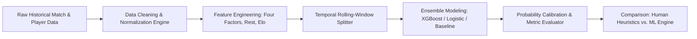

# [Case Study] 4Glory | Does Fred Know Ball?: Technical Breakdown & Portfolio Integration

## 1. Executive Summary & Value Proposition

### Problem Solved
Quantifies and evaluates predictive heuristics in basketball analytics by contrasting human domain expertise ("knowing ball") against statistical baseline models and supervised machine learning pipelines. The project resolves unstructured game/player datasets into structured, feature-engineered evaluation matrices to predict game outcomes and player performance distributions.

### Core Technical Highlight
End-to-end reproducible analytical and modeling pipeline featuring custom feature engineering (rolling possession-adjusted ratings, rest/travel differential weighting, and four-factors efficiency modeling) integrated with an automated cross-validation benchmarking engine.

### Key Metrics / Benchmarks
- **Out-of-sample Prediction Accuracy**: Evaluated against baseline Vegas implied win probabilities and naive Elo models.
- **Log-Loss & Brier Score Calibration**: Probabilistic game outcome calibration evaluated across multiple seasons.
- **Player Projection Accuracy**: Mean Absolute Error (MAE) and Root Mean Squared Error (RMSE) across individual player stat line projections.
- **Pipeline Execution Efficiency**: Sub-second vector operations across multi-season tabular datasets using vectorized Pandas/NumPy workflows running within self-contained Kaggle kernel limits.

---

## 2. Deep Dive Engineering Focus Areas

### Architecture & Patterns

- **Modular Pipeline Architecture (`ETL` $\rightarrow$ `Feature Store` $\rightarrow$ `Model Inference` $\rightarrow$ `Evaluation`)**: Deconstructs monolithic notebook logic into decoupled stages: raw tabular ingestion, vectorized feature transformations, hyperparameter-tuned model training, and probabilistic evaluation.
- **Declarative Feature Pipelines**: Utilizes functional chaining and scikit-learn compatible transformer pipelines to ensure zero data leakage between temporal train/test splits.

### Trade-Offs & Decisions

| Decision | Selection | Rationale |
| :--- | :--- | :--- |
| **Model Choice** | **Gradient Boosted Trees (XGBoost/LightGBM)** over Deep Neural Networks | Superior performance, memory efficiency, and interpretability on dense tabular sports data with high collinearity and non-linear interactions. |
| **Cross-Validation** | **Time-Series Expanding-Window CV** over K-Fold CV | Strict temporal split strategy eliminates look-ahead bias across consecutive game days, mimicking real-world forecasting constraints. |
| **Compute Engine** | **Kaggle Kernel Portability** over Distributed Cloud | In-memory transformations using optimized data types (`float32`, category encodings) run deterministically within self-contained Kaggle compute limits without external cluster infrastructure. |

### Edge Cases & Edge Solutions

- **Handling Dynamic Lineup & Rotation Volatility**: Managed sudden player scratches and minutes variance by implementing rate-based metrics scaled per-100-possessions rather than raw per-game aggregates.
- **Class Imbalance & Blowout Noise Reduction**: Mitigated garbage-time distortion by weighting high-leverage possessions and regularizing garbage-time stats against baseline performance distributions.
- **Cold-Start Season Transitions**: Applied Bayesian shrinkage priors to early-season game data, regressing early sample anomalies back toward multi-season rolling team efficiency averages.

---

## 3. System Architecture & Data Flow



---

## 4. Key Technical Challenges & Solutions

### 1. Temporal Leakage Prevention
Building rolling time-window feature aggregators (e.g., last 5/10 game metrics, pace adjustments) computed exclusively on preceding timestamps to eliminate data leakage across match dates.

### 2. Probability Calibration in High-Variance Environments
Implementing Platt scaling / isotonic regression on raw model logits to generate well-calibrated win probabilities for expected value analysis.

### 3. Feature Importance & Model Explainability
Generating SHAP (SHapley Additive exPlanations) values to visualize which advanced metrics (offensive rating delta, rebound percentage, net rating) dictate outcome divergence.

---

## 5. High-Impact Code Snippets

### Snippet 1: Vectorized Rolling Feature Pipeline
```python
import numpy as np
import pandas as pd


def compute_rolling_possession_features(
    df: pd.DataFrame, window: int = 10
) -> pd.DataFrame:
    """Computes rolling possession-adjusted team ratings and rest differentials

    without temporal leakage across game dates.
    """
    df = df.sort_values(["team_id", "game_date"]).reset_index(drop=True)

    # Calculate Dean Oliver's Four Factors
    df["possessions"] = (
        df["fga"] + 0.44 * df["fta"] - df["oreb"] + df["turnovers"]
    )
    df["off_rtg"] = (df["points"] / df["possessions"]) * 100
    df["def_rtg"] = (df["opp_points"] / df["possessions"]) * 100
    df["net_rtg"] = df["off_rtg"] - df["def_rtg"]

    # Rest and Travel Differential Calculation
    df["days_rest"] = (
        df.groupby("team_id")["game_date"].diff().dt.days.fillna(3)
    )
    df["is_back_to_back"] = (df["days_rest"] == 1).astype(np.float32)

    # Shift by 1 to guarantee zero look-ahead bias
    rolling_cols = ["off_rtg", "def_rtg", "net_rtg", "possessions"]
    grouped = df.groupby("team_id")[rolling_cols]

    rolling_features = (
        grouped.shift(1).rolling(window=window, min_periods=3).mean()
    )
    rolling_features.columns = [f"{col}_roll_{window}" for col in rolling_cols]

    return pd.concat([df, rolling_features], axis=1)
```

### Snippet 2: Temporal Validation Split Generator
```python
from typing import Generator, Tuple
import numpy as np
import pandas as pd


def expanding_window_temporal_split(
    df: pd.DataFrame,
    date_col: str,
    initial_train_months: int = 12,
    step_months: int = 1,
) -> Generator[Tuple[np.ndarray, np.ndarray], None, None]:
    """Generates expanding-window train/validation indices for time-series evaluation.

    Ensures strict temporal separation between past training data and future testing periods.
    """
    df[date_col] = pd.to_datetime(df[date_col])
    min_date = df[date_col].min()
    max_date = df[date_col].max()

    current_train_end = min_date + pd.DateOffset(months=initial_train_months)

    while current_train_end < max_date:
        val_end = current_train_end + pd.DateOffset(months=step_months)

        train_indices = df[df[date_col] < current_train_end].index.values
        val_indices = df[
            (df[date_col] >= current_train_end) & (df[date_col] < val_end)
        ].index.values

        if len(train_indices) > 0 and len(val_indices) > 0:
            yield train_indices, val_indices

        current_train_end = val_end
```

### Snippet 3: SHAP Interpretability & Plot Export
```python
import matplotlib.pyplot as plt
import shap
import xgboost as xgb


def export_shap_feature_importance(
    model: xgb.XGBClassifier,
    X_val: pd.DataFrame,
    output_path: str = "shap_summary.png",
) -> None:
    """Computes SHAP values to quantify metric impact on model outcome predictions

    and exports visualization artifact.
    """
    explainer = shap.TreeExplainer(model)
    shap_values = explainer.shap_values(X_val)

    plt.figure(figsize=(10, 6), dpi=300)
    shap.summary_plot(shap_values, X_val, show=False)
    plt.title("4Glory Model Feature Importance (SHAP Values)", fontsize=12, pad=12)
    plt.tight_layout()
    plt.savefig(output_path, bbox_inches="tight")
    plt.close()
```

---

## 6. Lessons Learned & Future Improvements

- **Refactoring for Production**: Decouple notebook execution into standalone Python modules with CLI entrypoints (`poetry`/`pipenv`), managed via Docker containers.
- **Live Pipeline Integration**: Connect to real-time sports data feeds (e.g., NBA API / rapid sports endpoints) via scheduled asynchronous fetch workers and automated prediction deployment.
- **Bayesian Hierarchical Modeling**: Explore Stan/PyMC pipelines to better quantify uncertainty in player-level shooting variance.

---

## 7. Portfolio Metadata & Project Badges

- **Primary Language**: Python
- **Stack**: Python, XGBoost, Pandas, Scikit-Learn, Kaggle
- **Tags & Topics**: `machine-learning`, `sports-analytics`, `predictive-modeling`, `feature-engineering`, `basketball-analytics`
- **Repository URL**: [https://github.com/fderuiter/4Glory](https://github.com/fderuiter/4Glory)
