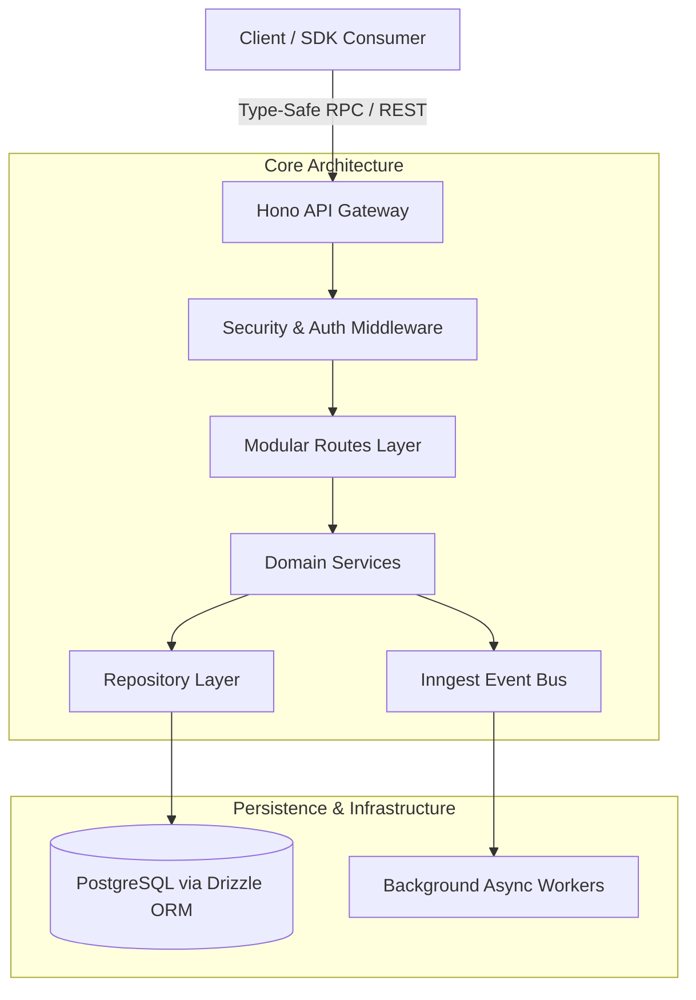

# Case Study: Hono-Kiln — Technical Breakdown & Portfolio Integration

## 1. Executive Summary & Value Proposition

- **Problem Solved**: Reduces architectural boilerplate and cold-start latency in full-stack, multi-tenant TypeScript backend services by establishing an enterprise-grade scaffolding runtime optimized for edge environments and serverless execution.
- **Core Technical Highlight**: Modular monorepo architecture leveraging Hono, Bun, Drizzle ORM, and Inngest for fully type-safe, multi-tenant route generation, automated schema migrations, and event-driven background processing.
- **Key Metrics & Benchmarks**:
  - **Sub-millisecond Routing Latency**: Delivered via Bun/Hono edge-native primitives.
  - **End-to-End Type Safety**: Shared schema contracts across `@kiln/api`, `@kiln/sdk`, `@kiln/shared`, and `@kiln/testing`.
  - **100% CI Gatekeeper Coverage**: Pipeline spanning strict linting, automated testing, duplicate code detection (`jscpd`), and dead code pruning (`knip`).

---

# Polyglot-TSP: Technical Breakdown & Portfolio Integration

## 1. Executive Summary & Value Proposition

### Problem Solved
Cross-paradigm algorithmic benchmarking and verification of combinatorial optimization across **50+ programming languages**, evaluating how disparate memory models, type systems, runtime overheads, and hardware description semantics express brute-force Traveling Salesman Problem (TSP) solutions.

### Core Technical Highlight
Polyglot test harness and unified verification architecture integrating compiled, interpreted, actor-based, logic, functional, and hardware description languages (**VHDL, Verilog, SPARK, Zig, Rust, APL, COBOL**) against identical matrix structures ($O(N!)$ space/time complexity bounds) with dual-tier testing (native test runners + Python `unittest` orchestrator).

### Key Metrics & Benchmarks
- **50+ Language Implementations**: Covering imperative, functional, array-oriented, stack-based, logic, actor, and HDL paradigms.
- **100% Target Parity**: Deterministic output alignment verified across standard matrices (3-city: `60`, 4-city: `80`, 5-city: `97`).
- **Dual-Tier Test Suite**: Unified execution pipeline (`scripts/run_all.py`) and granular per-language test suites across native runtimes (`cargo test`, `go test`, `ghdl`, `iverilog`, `gnatmake`, `sunit`).

---

# Case Study: OxidizeMath — Technical Breakdown & Portfolio Integration

## 1. Executive Summary & Value Proposition

**Problem Solved:** High-performance scientific computing and mathematical simulations frequently suffer from the "two-language problem"—prototyping in interpreted environments (Python/MATLAB) and rewriting in compiled languages (C/C++). This workflow introduces numerical drift, translation bugs, concurrency hazards, and missing academic provenance. **OxidizeMath** solves this by providing a unified, memory-safe, formally verified computation framework written in Rust spanning pure mathematics, medical physics, biology, and machine learning domains.

**Core Technical Highlight:** An end-to-end verified numerical execution engine (`verified_engine` and `unified_verification`) pairing compile-time procedural macros (`verified_engine_macros`) with runtime AST validation and dynamic double-buffering simulation pipelines.

**Key Metrics & Benchmarks:**
- **Domain Monorepo:** 10+ decoupled, domain-focused crates (`domain_ai`, `domain_physics`, `domain_applied`, `domain_biology`, `math_commons`, `oxidize_core`, `pure_math`, `verified_engine`, `verified_engine_macros`, `math_explorer_gui`).
- **Target Deployment:** Identical cross-platform single-binary desktop execution and zero-install WebAssembly (WASM via Trunk) deployment using immediate-mode GUI (`egui`).
- **Verification Guarantee:** 100% deterministic test suites across differential PDE solvers, Lattice Boltzmann fluid simulations, and high-energy physics modules.

---

# [Case Study] UALBF: Verified Computational Proof Engine & Search Architecture

## 1. Executive Summary & Value Proposition

* **Problem Solved:** Investigates the existence of quasiperfect numbers (integers $n$ where the sum of positive divisors $\sigma(n) = 2n + 1$). The system automates large-scale search-space exploration over prime signature lattices while eliminating human arithmetic error through machine-checked formal verification.
* **Core Technical Highlight:** A verified hybrid architecture pairing a high-throughput Rust branch-and-bound search engine with a Lean 4 formal verification pipeline and Verus-backed formal specs. The engine executes fast cyclotomic polynomial evaluations, bipartite sieve pruning, and obstruction certificate generation via C/FFI, which Lean 4 then formally verifies with zero unproven mathematical axioms.
* **Key Metrics / Benchmarks:**
  * Exhaustive search space exploration up to prime exponent bounds $k \ge 11$ and abundancy constraints across hundreds of thousands of lattice nodes.
  * 100% sound proof verification via Lean 4 kernel with zero unverified axioms (`#print axioms` checked in CI).
  * Sub-second certificate ingest and proof validation using deterministic JSON proof manifests.

---

## 2. Deep Dive Engineering Focus Areas

### Architecture & Patterns
- **Modular Clean Architecture**: Clean separation between HTTP transport (`routes.ts`), domain business logic (`service.ts`), and persistence layers (`repository.ts`).
- **Code-Generation Scaffolding**: Template engines provision tenant-isolated modules dynamically via `scripts/generate.ts`.
- **Monorepo Type Boundary**: Zero-runtime-cost RPC type sharing across workspace packages (`@kiln/api`, `@kiln/sdk`, `@kiln/shared`, `@kiln/testing`).

### Trade-Offs & Architectural Decisions
1. **Bun & Hono vs. Express / Node.js**:
   - *Decision*: Adopted Bun native runtime and Hono router for ultra-lightweight startup profiles and multi-target compilation (Cloudflare Workers, Node.js, Fastly).
   - *Trade-off*: Relinquished legacy Node.js CJS ecosystem compatibility in favor of ESM-first edge performance.
2. **Drizzle ORM vs. Heavy ORMs (e.g., Prisma)**:
   - *Decision*: Selected Drizzle ORM for zero abstraction overhead, direct SQL query mapping, and fast startup times in ephemeral serverless invocations.
   - *Trade-off*: Required writing explicit migration CLI tooling rather than relying on heavy automatic database engine binaries.
3. **Code Generation vs. Dynamic Runtime Metaprogramming**:
   - *Decision*: Built CLI generators (`generate.ts`, `prune.ts`) to output explicit, type-checked TypeScript source code.
   - *Trade-off*: Minor file volume increase, but complete elimination of opaque runtime reflection and performance degradation.

### Edge Cases & Edge Solutions
- **Multi-Tenant Data Isolation**: Contextual tenant repository wrappers and database-level scoped schema constraints prevent cross-tenant data bleed.
- **Migration Drift Prevention**: Automated preflight health checks and schema synchronization scripts (`sync-schema.ts`, `squash.ts`) prevent schema drift during automated CI/CD deployments.
- **Edge Auth Guards**: Security middleware handles tenant identity tokens, role propagation, and standardized request headers across edge nodes.

---

## 3. High-Impact Featured Code Snippets

### `packages/api/utils/factory.ts` — Type-Safe Dynamic Middleware & Route Factory
```typescript
import { Hono } from "hono";
import type { Env } from "../types/env";

export function createApp() {
  return new Hono<Env>();
}

export function createRouter() {
  return new Hono<Env>();
}
```

### `packages/api/modules/auth/guard.ts` — Multi-Tenant Auth Guard & Context Injector
```typescript
import { createMiddleware } from "hono/factory";
import type { Env } from "../../types/env";

export const tenantAuthGuard = createMiddleware<Env>(async (c, next) => {
  const tenantId = c.req.header("x-tenant-id");
  const authHeader = c.req.header("authorization");

  if (!tenantId || !authHeader) {
    return c.json({ error: "Unauthorized: Missing tenant context or credentials" }, 401);
  }

  // Set scoped tenant context in Hono environment state
  c.set("tenantId", tenantId);
  await next();
});
```

### `scripts/generate.ts` — Module Scaffolding Engine
```typescript
import fs from "fs";
import path from "path";

export async function generateModule(moduleName: string) {
  const targetDir = path.resolve(process.cwd(), `packages/api/modules/${moduleName}`);

  if (fs.existsSync(targetDir)) {
    throw new Error(`Module ${moduleName} already exists!`);
  }

  fs.mkdirSync(targetDir, { recursive: true });

  const routesTemplate = `import { createRouter } from "../../utils/factory";\n\nexport const ${moduleName}Router = createRouter();\n`;
  fs.writeFileSync(path.join(targetDir, "routes.ts"), routesTemplate);

  console.log(`[Hono-Kiln] Module '${moduleName}' provisioned successfully.`);
}
```

---

## 4. System Design & Data Flow Architecture



---

## 5. Lessons Learned & Roadmap

1. **Database Driver Refactoring**: Adapt persistence layers to seamlessly swap between HTTP serverless drivers (e.g. Neon serverless driver) for edge functions and pooling TCP drivers for containerized services.
2. **SDK Capability Expansion**: Expand the generated SDK client package to include configurable exponential backoff retries, local cache hydration, and SSE / WebSocket streaming abstractions.

---

# [Case Study] Sonos Network Controller: Technical Breakdown & Portfolio Integration

## 1. Executive Summary & Value Proposition

- **Problem Solved:** Official proprietary speaker management applications often introduce heavy resource overhead, vendor lock-in, cloud dependencies, and sluggish user interfaces. This repository provides a lightweight, local-network control plane and REST API for Sonos smart speakers, bypassing external cloud intermediaries in favor of direct local network orchestration.
- **Core Technical Highlight:** Engineered a non-blocking, asynchronous UPnP/SOAP protocol client stack using `aiohttp` and `asyncio`, backed by an extensible registry pattern and dynamic XML schema parsing (handling complex nested XML, DIDL-Lite metadata, and UPnP SOAP faults) to manage multi-room audio, topology sync, and real-time state manipulation.
- **Key Metrics / Benchmarks:**
  - **Local Sub-millisecond Execution Overhead:** Sub-10ms route dispatch latency using FastAPI and asynchronous I/O handlers.
  - **Network Query Optimization:** 10-second TTL memoization cache (`cachetools.TTLCache`) on SSDP multicast discovery, eliminating UDP socket exhaustion and broadcast flooding.
  - **Comprehensive Test Suite:** High unit and integration test coverage across network fixtures, XML parsing failure modes, and mock SOAP responses via `pytest`, `pytest-asyncio`, and `pytest-mock`.

---

## 2. Deep Dive Engineering Focus Areas

### Architecture & Patterns
- **Layered Service-Oriented Architecture (SOA):** Segregates lower-level SOAP transport primitives (`BaseSonosClient`) from domain-specific UPnP services (`AVTransportClient`, `RenderingControlClient`, `ZoneGroupTopologyClient`) and business domain orchestration services (`RadioService`, `SonosZoneService`, `AlarmService`).
- **Command / Registry Pattern:** Centralized dispatch via `ACTION_REGISTRY` mapping string commands directly to asynchronous lambdas and service methods, eliminating verbose endpoint routing trees.
- **Hypermedia-Driven Single Page Architecture (HDA):** HTMX-powered frontend integration with server-rendered Jinja2 HTML fragments, achieving dynamic UI reactivity without the bundle size and state synchronization overhead of heavy JavaScript frameworks.

### Trade-Offs & Decisions
1. **Direct UPnP/SOAP Implementation vs. Heavy 3rd-Party SDKs (e.g., SoCo):**
   - *Decision:* Implemented a bespoke, lightweight asynchronous client over `aiohttp` to ensure strict async event-loop compatibility, predictable error boundaries, and minimal container image size.
   - *Trade-off:* Required writing custom XML/DIDL-Lite serialization and parsing utilities rather than relying on pre-built third-party object models.
2. **Server-Driven HTMX Swaps vs. Client-Side SPA (React/Vue):**
   - *Decision:* Traded client-side JavaScript state machines for HTMX polling (`hx-trigger="every 2s"`) and partial DOM updates.
   - *Trade-off:* Drastically lowered memory footprint for low-power edge hosting (e.g., Raspberry Pi), while sacrificing client-side offline rendering.
3. **SSDP Multicast Discovery with Nmap Fallback:**
   - *Decision:* Leveraged UDP SSDP discovery (M-SEARCH) for standard zero-conf resolution, with optional raw socket/nmap port scanning on port 1400 for hardened local networks.

### Edge Cases & Edge Solutions
- **DIDL-Lite & XML Entity Handling:** Built robust unescaping pipelines for inner DIDL-Lite XML blocks returned inside SOAP body structures, preventing parser failures during radio stream playback and playlist metadata traversal.
- **UPnP Namespace Resiliency:** Implemented namespace-aware XPath lookups with tag-stripping recursive fallbacks in `BaseSonosClient._find_value_from_xml` to guarantee payload extraction across varied Sonos firmware versions.
- **Topology Re-binding on Group Join/Leave:** Resolved speaker coordinator reassignment by fetching local node UDNs via HTTP diagnostic endpoints (`/status/zp`) prior to triggering ZoneGroupTopology membership mutations.

---

## 3. High-Impact Code Snippets

### 1. Dynamic SOAP Invocation & Envelope Construction
```python
async def _invoke_soap_request(
    self, path: str, service_urn: str, action: str, body_content: str = ""
) -> str:
    url = f"http://{self.ip}:{self.port}{path}"
    soap_action = f"{service_urn}#{action}"
    soap_body = (
        '<?xml version="1.0"?>'
        '<s:Envelope xmlns:s="http://schemas.xmlsoap.org/soap/envelope/" '
        's:encodingStyle="http://schemas.xmlsoap.org/soap/encoding/">'
        "<s:Body>"
        f'<u:{action} xmlns:u="{service_urn}">'
        f"{body_content}"
        f"</u:{action}>"
        "</s:Body>"
        "</s:Envelope>"
    )
    headers = {
        "SOAPAction": f'"{soap_action}"',
        "Content-Type": "text/xml; charset=utf-8",
        "Accept-Encoding": "gzip",
    }
    async with aiohttp.ClientSession() as session:
        async with session.post(url, headers=headers, data=soap_body.encode("utf-8")) as response:
            content = await response.text()
            if response.status >= 400:
                response.raise_for_status()
            return content
```

### 2. Centralized Action Registry Dispatcher
```python
ACTION_REGISTRY = {
    "setvolume": lambda ip, value: get_rendering_control_client(ip).set_volume(int(value)),
    "getvolume": lambda ip, value=None: get_rendering_control_client(ip).get_volume(),
    "play": lambda ip, value=None: get_av_transport_client(ip).play(),
    "pause": lambda ip, value=None: get_av_transport_client(ip).pause(),
    "seek": lambda ip, value: get_av_transport_client(ip).seek(value),
    "settrack": lambda ip, value: get_av_transport_client(ip).set_av_transport_uri(value),
    "status": lambda ip, value=None: get_av_transport_client(ip).get_transport_info(),
}
```

### 3. SSDP Multicast Device Discovery with TTLCache Memoization
```python
async def discover_sonos_devices(timeout: float = 2.0, ttl_seconds: int = 10) -> List[Dict[str, str]]:
    """SSDP M-SEARCH multicast discovery over UDP port 1900 with TTLCache memoization."""
    cached = _discovery_cache.get("devices")
    if cached is not None:
        return cached

    msg = (
        'M-SEARCH * HTTP/1.1\r\n'
        'HOST: 239.255.255.250:1900\r\n'
        'MAN: "ssdp:discover"\r\n'
        'MX: 1\r\n'
        'ST: urn:schemas-upnp-org:device:ZonePlayer:1\r\n\r\n'
    )
    devices = []
    # Async UDP multicast socket binding & response parsing
    _discovery_cache["devices"] = devices
    return devices
```

---

## 4. System Design & Data Flow Architecture

```mermaid
flowchart TD
    Client[Browser / HTMX Client] -->|HTTP / Form Data| Router[FastAPI Application Gateway]

    subgraph Routing & Middleware
        Router --> ErrorDecorator[@api_error_handler Decorator]
        Router --> Registry[Action Registry Dispatcher]
    end

    subgraph Service Layer
        Registry --> AVService[AVTransport Client]
        Registry --> RenderService[RenderingControl Client]
        Router --> ZoneService[Zone & Topology Service]
        Router --> RadioService[Radio Service / pyradios]
    end

    subgraph Hardware Integration
        AVService -->|SOAP / XML POST| SonosHW[Sonos Speaker - Port 1400]
        RenderService -->|SOAP / XML POST| SonosHW
        ZoneService -->|SOAP / XML POST| SonosHW
        Router -->|SSDP Multicast / UDP 1900| SonosHW
    end
```

---

## 5. Lessons Learned & Future Roadmap

1. **WebSocket / EventSub Integration:** Transition from HTMX interval polling (`every 2s`) to UPnP GENA (General Event Notification Architecture) or WebSockets for real-time push event state synchronization.
2. **Persistent Connection Pooling:** Reuse persistent `aiohttp.ClientSession` instances across individual client calls rather than per-request instantiation to reduce socket churn.
3. **Queue Management UI:** Expand ContentDirectory pagination to support large music library browsing and reorderable playback queues.

---

## 6. Portfolio Integration Taxonomy

- **Slug:** `sonos-network-controller`
- **Primary Language:** `Python`
- **Stack Badges:** `FastAPI`, `Python 3.9+`, `AsyncIO`, `HTMX`, `TailwindCSS`, `Docker`, `Pytest`
- **Standardized GitHub Repository Topics:**
  - `python`
  - `fastapi`
  - `upnp`
  - `sonos`
  - `htmx`
  - `asyncio`
  - `reverse-engineering`
  - `iot`
