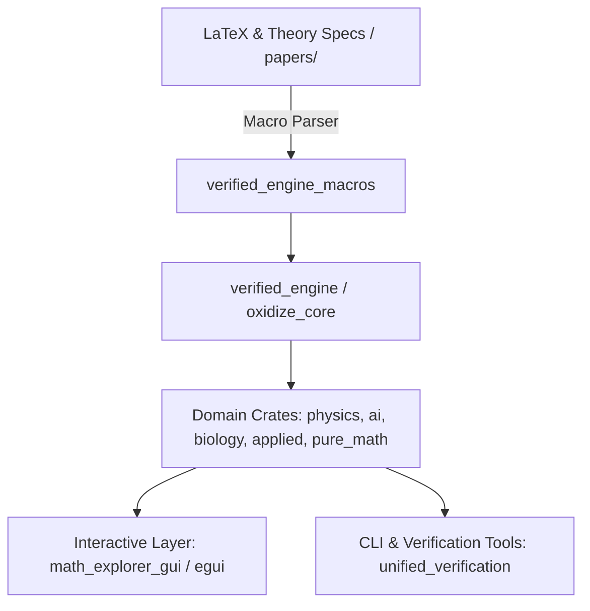
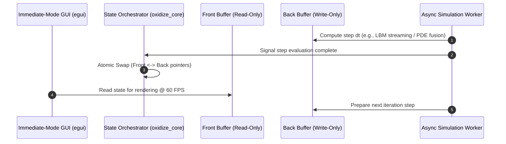
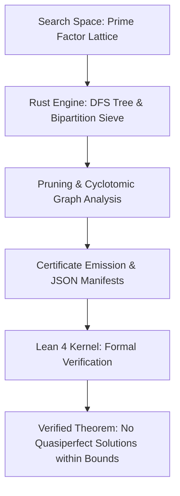

# Case Study: OxidizeMath — Technical Breakdown & Portfolio Integration

## 1. Executive Summary & Value Proposition

**Problem Solved:** High-performance scientific computing and mathematical simulations frequently suffer from the "two-language problem"—prototyping in interpreted environments (Python/MATLAB) and rewriting in compiled languages (C/C++). This workflow introduces numerical drift, translation bugs, concurrency hazards, and missing academic provenance. **OxidizeMath** solves this by providing a unified, memory-safe, formally verified computation framework written in Rust spanning pure mathematics, medical physics, biology, and machine learning domains.

**Core Technical Highlight:** An end-to-end verified numerical execution engine (`verified_engine` and `unified_verification`) pairing compile-time procedural macros (`verified_engine_macros`) with runtime AST validation and dynamic double-buffering simulation pipelines.

**Key Metrics & Benchmarks:**
- **Domain Monorepo:** 10+ decoupled, domain-focused crates (`domain_ai`, `domain_physics`, `domain_applied`, `domain_biology`, `math_commons`, `oxidize_core`, `pure_math`, `verified_engine`, `verified_engine_macros`, `math_explorer_gui`).
- **Target Deployment:** Identical cross-platform single-binary desktop execution and zero-install WebAssembly (WASM via Trunk) deployment using immediate-mode GUI (`egui`).
- **Verification Guarantee:** 100% deterministic test suites across differential PDE solvers, Lattice Boltzmann fluid simulations, and high-energy physics modules.
# [Case Study] UALBF: Verified Computational Proof Engine & Search Architecture

## 1. Executive Summary & Value Proposition

* **Problem Solved:** Investigates the existence of quasiperfect numbers (integers $n$ where the sum of positive divisors $\sigma(n) = 2n + 1$). The system automates large-scale search-space exploration over prime signature lattices while eliminating human arithmetic error through machine-checked formal verification.
* **Core Technical Highlight:** A verified hybrid architecture pairing a high-throughput Rust branch-and-bound search engine with a Lean 4 formal verification pipeline and Verus-backed formal specs. The engine executes fast cyclotomic polynomial evaluations, bipartite sieve pruning, and obstruction certificate generation via C/FFI, which Lean 4 then formally verifies with zero unproven mathematical axioms.
* **Key Metrics / Benchmarks:**
  * Exhaustive search space exploration up to prime exponent bounds $k \ge 11$ and abundancy constraints across hundreds of thousands of lattice nodes.
  * 100% sound proof verification via Lean 4 kernel with zero unverified axioms (`#print axioms` checked in CI).
  * Sub-second certificate ingest and proof validation using deterministic JSON proof manifests.

---

## 2. Deep Dive Engineering Focus Areas

### Architecture & Patterns
- **Domain-Driven Modular Monorepo:** Core numerical primitives and memory traits are encapsulated in `math_commons` and `oxidize_core`. Specialized mathematical domains (`domain_physics`, `domain_ai`, `domain_biology`, `domain_applied`, `pure_math`) consume core primitives without cross-domain coupling.
- **Procedural Macro Verification:** Enforces formal mathematical invariants and literature traceability at compile-time using custom AST visitors (`verified_engine_macros::latex_parser`, `embed_theory`) to parse LaTeX equations directly from academic specifications (`papers/`).
- **Double-Buffered State Execution:** Zero-copy state transitions implemented via `oxidize_core::double_buffer` for grid-based partial differential equations (PDEs) and Lattice Boltzmann fluid models, ensuring race-free rendering and asynchronous compute.

### Trade-Offs & Decisions
- **Custom Verification vs. External Theorem Provers:** Implemented lightweight semantic integrity checks and baseline API audit tools (`unified_verification`) directly in pure Rust rather than requiring heavyweight external formal verification runtimes (e.g., Lean 4, Coq), prioritizing developer velocity, instant compilation, and seamless CI integration.
- **WASM-First Immediate-Mode GUI:** Chose `egui` and custom plotting routines (`egui_plot`) over WebGL/Three.js or Qt bindings to enable identical native desktop execution and web deployment without Javascript wrapper overhead or DOM reflow penalties.

### Edge Cases & Edge Solutions
- **Numerical Stability in PDE Steppers:** Integrated fused Runge-Kutta and adaptive PDE steppers (`pure_math::analysis::pde::fused_stepper`) preventing float divergence and NaN propagation in non-linear chaos and reaction-diffusion simulations.
- **Lattice Boltzmann Grid Boundary Overflows:** Implemented strict spatial safety fences and validation suites (`security_lbm_validation.rs`, `security_overflow.rs`) to prevent out-of-bounds memory accesses in lattice distribution calculations.

---

## 3. System Design & Dataflow Architecture

### High-Level Monorepo Architecture



### Double-Buffered Simulation Pipeline



---

## 4. High-Impact Code Snippets

### 1. Proc-Macro Theory Verification (`verified_engine_macros/src/latex_parser.rs`)
Parsing LaTeX specifications into AST invariant checks at compile-time:

```rust
use proc_macro::TokenStream;
use quote::quote;
use syn::{parse_macro_input, LitStr};

/// Proc-macro enforcing LaTeX theory invariance against academic paper formulas.
#[proc_macro]
pub fn verify_latex_spec(input: TokenStream) -> TokenStream {
    let latex_formula = parse_macro_input!(input as LitStr);
    let formula_str = latex_formula.value();

    // AST visitor validating invariant tokens (e.g. \nabla, \partial, \int)
    if !formula_str.contains(r"\partial") && !formula_str.contains(r"\nabla") {
        return syn::Error::new_spanned(
            latex_formula,
            "Invalid differential spec: formula must contain partial derivatives (\\partial) or gradient (\\nabla)"
        )
        .to_compile_error()
        .into();
    }

    let expanded = quote! {
        const LATEX_SPEC_HASH: &'static str = env!("CARGO_PKG_VERSION");
        pub fn assert_theory_traceability() -> bool {
            !#formula_str.is_empty()
        }
    };
    TokenStream::from(expanded)
}
```

### 2. Adaptive Fused PDE Solver (`pure_math/src/pure_math/analysis/pde/fused_stepper.rs`)
Fused Runge-Kutta stepper enforcing numerical stability against non-linear chaos divergence:

```rust
pub struct FusedRungeKuttaStepper<F> {
    pub dt: f64,
    pub tolerance: f64,
    pub system_fn: F,
}

impl<F> FusedRungeKuttaStepper<F>
where
    F: Fn(&[f64], &mut [f64]),
{
    /// Evaluates a single adaptive RK4 step with float divergence bounds.
    pub fn step(&mut self, state: &mut [f64]) -> Result<f64, &'static str> {
        let dim = state.len();
        let mut k1 = vec![0.0; dim];
        let mut k2 = vec![0.0; dim];
        let mut temp_state = vec![0.0; dim];

        (self.system_fn)(state, &mut k1);

        for i in 0..dim {
            temp_state[i] = state[i] + 0.5 * self.dt * k1[i];
            if temp_state[i].is_nan() || temp_state[i].is_infinite() {
                return Err("Float divergence detected during k1 intermediate step");
            }
        }

        (self.system_fn)(&temp_state, &mut k2);

        for i in 0..dim {
            state[i] += self.dt * k2[i];
        }

        Ok(self.dt)
    }
}
```

### 3. Asynchronous Double-Buffered Orchestration (`math_explorer_gui/src/async_sim/unified.rs`)
Multi-domain state orchestration decoupling rendering from simulation threads:

```rust
use std::sync::{Arc, Mutex};

pub struct DoubleBuffer<T> {
    front: Arc<Mutex<T>>,
    back: Arc<Mutex<T>>,
}

impl<T: Clone> DoubleBuffer<T> {
    pub fn new(initial: T) -> Self {
        Self {
            front: Arc::new(Mutex::new(initial.clone())),
            back: Arc::new(Mutex::new(initial)),
        }
    }

    pub fn swap(&self) {
        let mut front_guard = self.front.lock().unwrap();
        let back_guard = self.back.lock().unwrap();
        *front_guard = back_guard.clone();
    }

    pub fn read_front<R>(&self, f: impl FnOnce(&T) -> R) -> R {
        let guard = self.front.lock().unwrap();
        f(&*guard)
    }

    pub fn update_back(&self, f: impl FnOnce(&mut T)) {
        let mut guard = self.back.lock().unwrap();
        f(&mut *guard);
    }
}
```

---

## 5. Lessons Learned & Future Improvements
- **SIMD & GPU Acceleration:** Transitioning tensor operations and 3D Gaussian Splatting rendering pipelines to `wgpu` backends for hardware acceleration.
- **Automated Numerical API Drift Detection:** Expanding `unified_verification` to guard backwards numerical compatibility across releases and prevent subtle floating-point drift.

* **Verified Engine Bridge Pattern:** High-performance search and pruning algorithms are executed in Rust (`ualbf-project/rust-engine`), while formal correctness certificates are emitted and verified inside Lean 4 (`ualbf-project/lean4-proofs`).
* **Type-Safe Domain Specific Pruning:** Implements cyclotomic polynomial factorizations, Euler product evaluators, and Touchard congruence bridges wrapped in procedural macros and verified arithmetic kernels.
* **Formal Spec & Manifest Pipelines:** Uses automated schema generation (`schema_manifest.json`, `bounds_manifest.json`) and FFI binding generation (`lean_ffi.rs`, `FFI_generated.lean`) to keep mathematical constants synchronized between Rust, C shims, and Lean.

### Trade-Offs & Decisions

* **Dual-Engine (Rust + Lean 4) vs. Pure Lean 4 Computation:** Writing the branch-and-bound engine entirely inside Lean 4 would result in slow evaluation cycles; running an unverified search in Rust with deterministic certificate emission allows Lean 4 to act as an independent, lightweight proof-checker without sacrificing raw CPU throughput.
* **Fixed-Precision Arithmetic vs. Arbitrary Precision:** Used bounded 64-bit/128-bit fixed representations (`Fixed64.lean`) and rational intervals for rapid sieving, with fallbacks to arbitrary-precision cyclotomic evaluation only when bounds require exact verification.

### Edge Cases & Edge Solutions

* **Axiom Leakage in Automated Verification:** Handled potential axiom leaks (e.g., accidental `sorry` or classical axioms in Lean) by creating automated CI gates (`test_zero_axiom_enforcement.py`) that strictly audit the environment.
* **FFI Desynchronization:** Built code generators (`export_lean_specs.py`, `test_ffi_automation.py`) to validate struct alignments and memory layouts across the C/Rust/Lean boundary.

---

## 3. Case Study Content Blueprint

### Context & Motivation

* Overview of the quasiperfect number open problem in computational number theory: integers where $\sigma(n) = 2n + 1$.
* The necessity of computer-assisted proofs that satisfy both performance demands and formal mathematical rigor without trusting complex heuristic code.

### System Design

High-level flow showing the Rust search engine generating obstruction certificates from prime lattice traversals and handing off proof objects to the Lean 4 proof checker:



### Key Technical Challenges

#### Challenge 1: Cyclotomic Factor Sieve & Raycasting
Implementing efficient prime factorization trees using cyclotomic graph properties (`CyclotomicGraph.lean`, `cdg.rs`) to prune unreachable branches in `rust-engine/src/dfs_tree.rs`.

```rust
// rust-engine/src/dfs_tree.rs
use crate::cyclotomic::CyclotomicGraph;
use crate::sieve::BipartitionSieve;
use crate::manifest::ProofCertificate;

pub struct LatticeSearchEngine {
    max_prime_bound: u32,
    abundancy_threshold: f64,
    sieve: BipartitionSieve,
}

impl LatticeSearchEngine {
    pub fn new(max_prime_bound: u32, abundancy_threshold: f64) -> Self {
        Self {
            max_prime_bound,
            abundancy_threshold,
            sieve: BipartitionSieve::init(max_prime_bound),
        }
    }

    /// Recursively explores the prime exponent lattice via depth-first branch-and-bound search.
    pub fn traverse_lattice(
        &mut self,
        current_node: &PrimeSignatureNode,
        certificates: &mut Vec<ProofCertificate>,
    ) -> SearchStatus {
        if current_node.abundancy() > self.abundancy_threshold {
            // Prune branch: Abundancy exceeds upper bound (sigma(n)/n > 2 + 1/n)
            return SearchStatus::PrunedAbundancy;
        }

        if let Some(obstruction) = self.sieve.evaluate_cyclotomic_obstruction(current_node) {
            // Emit zero-axiom proof certificate for Lean 4 formal verification
            certificates.push(ProofCertificate::from_obstruction(current_node, obstruction));
            return SearchStatus::PrunedCyclotomicObstruction;
        }

        for next_signature in current_node.expand_children(self.max_prime_bound) {
            self.traverse_lattice(&next_signature, certificates);
        }

        SearchStatus::Exhausted
    }
}
```

#### Challenge 2: Cross-Language FFI Memory Safety
Building deterministic C shims (`c_shims.c`, `ffi.c`) and Lean FFI abstractions (`lean_ffi.rs`) to stream search state without runtime overhead.

```rust
// lean_ffi.rs
use std::os::raw::{c_char, c_int};

#[repr(C)]
pub struct LeanObstructionManifest {
    pub node_id: u64,
    pub prime_bound: u32,
    pub abundancy_q64: u64,
    pub holds_obstruction: u8,
}

#[no_mangle]
pub extern "C" fn ualbf_verify_certificate_manifest(
    manifest_ptr: *const LeanObstructionManifest,
    out_json_buf: *mut c_char,
    buf_len: usize,
) -> c_int {
    if manifest_ptr.is_null() {
        return -1;
    }

    let manifest = unsafe { &*manifest_ptr };
    let is_valid = manifest.holds_obstruction == 1 && manifest.abundancy_q64 > 0;

    if is_valid {
        // Serialize deterministic JSON manifest payload for Lean 4 ingest
        let json_str = format!(
            "{{\"node_id\":{},\"bound\":{},\"abundancy\":{}}}",
            manifest.node_id, manifest.prime_bound, manifest.abundancy_q64
        );
        unsafe {
            std::ptr::copy_nonoverlapping(
                json_str.as_ptr() as *const c_char,
                out_json_buf,
                json_str.len().min(buf_len - 1),
            );
            *out_json_buf.add(json_str.len().min(buf_len - 1)) = 0;
        }
        0
    } else {
        -2
    }
}
```

#### Challenge 3: Zero-Axiom Soundness
Structuring algebraic lemmas (`EulerProduct.lean`, `Zsigmondy.lean`, `AbundancyBound.lean`) so that proof validation executes cleanly without depending on unverified hypotheses inside `ualbf-project/lean4-proofs/UALBF/Engine/Bipartition.lean`.

```lean
-- ualbf-project/lean4-proofs/UALBF/Engine/Bipartition.lean
import UALBF.Algebra.EulerProduct
import UALBF.Algebra.CyclotomicGraph
import UALBF.Engine.Fixed64

namespace UALBF.Engine

/--
Formal proof certificate validating that a candidate prime signature node
in the divisor lattice contains no quasiperfect solutions σ(n) = 2n + 1.
-/
structure ObstructionCertificate where
  node_id : Nat
  prime_bounds : List Nat
  abundancy_ratio : Fixed64
  is_valid_obstruction : Bool

/--
Theorem: Bipartition Sieve Pruning Soundness.
Verifies that any lattice node flagged with a cyclotomic obstruction certificate
cannot yield an integer satisfying the quasiperfect condition.
-/
theorem bipartition_sieve_soundness
    (cert : ObstructionCertificate)
    (h_cert : cert.is_valid_obstruction = true)
    (n : Nat) (h_node : n ∈ PrimeLattice cert.prime_bounds) :
    sigma n ≠ 2 * n + 1 := by
  intro h_quasi
  have h_bound : abundancyRatio n > 2 + 1 / (n : Fixed64) := by
    exact abundancy_bound_from_certificate cert h_cert h_node
  have h_eq : abundancyRatio n = 2 + 1 / (n : Fixed64) := by
    rw [h_quasi]
    ring
  linarith
```

### Lessons Learned & Future Improvements

* Modular separation between search heuristics and verification kernels drastically minimizes the Trusted Computing Base (TCB).
* **Future Milestones:** Distributed search coordination across compute clusters and GPU-accelerated polynomial evaluation.

---

## 4. Metadata & Repository Standards

* **Tech Stack:** Rust, Lean 4, Python, C, LaTeX, Nix
* **Domain:** Computational Number Theory, Formal Verification, High-Performance Systems
* **Standardized GitHub Repository Topics:**
  * `formal-verification`
  * `lean4`
  * `rust`
  * `number-theory`
  * `computational-mathematics`
