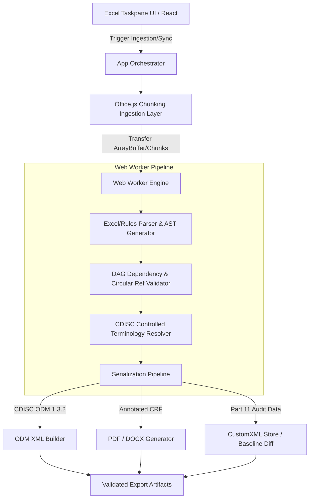

# CRF.xl: Technical Breakdown & Portfolio Integration

## 1. Executive Summary & Value Proposition

* **Problem Solved**: Bridge the gap between clinical research trial design in spreadsheet environments and regulatory-grade CDISC compliance by automating Case Report Form (CRF) authoring, validation, and multi-format serialization (CDISC ODM-XML 1.3.2, PDF aCRF, DOCX) directly within Microsoft Excel.
* **Core Technical Highlight**: Built an in-process, non-blocking Web Worker compilation engine featuring a Directed Acyclic Graph (DAG) rule validation solver and streaming serialization pipeline capable of transforming raw Excel cell grids into schema-valid CDISC ODM 1.3.2 XML and regulatory aCRF documents.
* **Key Metrics / Benchmarks**:
  * Near-zero UI thread latency during parsing and schema validation on 10,000+ item clinical definitions via background chunking workers.
  * 100% strict compliance verification against CDISC ODM 1.3.2 foundation schemas and 21 CFR Part 11 audit trails.
  * Comprehensive end-to-end test suite integrating Playwright visual regression across light/dark/high-contrast modes and automated document diff validation.

---

## 2. Deep Dive Engineering Focus Areas

### Architecture & Patterns

* **Decoupled Engine & UI via Middleware**: Clean separation between Office.js Taskpane React components and the core domain layer (`src/taskpane/core/`). The orchestration pipeline relies on a composable middleware runner pattern for data transformations and validation gates.
* **Web Worker Pipeline**: Resource-heavy parsing, Abstract Syntax Tree (AST) construction, and XML serialization are offloaded to dedicated Web Workers (`engine.worker.ts`, `customxml-worker.ts`), preserving interactive UI responsiveness in constrained Office Webview runtimes.
* **DAG Dependency Graph**: AST validation for conditional logic and form item display skips uses topological DAG traversal (`dag-validator.ts`, `rules-parser.ts`) to detect circular dependencies and unresolvable item references at authoring time.

### Trade-Offs & Decisions

* **Client-Side In-Memory Worker vs. Server-Side Execution**: Evaluated sending workbook structures to an external backend versus zero-dependency client execution in the Office taskpane. Chose client-side execution using embedded Web Workers and custom XML packaging to maintain strict compliance and clinical data privacy without exfiltrating trial designs over the wire.
* **Custom AST Parsing vs. Third-Party Formula Evaluators**: Implemented an internal deterministic expression validator tailored to clinical trial logic rules rather than embedding bloated general-purpose formula evaluators, reducing bundle footprint and eliminating execution security risks.

### Edge Cases & Edge Solutions

* **Office.js Sync & Batching Constraints**: Handled Office.js `context.sync()` payload bottlenecks during massive sheet reads by introducing an asynchronous chunking runtime (`chunking-runtime.ts`) and speculative caching layers.
* **21 CFR Part 11 Version Drift & State Integrity**: Solved silent metadata drift and concurrent cell overwrites through cryptographic baseline hashing (`baseline-workbook-service.ts`) and CustomXML part bindings that track semantic diffs without corrupting native Excel files.

---

## 3. Case Study Content Blueprint

### Context & Motivation

In clinical research, medical data managers heavily rely on Microsoft Excel for protocol definitions due to its ubiquity and flexible tabular layout. However, regulatory submissions to bodies like the FDA demand strictly structured schemas (CDISC ODM, aCRF, CDASH). Manual translation between unstructured spreadsheets and compliant submission deliverables is notoriously slow and error-prone.

Building an enterprise-grade compiler within the Office Web Add-in runtime presents steep technical hurdles: single-threaded JavaScript execution limits, sandboxed storage restrictions in WebView2/IE11 legacy containers, and context synchronization latency when interfacing with Excel via Office.js APIs.

### System Design



### Key Technical Challenges

1. **Asynchronous Ingestion & Chunking Engine**: Showcase how large workbooks with 10,000+ clinical items are broken down into batched cell regions, avoiding main-thread freezes and Office runtime timeouts.
2. **DAG-Based Clinical Logic & Rule Validation**: Walk through the algorithmic detection of circular jumps, undefined source variables, and condition validation within form item dependencies.
3. **CDISC ODM-XML Deterministic Serialization**: Detail the strict namespace management, XML schema compliance, and cryptographic audit hashing required for regulatory submission-ready deliverables.

---

## 4. Code Snippets

### Snippet 1: Topological DAG Dependency & Circular Reference Validator (`dag-validator.ts`)

```typescript
export interface DAGNode {
  id: string;
  dependencies: Set<string>;
}

export interface DAGValidationResult {
  hasCircularDependency: boolean;
  cyclePath: string[];
  topologicalOrder: string[];
}

export class DAGValidator {
  private nodes: Map<string, DAGNode> = new Map();

  public addNode(id: string, dependencies: string[]): void {
    this.nodes.set(id, { id, dependencies: new Set(dependencies) });
  }

  public validate(): DAGValidationResult {
    const visited = new Set<string>();
    const inStack = new Set<string>();
    const stack: string[] = [];
    const topologicalOrder: string[] = [];
    let cyclePath: string[] = [];

    const dfs = (nodeId: string): boolean => {
      visited.add(nodeId);
      inStack.add(nodeId);
      stack.push(nodeId);

      const node = this.nodes.get(nodeId);
      if (node) {
        for (const depId of node.dependencies) {
          if (!visited.has(depId)) {
            if (dfs(depId)) return true;
          } else if (inStack.has(depId)) {
            const cycleStart = stack.indexOf(depId);
            cyclePath = [...stack.slice(cycleStart), depId];
            return true;
          }
        }
      }

      inStack.delete(nodeId);
      stack.pop();
      topologicalOrder.push(nodeId);
      return false;
    };

    for (const [nodeId] of this.nodes) {
      if (!visited.has(nodeId)) {
        if (dfs(nodeId)) {
          return {
            hasCircularDependency: true,
            cyclePath,
            topologicalOrder: [],
          };
        }
      }
    }

    return {
      hasCircularDependency: false,
      cyclePath: [],
      topologicalOrder: topologicalOrder.reverse(),
    };
  }
}
```

### Snippet 2: Non-Blocking Excel Cell Chunking Ingestion Engine (`chunking-runtime.ts`)

```typescript
export interface ChunkingOptions {
  chunkSize: number;
  onProgress?: (progress: number) => void;
}

export async function processWorkbookInChunks<T, R>(
  items: T[],
  processor: (chunk: T[]) => Promise<R[]>,
  options: ChunkingOptions
): Promise<R[]> {
  const { chunkSize, onProgress } = options;
  const results: R[] = [];
  const total = items.length;

  for (let i = 0; i < total; i += chunkSize) {
    const chunk = items.slice(i, i + chunkSize);
    const chunkResults = await processor(chunk);
    results.push(...chunkResults);

    if (onProgress) {
      onProgress(Math.min(100, Math.round(((i + chunk.length) / total) * 100)));
    }

    // Yield control back to browser event loop to prevent UI jank
    await new Promise((resolve) => setTimeout(resolve, 0));
  }

  return results;
}
```

### Snippet 3: CDISC ODM 1.3.2 XML Deterministic Serializer (`odm-xml-serializer.ts`)

```typescript
export interface ODMStudyMetadata {
  studyOID: string;
  studyName: string;
  metaDataVersionOID: string;
  forms: Array<{
    oid: string;
    name: string;
    itemGroups: Array<{
      oid: string;
      items: Array<{ oid: string; name: string; dataType: string }>;
    }>;
  }>;
}

export function serializeODM132XML(study: ODMStudyMetadata): string {
  const timestamp = new Date().toISOString();
  let xml = `<?xml version="1.0" encoding="UTF-8"?>\n`;
  xml += `<ODM xmlns="http://www.cdisc.org/ns/odm/v1.3"\n`;
  xml += `     xmlns:ds="http://www.w3.org/2000/09/xmldsig#"\n`;
  xml += `     FileType="Snapshot"\n`;
  xml += `     FileOID="ODM.${study.studyOID}.${Date.now()}"\n`;
  xml += `     CreationDateTime="${timestamp}"\n`;
  xml += `     ODMVersion="1.3.2">\n`;
  xml += `  <Study OID="${study.studyOID}">\n`;
  xml += `    <GlobalVariables>\n`;
  xml += `      <StudyName>${escapeXml(study.studyName)}</StudyName>\n`;
  xml += `      <StudyDescription>CRF.xl Exported Clinical Trial Design</StudyDescription>\n`;
  xml += `      <ProtocolName>${escapeXml(study.studyOID)}</ProtocolName>\n`;
  xml += `    </GlobalVariables>\n`;
  xml += `    <MetaDataVersion OID="${study.metaDataVersionOID}" Name="${study.metaDataVersionOID}">\n`;

  for (const form of study.forms) {
    xml += `      <FormDef OID="${form.oid}" Name="${escapeXml(form.name)}" Repeating="No">\n`;
    for (const group of form.itemGroups) {
      xml += `        <ItemGroupRef ItemGroupOID="${group.oid}" Mandatory="Yes" OrderNumber="1"/>\n`;
    }
    xml += `      </FormDef>\n`;
  }

  xml += `    </MetaDataVersion>\n`;
  xml += `  </Study>\n`;
  xml += `</ODM>`;
  return xml;
}

function escapeXml(unsafe: string): string {
  return unsafe
    .replace(/&/g, '&amp;')
    .replace(/</g, '&lt;')
    .replace(/>/g, '&gt;')
    .replace(/"/g, '&quot;')
    .replace(/'/g, '&apos;');
}
```

---

## 5. Lessons Learned & Future Improvements

* **Office WebView Sandboxing**: Managing cross-platform WebView runtime nuances (e.g. sandboxed storage policies, Web Worker limits on older desktop Office builds) required strict fallback patterns and localized storage strategies.
* **Future Roadmap**:
  1. **WebAssembly Acceleration**: Offloading schema validation and large-scale XML generation to a Rust-compiled WebAssembly module for sub-millisecond execution.
  2. **Vault Cloud Repository Synchronization**: Direct bidirectional sync with Veeva Vault and cloud EDC repositories via the Vault SDK integration module.
