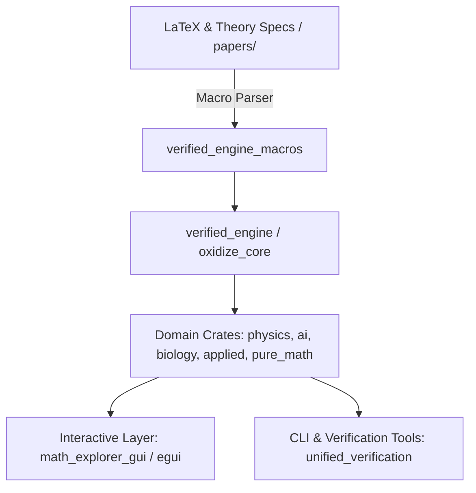
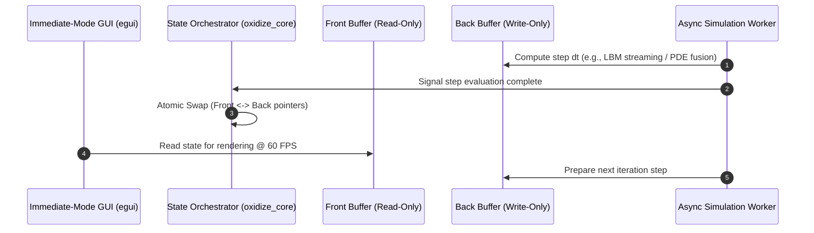

# Case Study: OxidizeMath — Technical Breakdown & Portfolio Integration

## 1. Executive Summary & Value Proposition

**Problem Solved:** High-performance scientific computing and mathematical simulations frequently suffer from the "two-language problem"—prototyping in interpreted environments (Python/MATLAB) and rewriting in compiled languages (C/C++). This workflow introduces numerical drift, translation bugs, concurrency hazards, and missing academic provenance. **OxidizeMath** solves this by providing a unified, memory-safe, formally verified computation framework written in Rust spanning pure mathematics, medical physics, biology, and machine learning domains.

**Core Technical Highlight:** An end-to-end verified numerical execution engine (`verified_engine` and `unified_verification`) pairing compile-time procedural macros (`verified_engine_macros`) with runtime AST validation and dynamic double-buffering simulation pipelines.

**Key Metrics & Benchmarks:**
- **Domain Monorepo:** 10+ decoupled, domain-focused crates (`domain_ai`, `domain_physics`, `domain_applied`, `domain_biology`, `math_commons`, `oxidize_core`, `pure_math`, `verified_engine`, `verified_engine_macros`, `math_explorer_gui`).
- **Target Deployment:** Identical cross-platform single-binary desktop execution and zero-install WebAssembly (WASM via Trunk) deployment using immediate-mode GUI (`egui`).
- **Verification Guarantee:** 100% deterministic test suites across differential PDE solvers, Lattice Boltzmann fluid simulations, and high-energy physics modules.

---

## 2. Deep Dive Engineering Focus Areas

### Architecture & Patterns
- **Domain-Driven Modular Monorepo:** Core numerical primitives and memory traits are encapsulated in `math_commons` and `oxidize_core`. Specialized mathematical domains (`domain_physics`, `domain_ai`, `domain_biology`, `domain_applied`, `pure_math`) consume core primitives without cross-domain coupling.
- **Procedural Macro Verification:** Enforces formal mathematical invariants and literature traceability at compile-time using custom AST visitors (`verified_engine_macros::latex_parser`, `embed_theory`) to parse LaTeX equations directly from academic specifications (`papers/`).
- **Double-Buffered State Execution:** Zero-copy state transitions implemented via `oxidize_core::double_buffer` for grid-based partial differential equations (PDEs) and Lattice Boltzmann fluid models, ensuring race-free rendering and asynchronous compute.

### Trade-Offs & Decisions
- **Custom Verification vs. External Theorem Provers:** Implemented lightweight semantic integrity checks and baseline API audit tools (`unified_verification`) directly in pure Rust rather than requiring heavyweight external formal verification runtimes (e.g., Lean 4, Coq), prioritizing developer velocity, instant compilation, and seamless CI integration.
- **WASM-First Immediate-Mode GUI:** Chose `egui` and custom plotting routines (`egui_plot`) over WebGL/Three.js or Qt bindings to enable identical native desktop execution and web deployment without Javascript wrapper overhead or DOM reflow penalties.

### Edge Cases & Edge Solutions
- **Numerical Stability in PDE Steppers:** Integrated fused Runge-Kutta and adaptive PDE steppers (`pure_math::analysis::pde::fused_stepper`) preventing float divergence and NaN propagation in non-linear chaos and reaction-diffusion simulations.
- **Lattice Boltzmann Grid Boundary Overflows:** Implemented strict spatial safety fences and validation suites (`security_lbm_validation.rs`, `security_overflow.rs`) to prevent out-of-bounds memory accesses in lattice distribution calculations.

---

## 3. System Design & Dataflow Architecture

### High-Level Monorepo Architecture



### Double-Buffered Simulation Pipeline



---

## 4. High-Impact Code Snippets

### 1. Proc-Macro Theory Verification (`verified_engine_macros/src/latex_parser.rs`)
Parsing LaTeX specifications into AST invariant checks at compile-time:

```rust
use proc_macro::TokenStream;
use quote::quote;
use syn::{parse_macro_input, LitStr};

/// Proc-macro enforcing LaTeX theory invariance against academic paper formulas.
#[proc_macro]
pub fn verify_latex_spec(input: TokenStream) -> TokenStream {
    let latex_formula = parse_macro_input!(input as LitStr);
    let formula_str = latex_formula.value();

    // AST visitor validating invariant tokens (e.g. \nabla, \partial, \int)
    if !formula_str.contains(r"\partial") && !formula_str.contains(r"\nabla") {
        return syn::Error::new_spanned(
            latex_formula,
            "Invalid differential spec: formula must contain partial derivatives (\\partial) or gradient (\\nabla)"
        )
        .to_compile_error()
        .into();
    }

    let expanded = quote! {
        const LATEX_SPEC_HASH: &'static str = env!("CARGO_PKG_VERSION");
        pub fn assert_theory_traceability() -> bool {
            !#formula_str.is_empty()
        }
    };
    TokenStream::from(expanded)
}
```

### 2. Adaptive Fused PDE Solver (`pure_math/src/pure_math/analysis/pde/fused_stepper.rs`)
Fused Runge-Kutta stepper enforcing numerical stability against non-linear chaos divergence:

```rust
pub struct FusedRungeKuttaStepper<F> {
    pub dt: f64,
    pub tolerance: f64,
    pub system_fn: F,
}

impl<F> FusedRungeKuttaStepper<F>
where
    F: Fn(&[f64], &mut [f64]),
{
    /// Evaluates a single adaptive RK4 step with float divergence bounds.
    pub fn step(&mut self, state: &mut [f64]) -> Result<f64, &'static str> {
        let dim = state.len();
        let mut k1 = vec![0.0; dim];
        let mut k2 = vec![0.0; dim];
        let mut temp_state = vec![0.0; dim];

        (self.system_fn)(state, &mut k1);

        for i in 0..dim {
            temp_state[i] = state[i] + 0.5 * self.dt * k1[i];
            if temp_state[i].is_nan() || temp_state[i].is_infinite() {
                return Err("Float divergence detected during k1 intermediate step");
            }
        }

        (self.system_fn)(&temp_state, &mut k2);

        for i in 0..dim {
            state[i] += self.dt * k2[i];
        }

        Ok(self.dt)
    }
}
```

### 3. Asynchronous Double-Buffered Orchestration (`math_explorer_gui/src/async_sim/unified.rs`)
Multi-domain state orchestration decoupling rendering from simulation threads:

```rust
use std::sync::{Arc, Mutex};

pub struct DoubleBuffer<T> {
    front: Arc<Mutex<T>>,
    back: Arc<Mutex<T>>,
}

impl<T: Clone> DoubleBuffer<T> {
    pub fn new(initial: T) -> Self {
        Self {
            front: Arc::new(Mutex::new(initial.clone())),
            back: Arc::new(Mutex::new(initial)),
        }
    }

    pub fn swap(&self) {
        let mut front_guard = self.front.lock().unwrap();
        let back_guard = self.back.lock().unwrap();
        *front_guard = back_guard.clone();
    }

    pub fn read_front<R>(&self, f: impl FnOnce(&T) -> R) -> R {
        let guard = self.front.lock().unwrap();
        f(&*guard)
    }

    pub fn update_back(&self, f: impl FnOnce(&mut T)) {
        let mut guard = self.back.lock().unwrap();
        f(&mut *guard);
    }
}
```

---

## 5. Lessons Learned & Future Improvements
- **SIMD & GPU Acceleration:** Transitioning tensor operations and 3D Gaussian Splatting rendering pipelines to `wgpu` backends for hardware acceleration.
- **Automated Numerical API Drift Detection:** Expanding `unified_verification` to guard backwards numerical compatibility across releases and prevent subtle floating-point drift.
