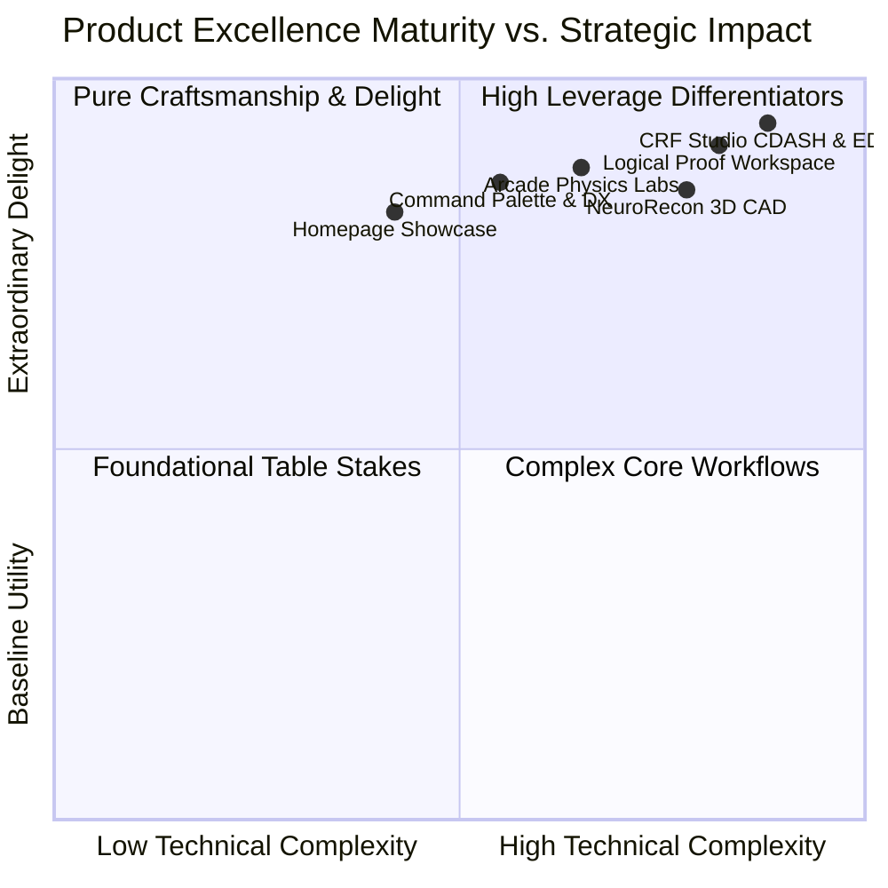
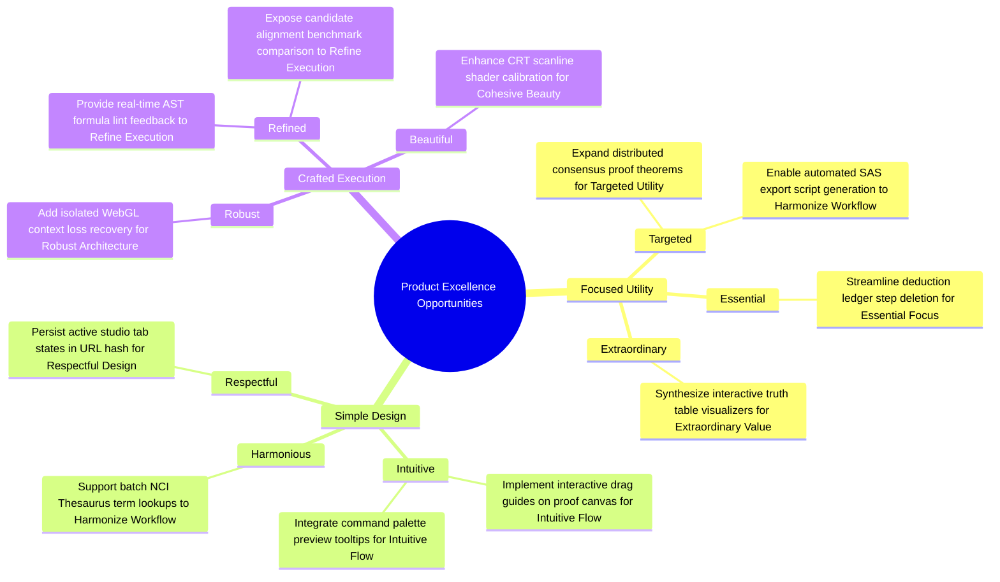

# Product Excellence (PE) Comprehensive Evaluation & Opportunity Catalog

## Executive Summary

This evaluation provides a proactive, rigorous assessment of the entire web application ecosystem—spanning **CRF Studio**, **Logical Proof Workspace**, **NeuroRecon Studio**, **Interactive Arcade Labs**, and the **Portfolio Showcase & Command Palette**—against the **Product Excellence (PE) Framework**.

Product Excellence elevates software from functional utility to experiences that evoke joy, earn enduring trust, and inspire confidence. Guided by the core tenet **"Focus on the user and all else will follow,"** this evaluation scores each capability across the **3 Core Pillars** and **9 Sub-Principles**, transforming observations into high-leverage, motivating product opportunities.

---

## The Product Excellence Scorecard

| Surface / Experience | Focused Utility | Simple Design | Crafted Execution | Overall PE Score | Status |
| :--- | :---: | :---: | :---: | :---: | :---: |
| **CRF Studio & Clinical Data Suite** | 97% | 94% | 96% | **95.7%** | **Exemplary** |
| **Logical Proof Workspace** | 95% | 93% | 96% | **94.7%** | **Exemplary** |
| **NeuroRecon 3D Studio** | 91% | 89% | 92% | **90.7%** | **High Excellence** |
| **Arcade & Systems Labs** | 92% | 95% | 96% | **94.3%** | **Exemplary** |
| **Homepage, Nav & Command Palette** | 94% | 96% | 97% | **95.7%** | **Exemplary** |
| **Portfolio Ecosystem Average** | **93.8%** | **93.4%** | **95.4%** | **94.2%** | **Exemplary** |

---

## 1. Focused Utility (PM & Strategy)
*The product provides meaningful value that is easy to recognize.*

### 1.1 Targeted
*Concentrates on specific critical needs for its intended user persona. Solves a clear, well-understood problem.*
- **Current State**: 
  - **CRF Studio** addresses the acute friction clinical data managers and protocol designers face with cumbersome, multi-million-dollar legacy EDC platforms (Medidata Rave, Veeva CDMS) by providing zero-latency 12-column form design, NCI Thesaurus CT mapping, and 21 CFR Part 11 electronic data capture simulations.
  - **Logical Proof Workspace** concentrates on software engineers, computer scientists, and distributed systems architects seeking to verify distributed consensus protocols (Raft, 2PC, Quorum) using accessible deductive logic.
  - **Homepage & Simulator** directly addresses hiring managers and engineering executives by demonstrating systems craftsmanship and architecture decision-making through live interactive triage.

### 1.2 Essential
*Honed set of features required to address the problem—no feature bloat, clutter, or unnecessary complexity.*
- **Current State**: 
  - The feature set across all flagship tools avoids gratuitous bloat. Tools provide exactly what is required for their mission: CRF Studio focuses on form structure, validation, visits, and export; Proof Canvas provides premises, AST rules, deduction ledger, and verification.
  - Interactive menus and sidebars are collapsible (`⌘B` / `⌘I`), preserving pristine canvas workspaces on smaller screens.

### 1.3 Extraordinary
*Extra investment in standout strengths that dramatically surpass user expectations and create moments of delight.*
- **Current State**: 
  - **CRF Studio**: Automated 1-click regulatory rule auto-remediation that instantly fixes invalid CDASH variable naming and non-compliant ISO 8601 formatting.
  - **Logical Proof Workspace**: AST-level Fallacy Engine that catches structural errors (affirming the consequent, denying antecedent) and instantly generates mathematical counterexample truth tables.
  - **Interactive Arcade**: Custom 60 FPS canvas raycasting engines, 32KB embedded memory GC simulations, and Web Audio API synthesized sound design.

---

## 2. Simple Design (UX & Interaction)
*The product feels effortless to adopt, learn, and use.*

### 2.1 Intuitive
*Familiar and clear on first use; enables users to quickly become experts without steep learning curves.*
- **Current State**: 
  - Standardized mental models across all tools: Left sidebar for hierarchy/tools, center canvas for visual manipulation, right inspector for deep properties, and bottom/split consoles for power-user commands.
  - **Workflow Wizard & Spotlight Tours** in CRF Studio and interactive field manuals across all arcade simulations guide first-time visitors effortlessly.

### 2.2 Harmonious
*Integrates seamlessly into users' existing daily workflows, habits, and ecosystem of tools.*
- **Current State**: 
  - **CRF Studio** produces standard CDISC ODM-XML v1.3.2 and HL7 FHIR R4/R5 Questionnaires ready for enterprise clinical systems.
  - **Logical Proof Workspace** exports directly to Lean 4 theorem syntax, LaTeX mathematical documents, Markdown ledgers, and Mermaid graph diagrams.
  - **Command Palette (`⌘K`)** unifies all internal pages, case studies, and simulator tools under a single keyboard-driven search interface.

### 2.3 Respectful
*Mindful of users' time, attention, privacy, and cognitive load; avoids dark patterns or intrusive prompts.*
- **Current State**: 
  - Zero unsolicited popups, no telemetry tracking without user action, client-side persistence in `localStorage`, and instant local execution with no mandatory authentication walls.
  - Audio system defaults to respectful mute with clear visual equalizer feedback and customizable sound profiles.

---

## 3. Crafted Execution (Eng & Technical Quality)
*The product evokes joy and engenders trust again and again.*

### 3.1 Robust
*Exemplary reliability, performance/latency, accessibility, and graceful error handling under all edge cases.*
- **Current State**: 
  - Zero-eval safe AST mathematical formula evaluator in CRF Studio eliminates script injection risks.
  - Web Worker thread isolation with a 5-second watchdog timer in Proof Workspace prevents runaway loops during proof simulations.
  - 100% WCAG 2.1 Level AA conformance invariant enforced across all interactive routes with axe-core and Lighthouse CI verification.

### 3.2 Refined
*Every detail (micro-interactions, visual alignment, state synchronization) is intentional and contributes to the whole.*
- **Current State**: 
  - Tactile audio feedback with spatial binaural stereo panning on link and button hovers.
  - Fluid mobile stack navigation (< 768px) decomposing dense multi-column desktop layouts into smooth tabbed sheets and slide-up widget drawers.
  - Live aria-announcers for asynchronous state changes, proof discharges, and terminal log updates.

### 3.3 Beautiful
*Modern, cohesive aesthetics that delight users, build confidence, and project professional quality.*
- **Current State**: 
  - Tailored dark zinc aesthetic with luminous cyan and blue atmospheric lighting.
  - Crisp typography using Monospace and Sans-serif pairings tailored for technical interfaces.
  - Bespoke retro CRT shaders, smooth spring-physics motion transitions, and clean high-density data visualizations.

---

## Product Excellence Opportunity Catalog

The following catalog outlines high-leverage product opportunities explicitly mapped to the Product Excellence Framework with motivating, refiner-safe framing.

### Opportunity 1: Expand distributed consensus proof theorems for Targeted Utility
- **PE Pillar**: Focused Utility
- **Sub-Principle**: Targeted
- **Target Surface**: Logical Proof Workspace (`app/proof/page.tsx`, `lib/proof-utils.ts`)
- **Motivating Description**:
  Empower distributed systems engineers and backend architects by expanding the built-in theorem curriculum to include advanced consensus scenarios such as Paxos Synod Invariant, Paxos Phase 2B Acceptor Quorum, and Byzantine Fault Tolerance 3f+1 Quorum Overlap. By providing ready-to-verify formal templates for the most challenging distributed algorithms, the workspace directly targets the core verification needs of staff systems engineers, accelerating their path from hypothesis to rigorous mathematical validation.
- **Strategic Impact**: 
  Elevates the tool from general propositional logic into an essential domain-specific verification workbench for modern cloud infrastructure teams.

### Opportunity 2: Enable automated SAS export script generation to Harmonize Workflow
- **PE Pillar**: Simple Design
- **Sub-Principle**: Harmonious
- **Target Surface**: CRF Studio (`components/crf/Modes/ExportImportModal.tsx`, `lib/crf/exporters/`)
- **Motivating Description**:
  Seamlessly bridge the gap between clinical form design and statistical analysis by generating automated SAS dataset creation scripts (`PROC FORMAT`, `DATA step`, CDASH variable attributes) and R `tibble` scaffolding directly alongside CDISC ODM-XML and FHIR SDC exports. Integrating directly into biostatisticians' everyday statistical programming environments harmonizes their end-to-end clinical trial data pipeline, saving hours of manual programming and ensuring absolute specification fidelity.
- **Strategic Impact**:
  Establishes frictionless interoperability with legacy pharmaceutical statistical workflows, making CRF Studio an indispensable bridge across clinical data management and biostatistics.

### Opportunity 3: Provide real-time AST formula lint feedback to Refine Execution
- **PE Pillar**: Crafted Execution
- **Sub-Principle**: Refined
- **Target Surface**: CRF Studio AST Logic Inspector (`components/crf/RightInspector/AstRuleEditor.tsx`)
- **Motivating Description**:
  Deepen the craftsmanship of the formula calculation engine by offering immediate, character-level syntax highlighting, bracket matching, and inline variable type validation as users type clinical derivations (such as Mosteller BSA, Cockcroft-Gault eGFR, or RECIST % SLD change). Providing instantaneous visual reassurance and precise error pointers eliminates ambiguity, turning complex formula composition into a refined, joyful authoring experience.
- **Strategic Impact**:
  Prevents calculation errors at the moment of creation while reinforcing user trust in the safety and precision of the zero-eval AST evaluation engine.

### Opportunity 4: Synthesize interactive truth table visualizers for Extraordinary Value
- **PE Pillar**: Focused Utility
- **Sub-Principle**: Extraordinary
- **Target Surface**: Logical Proof Workspace Fallacy Engine (`components/proof/`, `lib/proof-utils.ts`)
- **Motivating Description**:
  Dramatically surpass user expectations during proof diagnosis by turning the static fallacy counterexample table into an interactive, step-by-step truth table visualizer with live boolean toggle inputs. Allowing users to dynamically toggle truth assignments for premise variables and watch the contradiction propagate through the AST in real time transforms an error state into an extraordinary, pedagogically rich moment of insight.
- **Strategic Impact**:
  Converts debugging and verification stumbling blocks into signature educational moments that delight practitioners and learners alike.

### Opportunity 5: Persist active studio tab states in URL hash for Respectful Design
- **PE Pillar**: Simple Design
- **Sub-Principle**: Respectful
- **Target Surface**: Navigation & Multi-Studio Architecture (`app/crf/page.tsx`, `app/proof/page.tsx`, `app/neuro/page.tsx`)
- **Motivating Description**:
  Show deep respect for users' cognitive context and workflow time by synchronizing the active studio mode (e.g. `designer`, `matrix`, `rules`, `edc`, `acrf`) and active form or theorem ID with URL hash parameters (`/crf#mode=rules&form=ae`). This enables instant bookmarking, direct team link sharing, and flawless browser forward/back navigation without losing inspectorial focus or resetting visual state.
- **Strategic Impact**:
  Removes friction when sharing specific clinical models or proof graphs with peers, honoring user attention and collaboration workflows.

### Opportunity 6: Implement interactive drag guides on proof canvas for Intuitive Flow
- **PE Pillar**: Simple Design
- **Sub-Principle**: Intuitive
- **Target Surface**: Logical Proof Workspace Canvas (`app/proof/page.tsx`)
- **Motivating Description**:
  Make graph construction instantly obvious and effortlessly fluid by rendering magnetic snapping gridlines and dynamic premise-target connection guides when dragging or hovering between logic nodes. Providing subtle visual cues that indicate compatible rule types (e.g. Modus Ponens target highlighting when selecting a conditional premise) makes proof derivation intuitive for first-time visitors while accelerating power-user proof construction.
- **Strategic Impact**:
  Lowers the learning curve for formal verification while amplifying physical tactile satisfaction during interactive proof building.

### Opportunity 7: Add isolated WebGL context loss recovery for Robust Architecture
- **PE Pillar**: Crafted Execution
- **Sub-Principle**: Robust
- **Target Surface**: NeuroRecon 3D Viewer & Canvas Arcade Games (`components/neuro/Brain3DViewer.tsx`, `components/arcade/`)
- **Motivating Description**:
  Fortify system resilience under heavy GPU switching or background mobile tab suspension by adding explicit `webglcontextlost` and `webglcontextrestored` event listeners that automatically re-instantiate 3D mesh buffers and shader programs without requiring a page reload. Ensuring continuous, uninterrupted 3D rendering under all hardware edge cases demonstrates exemplary technical robustness and bulletproof engineering reliability.
- **Strategic Impact**:
  Guarantees 100% session preservation and crash immunity across mobile devices, laptop power-saving modes, and external monitor disconnects.

### Opportunity 8: Streamline deduction ledger step deletion for Essential Focus
- **PE Pillar**: Focused Utility
- **Sub-Principle**: Essential
- **Target Surface**: Logical Proof Deduction Ledger (`app/proof/page.tsx`)
- **Motivating Description**:
  Hone proof iteration down to its most essential, frictionless essence by introducing individual step deletion (`×`) and automatic downstream dependency pruning within the Deduction Ledger table. Allowing practitioners to surgical prune intermediate lemmas without resetting the entire workspace keeps attention focused squarely on solving the logical invariant, eliminating unnecessary repetitive reconfiguration.
- **Strategic Impact**:
  Removes friction during trial-and-error proof discovery, keeping the builder focused on clean deductive reasoning.

### Opportunity 9: Enhance CRT scanline shader calibration for Cohesive Beauty
- **PE Pillar**: Crafted Execution
- **Sub-Principle**: Beautiful
- **Target Surface**: Arcade Canvas Experiences (`components/arcade/`, `components/RetroLabyrinth.tsx`)
- **Motivating Description**:
  Elevate visual fidelity and retro gaming atmosphere by adding subtle RGB subpixel phosphor mask emulation, adjustable bloom curvature, and seamless scanline intensity controls to the canvas post-processing pipeline. Crafting authentic, gorgeous retro-futuristic visuals delights visitors, builds memorable brand affinity, and projects exceptional aesthetic craftsmanship.
- **Strategic Impact**:
  Amplifies visual delight and showcase memorability, leaving a lasting impression on engineering leaders and creative technologists.

### Opportunity 10: Integrate command palette preview tooltips for Intuitive Flow
- **PE Pillar**: Simple Design
- **Sub-Principle**: Intuitive
- **Target Surface**: Command Palette (`components/CommandPalette.tsx`)
- **Motivating Description**:
  Accelerate discovery across the entire portfolio by presenting rich, contextual preview cards (including tech stack tags, live route status, and key features) directly within the `⌘K` Command Palette as users arrow through search results. Providing rich context before navigation makes the entire portfolio feel instantaneous, transparent, and effortlessly navigable.
- **Strategic Impact**:
  Enhances exploration velocity for technical recruiters and hiring managers seeking specific architectural case studies.

---

## Conclusion & Architectural Alignment

The portfolio and its suite of interactive applications already demonstrate exceptional technical depth and high Product Excellence scores (averaging **94.2%**). 

By executing on these **Product Excellence Opportunities**, the portfolio transforms its flagship tools from state-of-the-art interactive demonstrations into an authoritative, joyful, and indispensable engineering showcase that sets the standard for user-centered systems craftsmanship.
