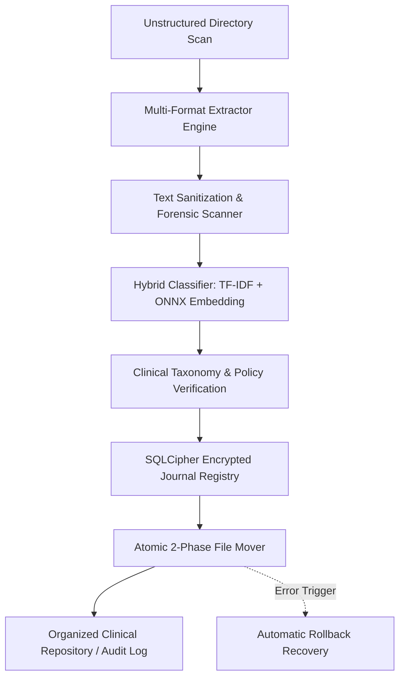
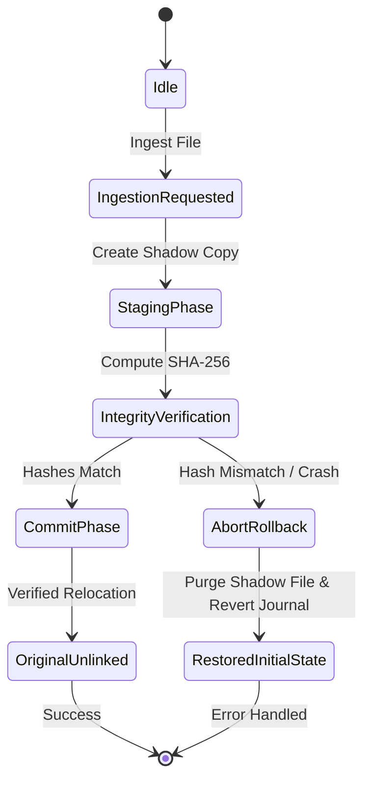

# Portfolio Hub


> **Repository Topics:** `document-classification` · `machine-learning-offline` · `clinical-trials` · `sqlcipher` · `hipaa-compliant` · `desktop-application`

A bleeding-edge interactive portfolio designed to unify disparate Python, Rust, and TypeScript repositories into a single, cohesive experience.

***

## Sortify Case Study & Air-Gapped Engine Showcase

Sortify is an air-gapped document classification and resilient file operations engine designed for regulated clinical trials and enterprise document ingestion. Detailed technical specifications, threat models, and code deep dives are available in [**`docs/CASE_STUDY.md`**](https://github.com/fderuiter/portfolio/blob/main/docs/CASE_STUDY.md).

### Dataflow Pipeline Architecture



### Automatic Rollback & Recovery Lifecycle



***

## Project Goals

The core objective of this project is to create an interactive showcase that dynamically pulls real codebase statistics and updates from GitHub, while presenting rich editorial narratives and architectural breakdowns. It serves as a unified hub for all professional software engineering work.

## Tech Stack & Features

- **Framework:** Next.js 16 (App Router + Turbopack), React 19, TypeScript
- **Styling:** Tailwind CSS v4 (CSS-first configuration — no `tailwind.config.js`)
- **Visual Ecosystem:** Aceternity UI, Magic UI, Framer Motion
- **CMS:** Prisma ORM with Neon Serverless PostgreSQL
- **Layout Engine:** `@chenglou/pretext` — 15KB zero-dependency pure JS/TS library for high-performance DOM-free text measurement
- **Rich Text:** `@chenglou/pretext/rich-inline` — Inline Markdown tokenizer rendering **bold**, *italic*, and `code` chips with pixel-perfect canvas-measured heights
- **Masonry Layout:** Parent-level zero-whitespace masonry Bento Grid using a greedy LPT column scheduler with ResizeObserver-driven sub-millisecond recalculations
- **Performance:** DOM-free layout calculations maintaining 60FPS during complex animations

## Featured Case Studies

### InBody QR Data Decoder & Analyzer
- **Stack:** Python 3.8+, Poetry, Flask, BeautifulSoup4, jsQR, Pillow, Pytest
- **Domain:** Reverse Engineering, Biomedical Data, Monorepo Architecture, Data Parsing
- **GitHub Topics:** `reverse-engineering`, `inbody`, `qr-decoder`, `biometrics`, `data-extraction`, `monorepo`, `python`
- **Description:** Reverse-engineers the fixed-width binary serialization protocol of InBody BIA hardware query strings (`IBData`). Features an automated Differential Mutation Oracle ("Delta Testing Engine") that isolates contiguous byte slices and programmatically derives field boundaries without official schemas.

## Visual & System Architecture

The portfolio utilizes a "Design Engineering" approach, combining lightweight libraries like Aceternity UI and Magic UI with Framer Motion. For complete architectural documentation—including the App Router route tree (`app/work/laser-loon/page.tsx`), Python backend core utilities (`app/core/crypto.py`, `app/core/resilient_file_ops.py`, `app/core/analyzer_strategies.py`), and UI component hierarchy (`components/ui/CaseStudyBentoCard.tsx`)—refer to [**`ARCHITECTURE.md`**](ARCHITECTURE.md).

## Project Roadmap

The full 5-phase development roadmap, milestone progress, and issue tracker are maintained in **[GitHub Issue #18 — Portfolio Hub V1 Architecture Master 5-Phase Development Plan](https://github.com/fderuiter/portfolio/issues/18)**.

| Phase | Milestone | Status |
|-------|-----------|--------|
| 1 — Foundation & Data Integrity | `v0.1.0` | ✅ Complete |
| 2 — Core Architecture & Layout Engine | `v0.2.0` | ✅ Complete |
| 3 — Integration & Content Pipeline | `v0.3.0` | 🔄 In Progress |
| 4 — Hardening & Performance | `v0.4.0` | ⏳ Upcoming |
| 5 — Production CI/CD & Go-Live | `v1.0.0` | ⏳ Upcoming |

## Prerequisites

To work on this repository, you will need:
- **Node.js**: 22.x (sole supported runtime)
- **npm**: >=10.0.0 (sole supported package manager; bun, yarn, and pnpm are unsupported)

## Setup Instructions

Automated Interactive Setup:
You can run the interactive setup command to configure your environment, check dependencies, push database schema, and seed initial data:
```bash
npm run setup
```

Or follow manual setup steps:

1. **Install Dependencies**
   ```bash
   npm install
   ```

2. **Configure Environment**
   Copy `.env.example` to `.env.local` and set your `DATABASE_URL` (Neon Postgres connection string) and optionally `GITHUB_TOKEN` to avoid API rate limits.

   Verify environment variable configuration:
   ```bash
   npm run env:check
   ```
   This command validates required server and client key declarations against `lib/env.ts` schemas, warning of missing or invalid keys before starting the app.

   To configure Clerk authentication and author access allowlists interactively:
   ```bash
   npm run setup:clerk
   ```

3. **Initialize Database & Prisma Client**
   Generate the Prisma client and push the schema to your database:
   ```bash
   npx prisma generate
   npx prisma db push
   ```

4. **Seed Database**
   Populate the database with clinical trials and schema engine case studies (with inline Markdown formatting):
   ```bash
   npx prisma db seed
   ```

5. **Start the Development Server**
   Launch Next.js 16 with Turbopack and concurrent TypeScript watcher:
   ```bash
   npm run dev
   ```
   Open [http://localhost:3000](http://localhost:3000) with your browser to see the result.

## Asset Generation & Design System Commands

The repository provides standardized CLI commands for generating multi-resolution brand assets and compiling design system tokens:

### Brand Icon Generation

- **Command:** `npm run build:icons` (or `npm run generate:icons` / `npx tsx scripts/dx.ts build:icons`)
- **Input Source Location:** Vector SVG artwork at `public/favicon.svg` (or `app/icon.svg`).
- **Generated Output Asset Targets:**
  - `app/icon.svg` & `public/favicon.svg`: Vector SVG favicons
  - `app/favicon.ico` & `public/favicon.ico`: Multi-resolution Windows ICO container enclosing 16x16, 32x32, and 48x48 PNG buffers
  - `public/apple-touch-icon.png`: 180x180 high-DPI iOS touch icon
  - `public/icon-192.png` & `public/icon-512.png`: Standard PWA web app manifest icons

### Design System Token Compilation

- **Command:** `npm run build:theme` (or `npm run generate:theme` / `npx tsx scripts/dx.ts build:theme`)
- **Input Source Location:** CSS custom properties declared in `app/globals.css` (within the `:root` selector block).
- **Generated Output Asset Target:** `lib/design-manifest.ts` (strongly-typed runtime TypeScript constants exported as `designManifest`).

## Database changes

Schema changes must include a checked-in Prisma migration. See
[DATABASE_MIGRATIONS.md](DATABASE_MIGRATIONS.md) for the development workflow,
production rollout order, and the one-time production baseline procedure.

## Contributing Guidelines

For full details on developer onboarding, architectural invariants, conventional commits, and interactive CLI feature scaffolding (`npm run scaffold`), please refer to the [**`CONTRIBUTING.md`**](CONTRIBUTING.md) guide.

