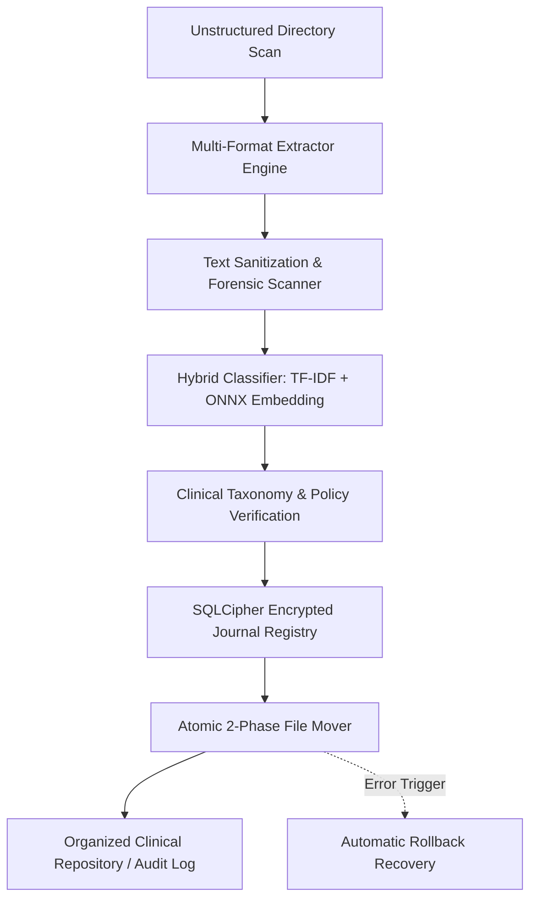
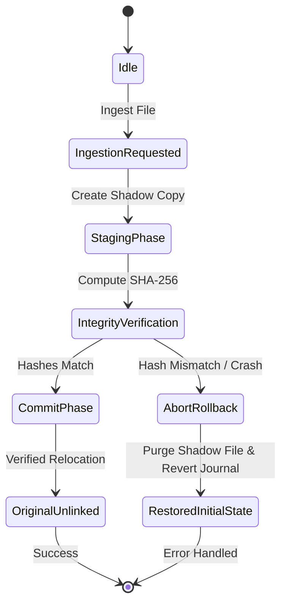

# Portfolio Hub


> **Repository Topics:** `document-classification` · `machine-learning-offline` · `clinical-trials` · `sqlcipher` · `hipaa-compliant` · `desktop-application`

A bleeding-edge interactive portfolio designed to unify disparate Python, Rust, and TypeScript repositories into a single, cohesive experience.

***

## Sortify Case Study & Air-Gapped Engine Showcase

Sortify is an air-gapped document classification and resilient file operations engine designed for regulated clinical trials and enterprise document ingestion. Detailed technical specifications, threat models, and code deep dives are available in [**`CASE_STUDY.md`**](CASE_STUDY.md).

### Dataflow Pipeline Architecture



### Automatic Rollback & Recovery Lifecycle



***

## Project Goals

The core objective of this project is to create an interactive showcase that dynamically pulls real codebase statistics and updates from GitHub, while presenting rich editorial narratives and architectural breakdowns. It serves as a unified hub for all professional software engineering work.

## Tech Stack & Features

- **Framework:** Next.js 16 (App Router + Turbopack), React 19, TypeScript
- **Styling:** Tailwind CSS v4 (CSS-first configuration — no `tailwind.config.js`)
- **Visual Ecosystem:** Aceternity UI, Magic UI, Framer Motion
- **CMS:** Prisma ORM with Neon Serverless PostgreSQL
- **Layout Engine:** `@chenglou/pretext` — 15KB zero-dependency pure JS/TS library for high-performance DOM-free text measurement
- **Rich Text:** `@chenglou/pretext/rich-inline` — Inline Markdown tokenizer rendering **bold**, *italic*, and `code` chips with pixel-perfect canvas-measured heights
- **Masonry Layout:** Parent-level zero-whitespace masonry Bento Grid using a greedy LPT column scheduler with ResizeObserver-driven sub-millisecond recalculations
- **Performance:** DOM-free layout calculations maintaining 60FPS during complex animations

## Featured Case Studies

### InBody QR Data Decoder & Analyzer
- **Stack:** Python 3.8+, Poetry, Flask, BeautifulSoup4, jsQR, Pillow, Pytest
- **Domain:** Reverse Engineering, Biomedical Data, Monorepo Architecture, Data Parsing
- **GitHub Topics:** `reverse-engineering`, `inbody`, `qr-decoder`, `biometrics`, `data-extraction`, `monorepo`, `python`
- **Description:** Reverse-engineers the fixed-width binary serialization protocol of InBody BIA hardware query strings (`IBData`). Features an automated Differential Mutation Oracle ("Delta Testing Engine") that isolates contiguous byte slices and programmatically derives field boundaries without official schemas.

## Visual Architecture

The portfolio utilizes a "Design Engineering" approach, combining lightweight libraries like Aceternity UI and Magic UI with Framer Motion. This approach handles complex micro-interactions, hardware-accelerated physics, and typographic animations to provide a premium interactive experience without heavy, monolithic component libraries.

## Project Roadmap

The full 5-phase development roadmap, milestone progress, and issue tracker are maintained in **[GitHub Issue #18 — Portfolio Hub V1 Architecture Master 5-Phase Development Plan](https://github.com/fderuiter/portfolio/issues/18)**.

| Phase | Milestone | Status |
|-------|-----------|--------|
| 1 — Foundation & Data Integrity | `v0.1.0` | ✅ Complete |
| 2 — Core Architecture & Layout Engine | `v0.2.0` | ✅ Complete |
| 3 — Integration & Content Pipeline | `v0.3.0` | 🔄 In Progress |
| 4 — Hardening & Performance | `v0.4.0` | ⏳ Upcoming |
| 5 — Production CI/CD & Go-Live | `v1.0.0` | ⏳ Upcoming |

## Prerequisites

To work on this repository, you will need:
- **Node.js** (v20+)
- **npm** or **bun** as the package manager

## Setup Instructions

1. **Install Dependencies**
   ```bash
   npm install
   ```

2. **Configure Environment**
   Copy `.env.local.example` to `.env.local` and set your `DATABASE_URL` (Neon Postgres connection string) and optionally `GITHUB_TOKEN` to avoid API rate limits.

3. **Initialize Database & Prisma Client**
   ```bash
   npx prisma generate
   ```

4. **Seed Database**
   Populate the database with clinical trials and schema engine case studies (with inline Markdown formatting):
   ```bash
   npx prisma db seed
   ```

5. **Start the Development Server**
   Launch Next.js 16 with Turbopack and concurrent TypeScript watcher:
   ```bash
   npm run dev
   ```
   Open [http://localhost:3000](http://localhost:3000) with your browser to see the result.

## Database changes

Schema changes must include a checked-in Prisma migration. See
[DATABASE_MIGRATIONS.md](DATABASE_MIGRATIONS.md) for the development workflow,
production rollout order, and the one-time production baseline procedure.
