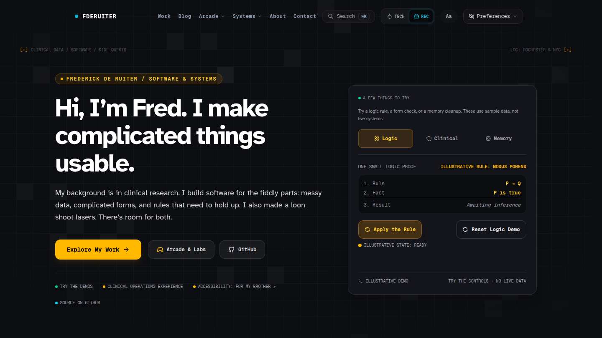

# Portfolio Hub

**Live at [deruiter.dev](https://deruiter.dev)** · [Architecture](ARCHITECTURE.md) · [Decision records](https://github.com/fderuiter/portfolio/tree/main/adr) · [Contributing](CONTRIBUTING.md)

The source for Frederick de Ruiter's interactive engineering portfolio. Instead
of describing the work, most of the site lets you try it: a logic proof
workspace, a clinical form designer, an MRI reconstruction studio, a handful of
decision simulators, and an arcade of browser games built around clinical data
and formal methods.



## What's inside

| Area                            | What you can do                                                                                                              | Try it                                                                                  |
| ------------------------------- | ---------------------------------------------------------------------------------------------------------------------------- | --------------------------------------------------------------------------------------- |
| **Logical Proof Workspace**     | Build a proof one step at a time, apply inference rules, and see where an argument breaks.                                   | [/proof](https://deruiter.dev/proof)                                                    |
| **CRF Studio**                  | Design clinical research forms, add validation rules, and test them against sample data.                                     | [/crf](https://deruiter.dev/crf)                                                        |
| **NeuroRecon Studio**           | Explore brain surfaces and MRI slices, place control points, and work through simulated reconstruction problems.             | [/neuro](https://deruiter.dev/neuro)                                                    |
| **Incident Decision Simulator** | Work through engineering decisions, from interface priorities to an outage, and compare what your choices emphasize.         | [/simulator](https://deruiter.dev/simulator)                                            |
| **Ski Patrol Shift Studio**     | A Midwest ski-patrol judgment simulation driven by deterministic state machines.                                             | [/patrol](https://deruiter.dev/patrol)                                                  |
| **Arcade**                      | Trial & Error: Biostat Ops, Clinical Trial Chaos, Laser Loon, Retro Labyrinth, Monkey C Mayhem, Working With Duck, and more. | [/arcade](https://deruiter.dev/arcade)                                                  |
| **Case studies and blog**       | Write-ups of clinical data engineering, formal verification, accessibility, and browser graphics projects.                   | [/case-studies](https://deruiter.dev/case-studies) · [/blog](https://deruiter.dev/blog) |
| **Under the Hood**              | How the site itself works: text layout, browser audio, the stack, and the checks behind it.                                  | [/stack](https://deruiter.dev/stack)                                                    |

## Built with

- **App:** Next.js 16 (App Router, Turbopack), React 19, TypeScript, Tailwind CSS v4
- **Rendering:** Canvas 2D and Three.js for the studios and games, [`@chenglou/pretext`](https://github.com/chenglou/pretext) for DOM-free text layout, Framer Motion for transitions
- **Data:** Prisma 7 on Neon serverless Postgres, Upstash Redis for caching and rate limits, Zod contracts for every API route ([`openapi.json`](https://github.com/fderuiter/portfolio/blob/main/openapi.json))
- **Services:** Clerk (admin auth), Resend (email), Sentry (errors and tracing), Vercel (hosting)
- **Quality:** Vitest, fast-check property tests, Stryker mutation testing, Playwright visual, accessibility and synthetic probes, and a custom architecture linter (`npm run doctor`)

The whole stack is designed to run inside free-tier provider limits; see
[ADR 0036](https://github.com/fderuiter/portfolio/blob/main/adr/0036-free-tier-offloading-and-provider-quota-governance.md).

## Run it locally

You need **Node.js 22 or newer** (CI uses Node 24) and **npm 10 or newer**.
npm is the only supported package manager.

The quickest path is the interactive setup, which checks your toolchain,
creates `.env.local`, pushes the schema, and seeds sample data:

```bash
npm install
npm run setup
npm run dev
```

Or step by step:

```bash
npm install
cp .env.example .env.local   # then set DATABASE_URL to a Postgres connection string
npx prisma db push           # create the schema
npx prisma db seed           # load sample case studies
npm run dev                  # http://localhost:3000
```

`GITHUB_TOKEN` is optional and only avoids GitHub API rate limits. Clerk,
Resend, Upstash and Sentry are optional for local work; `npm run env:check`
reports what is missing. The full walkthrough is in the
[onboarding tutorial](docs/tutorials/01-local-development-and-onboarding.md).

## Documentation

- [`ARCHITECTURE.md`](ARCHITECTURE.md): route tree, component hierarchy, and data flow
- [`adr/`](https://github.com/fderuiter/portfolio/tree/main/adr): architecture decision records, one per significant design choice
- [`docs/`](docs/README.md): tutorials, how-to guides, reference (including the TypeDoc API reference), and explanation
- [`DEPLOYMENT.md`](DEPLOYMENT.md) and [`DATABASE_MIGRATIONS.md`](DATABASE_MIGRATIONS.md): release and schema-change runbooks
- [`CHANGELOG.md`](CHANGELOG.md): release history

## Contributing

Issues and pull requests are welcome. [`CONTRIBUTING.md`](CONTRIBUTING.md)
covers the scaffolding CLI, the quality gates CI runs, and how local commands
map to them. Please report security issues privately as described in
[`SECURITY.md`](SECURITY.md).

## License

The application source is licensed under the [Apache License 2.0](LICENSE). The repository ships three kinds of material under three different terms, and [`NOTICE`](NOTICE) is the authoritative scope statement:

- **Application source**: Apache-2.0. `app/`, `components/`, `hooks/`, `lib/`, `types/`, `prisma/`, `scripts/`, `__tests__/`, root configuration, and the generated `docs/` and `openapi.json`.
- **Laser Loon brand artwork** (`public/files/`): [CC BY 4.0](public/files/LICENSE.txt), unchanged.
- **Editorial content, biography, resume data, photography, and the `Frederick de Ruiter` / `deruiter.dev` marks**: all rights reserved.

Fork the engineering freely; replace the writing and the branding before you deploy.
