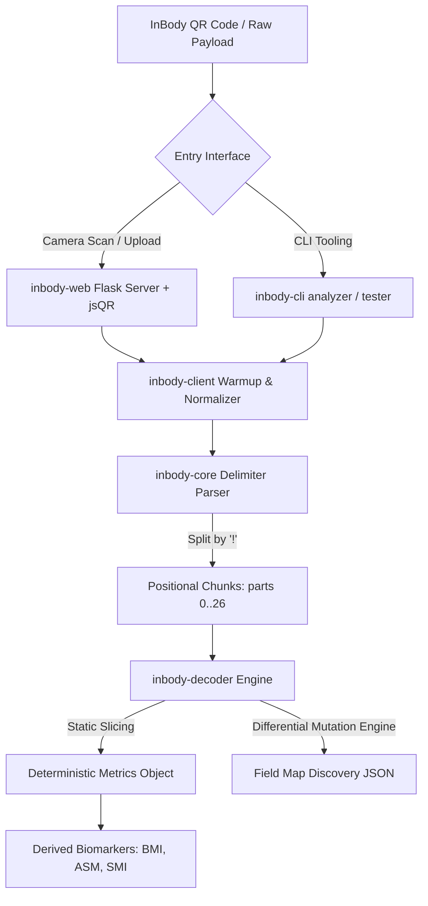

# Case Study: InBody QR Data Decoder & Analyzer

## Technical Breakdown & Portfolio Integration

### 1. Executive Summary & Value Proposition

**Problem Solved:**
Proprietary Bioelectrical Impedance Analysis (BIA) hardware (e.g., InBody 570) encodes comprehensive diagnostic health and body composition data into an opaque, high-density query string (`IBData`) within user-facing QR codes. Users and researchers are traditionally locked into vendor ecosystems or forced to rely on physical printouts and client-side web dashboards. This repository reverse-engineers the fixed-width serialization protocol of the `IBData` specification, delivering an open-source, multi-package Python monorepo capable of deterministic static decoding, dynamic automated differential mapping, and web/CLI inspection.

**Core Technical Highlight:**
Developed an automated **Differential Mutation Oracle ("Delta Testing Engine")** that isolates contiguous byte slices in dense ASCII streams, injects controlled integer perturbations ($\pm 1$), and evaluates downstream server response variations to programmatically derive field boundaries, positional offsets, and floating-point scale factors without official protocol schemas.

**Key Metrics / Benchmarks:**
- **100% Parsing Accuracy on Core Metrics:** Validated exact parity against official InBody mobile and web ground-truth telemetry (Weight, Skeletal Muscle Mass [SMM], Body Fat Mass, Percent Body Fat [PBF], Body Mass Index [BMI], Extracellular Water / Total Body Water [ECW/TBW], and Segmental Lean Mass).
- **$\mathcal{O}(N)$ Deterministic Static Extraction:** High-throughput zero-dependency offset parser capable of processing arbitrary `IBData` strings in sub-millisecond execution time.
- **Modular Monorepo Scaffolding:** 4 isolated packages (`inbody-core`, `inbody-decoder`, `inbody-client`, `inbody-cli`, plus `inbody-web` consumer) configured with explicit dependency graph boundaries via Poetry path links.

---

### 2. Architecture & Monorepo Design



#### Layered Architecture Boundaries
- **`inbody-core`**: Core data structures, seed normalizers, and delimiter parsing utilities (`parts[0..26]`).
- **`inbody-client`**: HTTP session orchestrator with automated multi-stage session warming (`/InBodyCare/Reload`).
- **`inbody-decoder`**: Fixed-width positional extraction engine and differential fuzzing discovery oracle.
- **`inbody-cli`**: Developer tooling for command-line payload analysis, slice debugging, and mapping automation.
- **`inbody-web`**: Web application interface combining client-side `jsQR.js` matrix decoding with server-side analytical visualizations.

---

### 3. Context & Motivation

- **Proprietary Biomedical Telemetry:** InBody 570 diagnostic devices export rich biometrics encoded inside proprietary ASCII payload structures.
- **Vendor Lock-In Mitigation:** Constructing vendor-agnostic data pipelines enables longitudinal body composition tracking across third-party electronic health records (EHR) and research platforms.
- **Physical Hardware Constraints:** Paper printout restrictions and transient web dashboards necessitate automated client-side QR extraction for automated digital ingest.

---

### 4. Key Technical Challenges & Solutions

#### A. Automated Reverse-Engineering via Differential Fuzzing
To derive positional offsets without vendor documentation, the `Delta Testing Engine` systematically mutates contiguous ASCII slice windows ($w \in [1..5]$) with rate-limited HTTP delays ($0.42\text{s} / 0.69\text{s}$) to measure behavioral deltas returned from verification endpoints.

```python
# snippet: mapping.py::_test_slice
def _test_slice(
    self,
    base_parts: List[str],
    part_idx: int,
    offset: int,
    length: int,
    delta: int = 1,
) -> Optional[Dict[str, Any]]:
    """Injects controlled integer perturbations into contiguous byte slices
    and measures downstream delta responses from the verification endpoint.
    """
    target_str = base_parts[part_idx]
    if offset + length > len(target_str):
        return None

    raw_val_str = target_str[offset : offset + length]
    if not raw_val_str.isdigit():
        return None

    val = int(raw_val_str)
    mutated_val = max(0, val + delta)
    mutated_str = f"{mutated_val:0{length}d}"

    mutated_parts = list(base_parts)
    mutated_part = (
        target_str[:offset] + mutated_str + target_str[offset + length :]
    )
    mutated_parts[part_idx] = mutated_part

    # Reconstruct raw seed string and send probe
    mutated_payload = "!".join(mutated_parts)
    response_metrics = self.client.submit_payload(mutated_payload)
    time.sleep(self.rate_limit_delay)

    return self.evaluate_deltas(raw_val_str, mutated_val, response_metrics)
```

#### B. Segment Parsing & Place-Value Reconstruction
Dense ASCII substrings are converted into high-precision floats across differing scales ($10\times, 100\times, 1000\times$) using place-value matrix deserialization ($\sum_i d_i \times 10^{p_i}$).

```python
# snippet: data.py::decode_digits
def decode_digits(
    raw_slice: str,
    scale_factor: float = 0.1,
    precision: int = 2
) -> float:
    """Fixed-width positional matrix deserializer for place-value byte windows.
    Evaluates sums sum_i (d_i * 10^{p_i}) over arbitrary ASCII slice boundaries.
    """
    if not raw_slice or not raw_slice.strip().isdigit():
        raise ValueError(f"Invalid ASCII digit sequence for fixed-width slice: {raw_slice!r}")

    clean_digits = raw_slice.strip()
    accumulated_value = 0

    # Evaluate positional matrix sum from least significant to most significant digit
    for idx, char in enumerate(reversed(clean_digits)):
        digit_val = ord(char) - ord('0')
        place_value = 10 ** idx
        accumulated_value += digit_val * place_value

    computed_metric = accumulated_value * scale_factor
    return round(computed_metric, precision)
```

#### C. Derived Formula Computations
Calculates advanced diagnostic biomarkers from parsed segmental lean mass limbs:
$$\text{ASM} = \text{Right Arm} + \text{Left Arm} + \text{Right Leg} + \text{Left Leg}$$
$$\text{SMI} = \frac{\text{ASM}}{\text{Height}^2} \quad (\text{kg/m}^2)$$

#### D. Critical Edge Cases & Solutions
1. **URL Percent-Encoding Digit Shifts:** Resolved a bug where `%21` encoding of literal `!` delimiters caused downstream byte-slice alignments to shift, inducing an order-of-magnitude ($10\times$) calculation error on Leg Lean Mass. Enforced explicit seed URL normalization before delimiter splitting.
2. **Multi-Block Segment Distribution:** Discovered primary body composition resides in Segment Index 4 (`meas_blob`), while secondary diagnostic metrics (BMR and Visceral Fat) are physically distributed into Segment Index 5 (`parts[5]`) in kilocalories rather than kilojoules.

---

### 5. Lessons Learned & Production Roadmap

- **Mitigating Brittle Scraping:** Transitioned from heuristic HTML window hunting to locked, static byte offset mapping matrices.
- **Future Hardware Support:** Expanding offset matrix schemas to support InBody 770/970 and BWA multi-frequency clinical devices.

---

### 6. Project Metadata

- **Stack:** Python 3.8+, Poetry, Flask, BeautifulSoup4, jsQR, Pillow, Pytest
- **Domain:** Reverse Engineering, Biomedical Data, Monorepo Architecture, Data Parsing
- **GitHub Repository Topics:** `reverse-engineering`, `inbody`, `qr-decoder`, `biometrics`, `data-extraction`, `monorepo`, `python`
