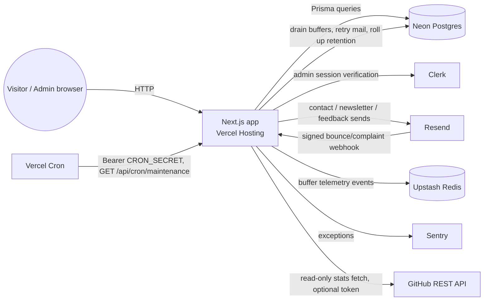

# Reference: Integration Catalog

Last verified: 2026-09-13, during the 0.3.0 release-readiness audit, from an isolated sandbox
with no live provider credentials. Everything below is either read directly
from source in this repository (code, `lib/env.ts`, `.env.example`,
`vercel.json`, `prisma/schema.prisma`, CI workflows) or cited to a provider's
own documentation. Any live account fact this sandbox cannot observe
(current usage against a quota, whether a specific dashboard toggle is
enabled, the exact plan tier active today) is marked **unknown** rather than
guessed — confirm those directly in the provider's dashboard before relying
on them.

This is the fact table. For step-by-step setup, see the linked how-to guide
for a given provider.

## Classification

| Integration | Status | Purpose | Primary code entrypoint |
| --- | --- | --- | --- |
| Neon Postgres (via Prisma) | Active | Primary relational datastore | `prisma/schema.prisma`, `lib/db.ts` — setup: [tutorial §4](../tutorials/01-local-development-and-onboarding.md#4-migrate-the-database-with-prisma) — capacity & audit: [Neon capacity inventory](neon-capacity-inventory.md) |
| Prisma ORM | Active | Schema, migrations, typed client | `prisma/schema.prisma`, `prisma/migrations/` — see [`DATABASE_MIGRATIONS.md`](../../DATABASE_MIGRATIONS.md) |
| Clerk | Active | Admin-console authentication | `proxy.ts`, `lib/auth/admin.ts` — setup: [how-to §Clerk](../how-to/configure-integrations.md#clerk-admin-authentication) |
| Resend | Active | Transactional email + deliverability webhook | `lib/services/email-service.ts`, `app/api/webhooks/resend/route.ts` — setup: [how-to: configure Resend and webhooks](../how-to/configure-resend-and-webhooks.md) |
| Sentry | Active | Error monitoring (server, edge, client) | `sentry.server.config.ts`, `sentry.edge.config.ts`, `instrumentation.ts`, `instrumentation-client.ts` — setup: [how-to §Sentry](../how-to/configure-integrations.md#sentry-error-monitoring) |
| Upstash Redis | Active | Telemetry event buffer, rate limiting | `lib/redis.ts`, `lib/services/telemetry-service.ts` — setup: [how-to §Upstash Redis](../how-to/configure-integrations.md#upstash-redis) |
| Vercel Hosting | Active | Production/preview deployment | `vercel.json`, root `next.config.ts` — setup: [how-to §Vercel Hosting, Cron, Analytics, and Speed Insights](../how-to/configure-integrations.md#vercel-hosting-cron-analytics-and-speed-insights) — capacity & audit: [Vercel retention inventory](vercel-retention-inventory.md), [how-to: monitor headroom](../how-to/monitor-vercel-headroom.md) |
| Vercel Cron | Active | Unified daily maintenance | `vercel.json`, `app/api/cron/maintenance/route.ts` — same how-to section as Vercel Hosting above |
| Vercel Analytics | Active | Page-view analytics widget | `app/layout.tsx` (`@vercel/analytics/next`) — same how-to section as Vercel Hosting above |
| Vercel Speed Insights | Active | Real-user Core Web Vitals telemetry | `app/layout.tsx` (`@vercel/speed-insights/next`) — setup: [how-to §Vercel Hosting, Cron, Analytics, and Speed Insights](../how-to/configure-integrations.md#vercel-hosting-cron-analytics-and-speed-insights) |
| GitHub REST API | Active, optional auth | Live repository/commit-activity stats on case study pages | `lib/github.ts` — setup: [how-to §GitHub data fetching](../how-to/configure-integrations.md#github-data-fetching) |
| Neon-Vercel preview branching integration | **Unverified** | Would provision a disposable Neon branch per PR preview | Not visible from repository source — this is a dashboard-level integration toggle in Neon/Vercel, not code. Confirm in the Vercel or Neon dashboard; do not assume it is enabled |
| Vercel Deployment Protection | **Unverified** | Would gate preview URLs behind auth | Dashboard-level setting, not visible from source. Confirm in Vercel project settings |
| `@lhci/cli` / Lighthouse CI | Historical | Was in the dependency path that carried the now-removed `extract-zip` exposure | Removed per [ADR 0032](../../adr/0032-remove-extract-zip-security-exposure.md) — no longer an active integration |

## Data flow

## Per-environment resource identity matrix

"Production", "PR Preview", and "local" are directly observable from
repository configuration. During the one-time transition in
[ADR 0037](../../adr/0037-controlled-integration-and-release-deployments.md),
`dev` remains a historical integration branch, but automatic Vercel
deployments are allowlisted to `main` only. After reconciliation, short-lived
topic branches target `main` and receive a preview only when an operator
requests one.

The live Vercel audit on 2026-09-12 found Resend, Clerk, and one Neon resource
connected to `portfolio`. It also found an unconnected Sentry integration and
two unconnected Neon resources. Vercel environment metadata showed the same
Neon/Postgres variable records scoped to both Production and Preview, while
Upstash and Sentry variables were absent. Treat Preview database access as
unsafe until it has a dedicated branch or read-only credential, and treat
Upstash and Sentry as unconfigured until a release audit proves otherwise.

| Integration | Production | `dev` / PR Preview | Local | CI (`ci.yml`) |
| --- | --- | --- | --- | --- |
| Neon Postgres | Unknown project/branch identity (dashboard-only) | Unknown — possibly the same Neon branch as production, possibly per-preview branches if the Neon-Vercel integration is enabled (unverified) | Any Postgres reachable via `DATABASE_URL` in `.env.local`; a free Neon project works | Ephemeral `postgres:16`-family service container on `localhost:5432` (database `portfolio_ci`, user and password both the literal word `postgres` — a disposable CI-only credential, see `.github/workflows/ci.yml`) — never a real Neon credential |
| Clerk | Unknown instance identity | Unknown — Clerk supports separate dev/prod instances; whether this project uses one or two is not visible from source | `CLERK_SECRET_KEY` / `NEXT_PUBLIC_CLERK_PUBLISHABLE_KEY` from `.env.local`, typically Clerk's own `sk_test_`/`pk_test_` development instance | Not configured — `ADMIN_USER_IDS`/`ADMIN_EMAILS` unset means `isUserAuthorizedAdmin` [defaults closed](../../lib/auth/admin.ts) and admin-gated tests use mocked Clerk objects instead of a live instance |
| Resend | Unknown account/domain identity | Forced simulated delivery | `EmailService` forces simulated (non-transmitting) mode regardless of an attached key; see [how-to: configure Resend and webhooks](../how-to/configure-resend-and-webhooks.md) | Unset — all email tests use `EmailService`'s simulated path or mock the `resend` SDK directly |
| Sentry | `NEXT_PUBLIC_SENTRY_DSN` — real value unknown to this sandbox | Unknown whether preview deployments report to the same Sentry project as production or a separate one | Unset by default → `sentry.server.config.ts`/`sentry.edge.config.ts` fall back to a dummy `https://dummy@o0.ingest.sentry.io/0` DSN, which drops events silently rather than erroring | Unset — same dummy-DSN fallback applies |
| Upstash Redis | Unprefixed default (production keys: `telemetry_buffer`, `telemetry_processing`, `@upstash/ratelimit`); protected behind operator gate | `preview:` prefix automatically isolates preview deployments (e.g. `preview:telemetry_buffer`) preventing collision with production; customizable via `UPSTASH_REDIS_KEY_PREFIX` | `UPSTASH_REDIS_REST_URL`/`_TOKEN` unset by default → `lib/redis.ts` points the `@upstash/redis` client at `http://localhost:8079` with a placeholder token, which is not a running service locally; code paths that depend on Redis must tolerate that failing | Unset — placeholder endpoint fallback; rate-limiting and telemetry tests mock Redis/Ratelimit and assert namespace isolation |
| Vercel Cron | `CRON_SECRET` — real value unknown to this sandbox; Vercel Cron sends it as `Authorization: Bearer <CRON_SECRET>` (see [Vercel Cron Jobs docs](https://vercel.com/docs/cron-jobs)) | Vercel does not invoke Cron Jobs against preview deployments (per Vercel's own docs) — the sync route is only ever cron-triggered in Production | `CRON_SECRET` unset or any dev value; `validateSyncRequest` (`lib/security.ts`) allows unauthenticated calls only when `NODE_ENV` is `development`/`test` | Not exercised as a scheduled job; route logic is covered by unit tests that call the handler directly |
| GitHub REST API | `GITHUB_TOKEN` unset unless configured — unauthenticated GitHub REST calls are rate-limited to 60 requests/hour per source IP (see [GitHub REST API rate limit docs](https://docs.github.com/en/rest/using-the-rest-api/rate-limits-for-the-rest-api)); a token raises this to 5,000/hour | Same unauthenticated-by-default behavior | Same — set `GITHUB_TOKEN` locally only to avoid hitting the unauthenticated rate limit during development | Unset — `lib/github.ts` falls back to deterministic simulated stats (`generateMockCommitActivity` and the simulated-stats path) rather than making live calls that could fail the build on a rate limit |

**Public vs. secret settings**: every server-only value above
(`*_SECRET`, `*_TOKEN`, `DATABASE_URL` and its Postgres-variable siblings,
`RESEND_API_KEY`, `SENTRY_ORG`/`SENTRY_PROJECT`, `CLERK_SECRET_KEY`) is
declared in `serverEnvSchema` in [`lib/env.ts`](../../lib/env.ts) and is
never read outside it (enforced by the `checkRawEnvironmentAccess` guard in
`lib/dx/env-guard.ts`, part of `npm run env:check`). Only
`NEXT_PUBLIC_`-prefixed values (`NEXT_PUBLIC_APP_URL`,
`NEXT_PUBLIC_SENTRY_DSN`, `NEXT_PUBLIC_CLERK_PUBLISHABLE_KEY`) are declared
in `clientEnvSchema` and safe to ship to the browser.

## Credential scope, rotation, quotas and retention

| Integration | Credential scope | Rotation | Free-tier quota (per provider docs) | Retention |
| --- | --- | --- | --- | --- |
| Neon Postgres | `DATABASE_URL` (pooled runtime) and `DIRECT_URL` (unpooled migrations) grant full read/write on target database | No rotation-overlap mechanism in this codebase — rotating means updating the deployment's env var and redeploying | 0.5 GiB storage, 0.25 CU max compute, 5-minute compute auto-suspend limit (see [Neon capacity inventory](neon-capacity-inventory.md)) | Production (`main`) and Dev (`dev`) branches protected; PR preview branches expire 7d after creation or on PR close; see [Neon capacity inventory](neon-capacity-inventory.md) |
| Clerk | `CLERK_SECRET_KEY` is a full backend-API secret (can read/manage all users); `ADMIN_USER_IDS`/`ADMIN_EMAILS` are an application-level allowlist layered on top, not a Clerk permission | No overlap window; rotate in the Clerk dashboard and update the env var together | Clerk's free tier active-user/MAU limit — **unknown current entitlement**; confirm at [clerk.com/pricing](https://clerk.com/pricing) | Governed by Clerk's own account data retention policy |
| Resend | `RESEND_API_KEY` scope depends on how it was created in the Resend dashboard (full access vs. sending-only) — **unknown which scope this project's key uses** | `RESEND_WEBHOOK_SECRET` has no rotation-overlap support (see [how-to: configure Resend and webhooks](../how-to/configure-resend-and-webhooks.md)) — only one secret is ever accepted at a time | Resend's free tier send volume — **unknown current entitlement**; confirm at [resend.com/pricing](https://resend.com/pricing) | Suppression-list and outbound-queue rows are retained indefinitely by this application's own Postgres tables (`SuppressionList`, `OutboundEmailQueue` in `prisma/schema.prisma`) — there is no automatic expiry job |
| Sentry | `SENTRY_DSN`/`NEXT_PUBLIC_SENTRY_DSN` only permit sending events to that project, not reading/managing the account | Rotate by regenerating the DSN in the Sentry project settings | Sentry's free tier event volume — **unknown current entitlement**; confirm at [sentry.io/pricing](https://sentry.io/pricing/) | Governed by Sentry's own event retention window for the plan in use |
| Upstash Redis | `UPSTASH_REDIS_REST_TOKEN` grants full read/write via REST API. Key namespaces: `telemetry_buffer` (48h TTL), `telemetry_processing` (48h TTL), `@upstash/ratelimit` (sliding window TTL per check). In preview, all prefixed with `preview:` (or `UPSTASH_REDIS_KEY_PREFIX`) | Rotate in Upstash console; no dual-key overlap in REST API (atomic on redeploy) | Free tier: 10,000 commands/day, 256 MB storage, max 100 req/sec REST rate limit. Rate limiting: 1 command per uncached window check; 0 commands for in-memory hits | Buffered telemetry events hold a 48h TTL until drained by `/api/cron/maintenance` into Postgres. Rate-limit sliding-window keys expire within 60s; Redis performs expiry without a maintenance scan. |
| Vercel Cron | `CRON_SECRET` is a shared-secret bearer token this application defines and checks itself — Vercel does not manage its value | Rotate by changing the env var; Vercel Cron always sends whatever value is currently configured, so there is no overlap concern | Vercel Hobby plan allows a limited number of Cron Jobs and a coarser minimum schedule granularity than paid plans — **confirm the exact current Hobby limits** at [vercel.com/docs/cron-jobs/usage-and-pricing](https://vercel.com/docs/cron-jobs/usage-and-pricing), since these have changed over time | N/A |
| Vercel Hosting | Platform deployment tokens (`VERCEL_TOKEN` / CLI) — not required at application runtime | Rotate via Vercel Personal/Team Tokens dashboard | Functions Storage: 10 GB limit (9.68 GB used, 3.2% headroom); Deployment Storage: 10 GB limit (6.20 GB used); Build Time: 100 hrs/mo (87 hrs used) | 57 superseded deployments removed under closed issue #692; no additional conservative candidate remained — see [Vercel retention inventory](vercel-retention-inventory.md) |
| GitHub REST API | `GITHUB_TOKEN` scope depends on how it was generated — **unknown scope**; a fine-grained PAT with read-only public-repo access is sufficient for what `lib/github.ts` does | Rotate/regenerate in GitHub settings; no overlap needed since this token only raises a rate limit, it is not required for correctness (see missing-service behavior below) | 60 req/hour unauthenticated, 5,000 req/hour authenticated per [GitHub's REST API rate-limit docs](https://docs.github.com/en/rest/using-the-rest-api/rate-limits-for-the-rest-api) | N/A (read-only) |

## Missing-service / degraded-mode behavior

Every integration in this catalog has an explicit fallback for "the service
is unreachable or unconfigured" rather than throwing an unhandled error at
request time:

- **Neon Postgres unreachable**: `EmailService.isSuppressed` fails open
  (treats every address as not-suppressed rather than blocking sends);
  `EmailService.recordSuppression` now (as of #697) lets the error propagate
  so the Resend webhook route can return a retryable non-2xx instead of
  silently losing the write — see
  [how-to: configure Resend and webhooks](../how-to/configure-resend-and-webhooks.md).
- **Clerk unconfigured** (`ADMIN_USER_IDS`/`ADMIN_EMAILS` both empty):
  `isUserAuthorizedAdmin` in `lib/auth/admin.ts` defaults **closed** — no
  admin access is possible until at least one allowlist is configured.
- **Resend unconfigured** (`RESEND_API_KEY` unset): `EmailService` runs in
  simulated delivery mode — it logs what would have been sent (in
  development only) and returns a synthetic success result, never a live
  send.
- **Sentry unconfigured**: falls back to a dummy DSN
  (`https://dummy@o0.ingest.sentry.io/0`) that silently discards events
  rather than raising at init time.
- **Upstash Redis unreachable / slow (>1500ms deadline)**: Rate limiting
  enforces a 1500ms request deadline and activates a 30-second circuit breaker
  on timeout or upstream error. During cooldown, rate limiting fails open to an
  in-memory double-buffered generational cache (`activeGeneration` / `inactiveGeneration`)
  with standard `X-RateLimit-*` headers. Buffer enqueue operations time out after
  2000ms and return HTTP 202 (`durable: false`) without compounding downstream retries.
  Repeatable safe verification is available via `npm run verify:upstash`.
- **GitHub REST API unauthenticated/rate-limited**: `lib/github.ts` treats a
  403/404 as an expected offline/build condition and falls back to
  `generateMockCommitActivity()` / simulated stats rather than failing the
  page render or the build.
- **Vercel Cron secret missing in a non-development environment**:
  `validateRouteInitialization`/`validateSyncRequest` in `lib/security.ts`
  fail **closed** (reject with 401) rather than accepting unauthenticated
  sync requests.

## Secret-safe environment preflight

`npm run env:check` (`scripts/dx.ts env` →
`checkEnvironmentVariables`/`checkRawEnvironmentAccess` in
`lib/dx/env-guard.ts`) is this repository's existing secret-safe preflight,
and it already satisfies this ticket's requirement rather than needing a new
mechanism:

- It validates `.env.example` against the keys declared in
  `serverEnvSchema`/`clientEnvSchema` in `lib/env.ts`, and flags any
  declared key missing from `.env.example`.
- It statically scans `app/`, `lib/`, `components/`, and `hooks/` for direct
  `process.env` reads outside `lib/env.ts` itself (a real security property:
  every environment access goes through the one validated, typed surface).
- It runs `validateEnv(process.env)` — a **schema-only** check (types,
  required-ness, URL format) against whatever environment happens to be
  present when the command runs.

It never opens a network connection to Neon, Clerk, Resend, Sentry,
Upstash, or GitHub, never mutates a provider, and never reports a simulated
result as live success — it only checks that declared configuration keys
exist and are shaped correctly. Because of that, it is safe to run in any
environment, including one with no credentials configured at all (every key
above is `.optional()` in the schema, so an empty `.env.local` still passes
schema validation — the individual services fall back to the degraded modes
described above rather than the preflight blocking on missing secrets).

`npm run doctor` / `npm run doctor:fix` run this check alongside the other
architectural invariants; see
[ADR 0027](../../adr/0027-agent-first-cli-ergonomics-and-machine-readable-dx-architecture.md)
for the design rationale behind the DX CLI these commands belong to.

## Related documentation

- [How-to: configure Resend and webhooks](../how-to/configure-resend-and-webhooks.md)
- [How-to: configure Clerk, Sentry, Upstash, Vercel Cron/Analytics, and GitHub data fetching](../how-to/configure-integrations.md)
- [Tutorial: local development & onboarding](../tutorials/01-local-development-and-onboarding.md)
- [`DATABASE_MIGRATIONS.md`](../../DATABASE_MIGRATIONS.md) at the repository root
- [ADR 0001: pre-build database migrations](../../adr/0001-pre-build-database-migrations.md)
- [ADR 0013: Next.js 16 proxy migration and SSG telemetry resilience](../../adr/0013-next16-proxy-migration-and-ssg-telemetry-resilience.md)
- [ADR 0014: Clerk auth admin portal](../../adr/0014-clerk-auth-admin-portal.md)
- [ADR 0018: resilient transactional email and bot defense](../../adr/0018-resilient-transactional-email-and-bot-defense.md)
- [ADR 0024: resilient Resend webhook deliverability and outbound retry queue](../../adr/0024-resilient-resend-webhook-deliverability-and-outbound-retry-queue.md)
- [Reference: Vercel retention and storage inventory](vercel-retention-inventory.md)
- [How-to: monitor Vercel headroom](../how-to/monitor-vercel-headroom.md)
- [`openapi.json`](../../openapi.json) at the repository root — every `app/api/**/route.ts` this catalog references has a corresponding contract there
