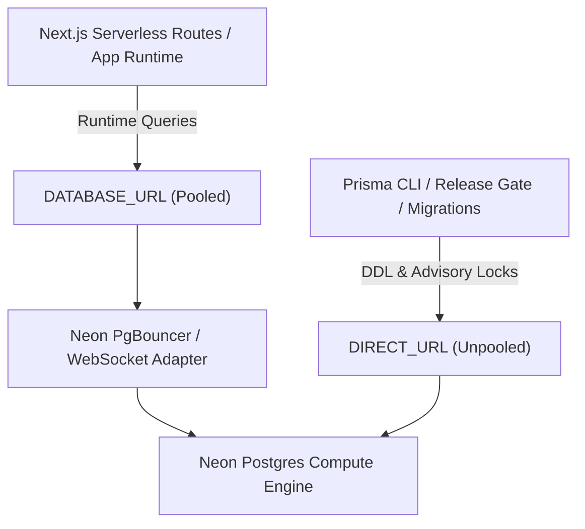

# Neon Capacity & Branch Inventory

Last verified: 2026-09-19 against the Neon API (Issue #621 audit, provider gap closed)

Scope: `fderuiter/portfolio`, Neon Free Tier, Vercel Resource `neon-gray-drum`

Sources: authenticated Neon API (projects, branches, endpoints, databases), Vercel integration inspection, environment configuration names (`vercel env ls`), and repository source (`lib/db.ts`, `prisma/schema.prisma`, `lib/env.ts`)

This is the evidence-backed capacity, connection hygiene, and retention record for Neon Postgres under [ADR 0036](../../adr/0036-free-tier-offloading-and-provider-quota-governance.md).

> [!NOTE]
> **Provider-Side Inventory Gap (Issue #621): closed 2026-09-19.** A Neon API credential is now available and every figure below is observed provider state rather than inference. The previous revision of this document recorded two protections that do not exist; see the correction note under the branch inventory. Deletion candidates are identified but remain unapproved pending operator sign-off.

## Capacity & Policy Baseline

| Meter | Observed Usage | Governed Limit | Policy Headroom | Status |
| --- | ---: | ---: | ---: | --- |
| Storage (`neon-gray-drum`) | **30.8 MiB** (32,284,672 B) | 0.500 GiB (512 MiB) | 481 MiB (94%) | Healthy |
| Storage (`neon-blue-plank`) | **29.9 MiB** (31,301,632 B) | 0.500 GiB (512 MiB) | — | Archived, see candidates |
| Compute Auto-Suspend | **5 minutes** (300s) | 5 minutes | 0s delay | Optimal |
| Compute Unit Limit | **0.25 CU** (min = max) | 0.25 CU | 0 CU | Bounded, no autoscale |
| Project compute this cycle | **27,473 CPU-seconds** / 108,220s active | — | quota resets 2026-10-01 | Observed |
| Point-in-time recovery | **6 hours** (21,600s) | — | — | **This is the effective RPO** |

History retention is six hours. Any restore target older than that does not exist, which bounds what [#700](https://github.com/fderuiter/portfolio/issues/700) can rehearse.

Neon's free plan provides 0.5 GiB storage and auto-suspends compute after 5 minutes of inactivity. Direct un-cached public queries wake compute, adding 1–3s cold-start latency and consuming monthly compute hours.

## Project & Branch Inventory (Policy Baseline)

| Project (id) | Branch | Endpoint | Environment | Protection | Storage | Role |
| --- | --- | --- | --- | --- | ---: | --- |
| `neon-gray-drum` (`withered-tooth-11857430`) | `main` (`br-snowy-butterfly-apmzw7bd`) | `ep-young-mouse-ap1zkh0m` | Production | **NOT protected** | 30.8 MiB | Canonical production database backing deruiter.dev |
| `neon-gray-drum` | `pre-rehearsal-main-2026-09-19` (`br-shiny-dust-apixoyf1`) | `ep-sweet-grass-ap3tbi8x` | Ephemeral | Not protected | 30.8 MiB | Former production branch, demoted by the #700 rehearsal; identical data, retained as a rollback copy |
| `neon-gray-drum` | `rehearsal/v0.3.0-migrations` (`br-royal-sky-apfvczyx`) | `ep-ancient-pine-appqk4cj` | Ephemeral | Not protected | 30.6 MiB | Release rehearsal branch, idle since 2026-09-13 |
| `neon-blue-plank` (`hidden-frog-92457060`) | `main` (`br-patient-heart-augr38sg`) | — | Abandoned | Not protected | 29.9 MiB | Neon Auth experiment; `neon_auth` schema only, no application tables |

> [!WARNING]
> **Correction (2026-09-19).** The previous revision of this table stated that `main` had Protection Status **Protected** and that a `dev` branch existed and was **Protected**. Neither is true. `main` reports `"protected": false`, and there is no `dev` branch in the project; it was most likely removed under [ADR 0037](../../adr/0037-controlled-integration-and-release-deployments.md), which superseded the persistent dev environment, without this inventory being updated.
>
> Protecting the production branch is an unmet acceptance criterion of [#622](https://github.com/fderuiter/portfolio/issues/622), not a control in place. A document asserting governance that does not exist is worse than one recording the gap.

A second correction landed the same day, from executing the restore rehearsal
rather than from reading provider state:

> [!IMPORTANT]
> **Production branch id changed (2026-09-19).** The canonical production branch is now `br-snowy-butterfly-apmzw7bd`. It was `br-shiny-dust-apixoyf1` from 2026-05-27 until 2026-09-19.
>
> The [#700](https://github.com/fderuiter/portfolio/issues/700) restore rehearsal called Neon's `restore_snapshot` with its default `finalize: true`. That is not an isolated restore. It is a **production cutover**: the restored branch takes the `main` name, the primary/default flags, and the production compute endpoint, while the previous branch is demoted and renamed. Data was verified byte-identical before and after (schema fingerprint `800a41c74b9eb8fb31798631812e007d`, case-study fingerprint `90eb59844b848b1cbe4ef4a8b45603e9`, 4/94/11 rows), and the newest write in the database predated the restore point by 34 days, so nothing was lost.
>
> **The compute endpoint is the thing production depends on, not the branch id.** `ep-young-mouse-ap1zkh0m` is named by nine environment variables (`DATABASE_URL`, `DATABASE_URL_UNPOOLED`, `PGHOST`, `PGHOST_UNPOOLED`, `POSTGRES_HOST`, `POSTGRES_PRISMA_URL`, `POSTGRES_URL`, `POSTGRES_URL_NON_POOLING`, `POSTGRES_URL_NO_SSL`). This is a *different* set from the eight password-bearing variables listed in [#865](https://github.com/fderuiter/portfolio/issues/865). `set_default_branch` moves the default designation but **does not** move the endpoint, and Neon refuses both to delete the root branch's read-write endpoint and to add a second one to an occupied branch. The branch holding `ep-young-mouse-ap1zkh0m` was therefore renamed to `main` rather than relocating a live endpoint.
>
> `pre-rehearsal-main-2026-09-19` (`br-shiny-dust-apixoyf1`) is retained with identical data as a rollback copy and is safe to delete once this release is confirmed. Because history retention is six hours, its longer lineage confers no recovery advantage.

## Resource Classification & Retention Policy

### Protected Resources (Excluded from Cleanup)

1. **Production Branch (`main`)**: Canonical database powering live visitor endpoints. Retained permanently; never deleted, reset, or expired. **Branch protection is not currently enabled** and should be, per #622.
2. ~~**Integration Branch (`dev`)**~~: No such branch exists. ADR 0037 replaced the persistent dev environment with isolated production plus operator-requested previews.

### Ephemeral Resources (Subject to Retention & Expiry)

1. **PR Preview Branches (`preview/*`)**: Disposable per-PR databases. Expire automatically 7 days after creation or immediately upon PR merge/closure.
2. **Continuous Integration (`ci.yml`)**: Uses an ephemeral `postgres:16` service container on `localhost:5432` (`portfolio_ci`). CI execution consumes **0 bytes** of Neon free-tier storage and **0 seconds** of Neon compute.

## Connection URL Hygiene Architecture

Neon databases provide two distinct connection modes to isolate serverless application queries from database migration transactions:



### 1. Runtime Pooled Connection (`DATABASE_URL`)

- **Configuration**: Set in `DATABASE_URL` (and `POSTGRES_PRISMA_URL` / `POSTGRES_URL`).
- **Endpoint**: Transaction pooler endpoint (`ep-xxx-pooler.us-east-2.aws.neon.tech` or `@prisma/adapter-neon` over WebSockets via `ws`).
- **Usage**: Serverless API route handlers and server components (`lib/db.ts`).
- **Purpose**: Prevents connection exhaustion during traffic bursts by multiplexing client connections through PgBouncer.

### 2. Production Migration Direct Connection (`DATABASE_URL_UNPOOLED`)

- **Configuration**: Provisioned as `DATABASE_URL_UNPOOLED` by the Vercel/Neon integration.
- **Endpoint**: Direct compute endpoint (`ep-xxx.us-east-2.aws.neon.tech`).
- **Usage**: `scripts/build.js` maps it to Prisma’s `DIRECT_URL` only when `VERCEL=1` and `VERCEL_ENV=production`. Local drift checks use disposable non-production targets.
- **Purpose**: Directly targets compute to execute PostgreSQL session-level advisory locks (`SELECT pg_advisory_lock(...)`) and schema DDL statements without PgBouncer session pooling timeouts (`P1002`).

## Cold-Start Protection & Upstash Read-Through Cache

To guarantee Neon compute remains suspended in zero-compute sleep states across public visitor traffic:

1. **Tier 1 (Static Edge Prerendering)**: Full-page editorial routes (case studies, dossier specs) use Next.js Incremental Static Regeneration (ISR) with `revalidate = 3600`. Static requests cost 0 database queries.
2. **Tier 2 (Upstash Redis Read-Through Cache)**: Dynamic data queries in `CaseStudyService` query Upstash Redis first with a 1-hour TTL. Only cache misses wake Neon Postgres.
3. **Write Buffering**: Visitor reactions and telemetry events are buffered in Upstash Redis (`HINCRBY`, `RPUSH`) rather than issuing immediate mutative SQL queries per request, and drained once daily by `/api/cron/maintenance`.

## Cleanup Governance & Candidate Status

No cloud mutations, drops, or deletions are executed by this inventory ticket. Zero deletion candidates are approved today:

- **Approved Candidates**: 0 targets. Identification is not approval.
- **Identified Candidates**: 2, totalling ~60.5 MiB.
  1. `rehearsal/v0.3.0-migrations` (`br-royal-sky-apfvczyx`): 30.6 MiB. Branched from `main` on 2026-09-13 for the v0.3.0 migration rehearsal; compute idle since 2026-09-13T01:33. Nothing expires it, which is the missing lifecycle automation #622 asks for.
  2. `neon-blue-plank` (`hidden-frog-92457060`): 29.9 MiB, branch archived. Contains only the `neon_auth` schema (`account`, `session`, `user`, `organization`, `jwks`, …) and no application tables. An abandoned Neon Auth experiment superseded by Clerk. Its `NEON_AUTH_BASE_URL` and `VITE_NEON_AUTH_URL` variables remain live in Vercel Production and Preview, are referenced nowhere in the codebase, and are declared in neither `lib/env.ts` nor `.env.example`, an AGENTS.md section 15 violation independent of the storage.
- **Protected Targets**: `main` (production) is excluded from candidates regardless of its current unprotected flag.

### Operating Constraints & Approval Workflow

1. Obtain explicit operator sign-off with authenticated provider credentials before identifying any candidate target IDs in Neon Console or CLI.
2. Never delete the `main` branch under any circumstances. (`dev` no longer exists.)
3. Post-cleanup verification: Run `npm run check:migrations:drift` and verify HTTP 200 on `https://deruiter.dev/`.

## Verification Commands

```bash
# Run Neon capacity inventory verification
npx tsx scripts/neon-capacity-inventory.ts

# Export machine-readable JSON inventory
npx tsx scripts/neon-capacity-inventory.ts --json

# Display candidate list details
npx tsx scripts/neon-capacity-inventory.ts --candidates

# Run inventory via DX CLI
npm run dx inventory:neon
```
