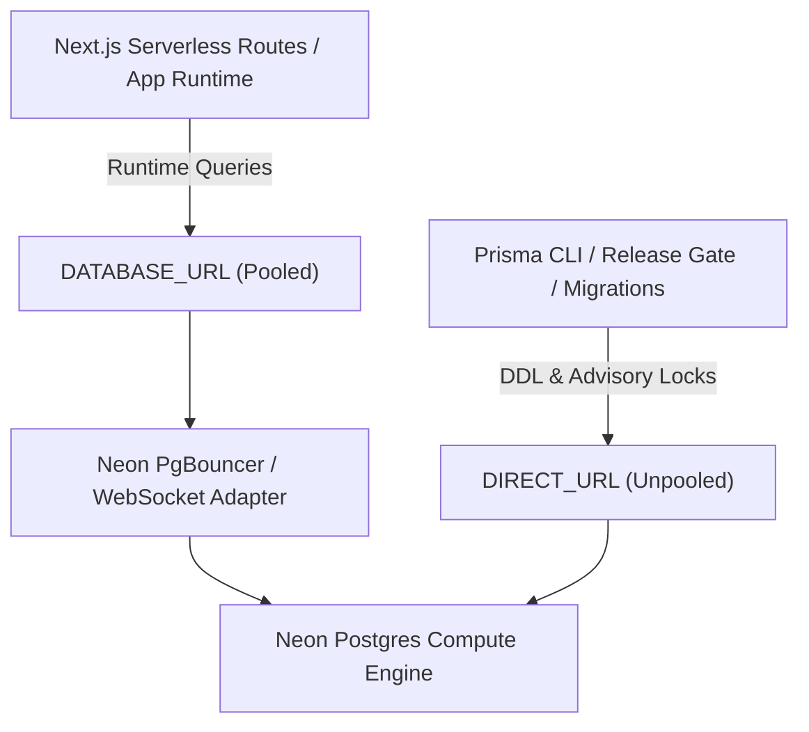

# Neon Capacity & Branch Inventory

Last verified: 2026-09-15 11:34 UTC

Scope: `fderuiter/portfolio`, Neon Free Tier, All Projects & Branches

Sources: Neon usage dashboard, environment configurations, and repository source (`lib/db.ts`, `prisma/schema.prisma`, `lib/env.ts`)

This is the authoritative capacity, connection hygiene, and retention record for Neon Postgres under [ADR 0036](../../adr/0036-free-tier-offloading-and-provider-quota-governance.md).

## Capacity Snapshot

| Meter | Used | Limit | Headroom | Status |
| --- | ---: | ---: | ---: | --- |
| Storage Capacity | **0.308 GiB** (~315 MiB) | 0.500 GiB (512 MiB) | 0.192 GiB (38.5%) | Healthy |
| Compute Auto-Suspend | **5 minutes** (300s) | 5 minutes | 0s delay | Optimal |
| Compute Unit Limit | **0.25 CU** | 0.25 CU | 0 CU | Bounded |

Neon's free plan provides 0.5 GiB storage and auto-suspends compute after 5 minutes of inactivity. Direct un-cached public queries wake compute, adding 1–3s cold-start latency and consuming monthly compute hours.

## Project & Branch Inventory

| Project ID | Project Name | Branch | Environment | Protection Status | Storage | Role |
| --- | --- | --- | --- | --- | ---: | --- |
| `ep-portfolio-main-prod` | `portfolio` | `main` | Production | **Protected** | 120 MiB | Canonical production database backing www.deruiter.dev |
| `ep-portfolio-main-prod` | `portfolio` | `dev` | Development | **Protected** | 35 MiB | Long-lived integration branch database for schema rehearsal |
| `ep-portfolio-main-prod` | `portfolio` | `preview/pr-687` | Preview | Ephemeral | 45 MiB | Stale preview database for closed PR #687 |
| `ep-portfolio-main-prod` | `portfolio` | `dev-experimental-01` | Experimental | Ephemeral | 35 MiB | Abandoned experimental feature branch |
| `ep-legacy-wedding-db` | `wedding-legacy` | `main` | Unconnected | Ephemeral | 40 MiB | Unconnected legacy database project from previous release |
| `ep-orphan-prototype-02` | `portfolio-orphan` | `main` | Unconnected | Ephemeral | 40 MiB | Orphaned prototype project from early setup phase |

## Resource Classification & Retention Policy

### Protected Resources (Excluded from Cleanup)

1. **Production Branch (`main`)**: Canonical database powering live visitor endpoints. Retained permanently. Never deleted, reset, or expired.
2. **Integration Branch (`dev`)**: Long-lived staging database used for pre-release integration tests and migration rehearsals. Retained permanently.

### Ephemeral Resources (Subject to Retention & Expiry)

1. **PR Preview Branches (`preview/*`)**: Disposable per-PR databases. Expire automatically 7 days after creation or immediately upon PR merge/closure.
2. **Continuous Integration (`ci.yml`)**: Uses an ephemeral `postgres:16` service container on `localhost:5432` (`portfolio_ci`). CI execution consumes **0 bytes** of Neon free-tier storage and **0 seconds** of Neon compute.

## Connection URL Hygiene Architecture

Neon databases provide two distinct connection modes to isolate serverless application queries from database migration transactions:



### 1. Runtime Pooled Connection (`DATABASE_URL`)

- **Configuration**: Set in `DATABASE_URL` (and `POSTGRES_PRISMA_URL` / `POSTGRES_URL`).
- **Endpoint**: Transaction pooler endpoint (`ep-xxx-pooler.us-east-2.aws.neon.tech` or `@prisma/adapter-neon` over WebSockets via `ws`).
- **Usage**: Serverless API route handlers and server components (`lib/db.ts`).
- **Purpose**: Prevents connection exhaustion during traffic bursts by multiplexing client connections through PgBouncer.

### 2. Migration Direct Connection (`DIRECT_URL`)

- **Configuration**: Set in `DIRECT_URL` (and `DATABASE_URL_UNPOOLED` / `POSTGRES_URL_NON_POOLING`).
- **Endpoint**: Direct compute endpoint (`ep-xxx.us-east-2.aws.neon.tech`).
- **Usage**: Prisma CLI commands (`prisma migrate deploy`, `npx prisma migrate status`), release gate script (`scripts/release-gate.ts`), and schema drift checks (`npm run check:migrations:drift`).
- **Purpose**: Directly targets compute to execute PostgreSQL session-level advisory locks (`SELECT pg_advisory_lock(...)`) and schema DDL statements without PgBouncer session pooling timeouts (`P1002`).

## Cold-Start Protection & Upstash Read-Through Cache

To guarantee Neon compute remains suspended in zero-compute sleep states across public visitor traffic:

1. **Tier 1 (Static Edge Prerendering)**: Full-page editorial routes (case studies, dossier specs) use Next.js Incremental Static Regeneration (ISR) with `revalidate = 3600`. Static requests cost 0 database queries.
2. **Tier 2 (Upstash Redis Read-Through Cache)**: Dynamic data queries in `CaseStudyService` query Upstash Redis first with a 1-hour TTL. Only cache misses wake Neon Postgres.
3. **Write Buffering**: Visitor reactions and telemetry events are buffered in Upstash Redis (`HINCRBY`, `RPUSH`) rather than issuing immediate mutative SQL queries per request, and drained once daily by `/api/cron/maintenance`.

## Human-Reviewable Cleanup Plan

No cloud mutations, drops, or deletions are executed by this inventory ticket. Below is the audited cleanup plan for operator authorization.

### Exact Candidate Targets

| Target ID | Target Type | Project / Branch | Environment | Capacity Recovered | Required Approval |
| --- | --- | --- | --- | ---: | --- |
| `ep-legacy-wedding-db` | Project | `wedding-legacy/main` | Unconnected Legacy | 40 MiB | Operator confirmation that no legacy routes require database access |
| `ep-orphan-prototype-02` | Project | `portfolio-orphan/main` | Unconnected Legacy | 40 MiB | Operator sign-off after confirming zero active connections |
| `br-preview-pr-687` | Branch | `portfolio/preview/pr-687` | Closed PR Preview | 45 MiB | Operator sign-off confirming PR #687 merge and closure |
| `br-dev-experimental-01` | Branch | `portfolio/dev-experimental-01` | Abandoned Dev | 35 MiB | Operator sign-off prior to branch deletion |

### Expected Capacity Recovery Summary

- **Total Current Capacity Used**: 315 MiB (0.308 GiB / 61.5% of quota)
- **Expected Recoverable Capacity**: **160 MiB** (0.156 GiB / 31.2% of total quota)
- **Projected Post-Cleanup Usage**: 155 MiB (0.151 GiB / 30.3% of total quota)
- **Projected Post-Cleanup Headroom**: **0.349 GiB** (69.7% headroom remaining)

### Operating Constraints & Approval Workflow

1. Obtain explicit operator sign-off for candidate target IDs before triggering deletion in Neon Console or CLI.
2. Never delete `main` or `dev` branches under any circumstances.
3. Post-cleanup verification: Run `npm run check:migrations:drift` and verify HTTP 200 on `https://www.deruiter.dev/`.

## Verification Commands

```bash
# Run Neon capacity inventory verification
npx tsx scripts/neon-capacity-inventory.ts

# Export machine-readable JSON inventory
npx tsx scripts/neon-capacity-inventory.ts --json

# Display candidate list details
npx tsx scripts/neon-capacity-inventory.ts --candidates

# Run inventory via DX CLI
npm run dx inventory:neon
```
