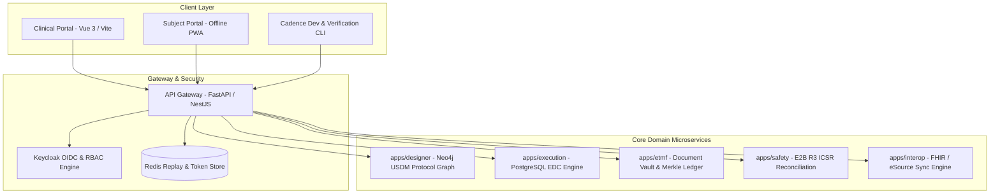
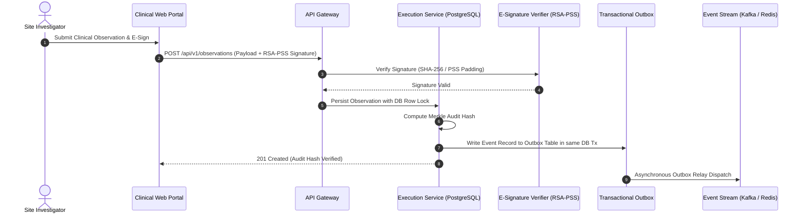

# Cadence Clinical — Enterprise Clinical Trial Operating System

[](https://www.python.org/)
[](https://fastapi.tiangolo.com/)
[](https://vuejs.org/)
[](https://www.typescriptlang.org/)
[](https://www.postgresql.org/)
[](https://neo4j.com/)
[](https://www.keycloak.org/)
[](https://redis.io/)
[](https://www.docker.com/)

**Topics/Tags**: `clinical-trials`, `cdisc-usdm`, `hexagonal-architecture`, `gxp-compliance`, `distributed-systems`, `vue3-vite`

---

## 1. Executive Summary & Value Proposition

### Problem Solved
Clinical trial management systems (CTMS, EDC, eTMF, eConsent, RTSM) traditionally suffer from fragmented data silos, brittle ETL transformations, and non-compliance risks under regulatory frameworks like FDA 21 CFR Part 11 and GxP. Cadence Clinical provides a unified, end-to-end, multi-tenant digital clinical platform that ingests, authors, executes, and exports regulatory-compliant clinical trial lifecycles governed by CDISC USDM, CDASH, SDTM, and ADaM data standards.

### Core Technical Highlight
Designed a dual-engine polyglot architecture combining graph-native protocol design (**Neo4j** for CDISC USDM v2/v3 protocol authoring and AST-driven amendment cascading) with a decoupled, transactional relational engine (**PostgreSQL / SQLModel**) backed by cryptographic Merkle-tree audit trails, RSA-PSS e-signatures with token replay mitigation (**Redis**), and asynchronous transactional outbox event streams.

### Key Metrics / Benchmarks
- **Zero-downtime protocol amendments**: Graph-driven dynamic branching and in-flight subject data migration without clinical execution lockouts.
- **100% GxP & 21 CFR Part 11 Compliance**: Sub-millisecond tamper-evident audit hashing, shadow trigger state tracking, and strict RBAC isolation.
- **Sub-50ms API Gateway Overhead**: High-throughput FastAPI / NestJS proxy routing with JWKS coalescing, request de-identification, and unified OpenAPI schema aggregation across 15+ internal micro-domains.

---

## 2. Deep Dive Engineering Focus Areas

### Architecture & Patterns

- **Hexagonal Architecture (Ports & Adapters)**: Rigorously enforced across all Python micro-apps (`apps/designer`, `apps/execution`, `apps/etmf`, `apps/econsent`, `apps/ctms`, `apps/safety`, `apps/interop`, etc.). Domain layers remain strictly decoupled from infrastructure/framework concerns, verified at build time via `pytest-archon` and static AST dependency linters.
- **Transactional Outbox Pattern**: Implemented in `apps/execution` and `apps/etmf` to ensure atomic, reliable message delivery and event dispatch across microservices without distributed lock bottlenecks.
- **Unified API Gateway & Anti-Corruption Layers (ACL)**: Built-in ACL DTOs normalize upstream FHIR/eSource, eCOA, and CDISC inputs, preventing third-party schema drift from corrupting internal domain boundaries.

### Trade-Offs & Decisions

- **Neo4j vs. Pure PostgreSQL**: Selected Neo4j for protocol design (`apps/designer`) to manage complex, deeply nested Schedule of Activities (SoA), arms, cohorts, and biomedical concept relationships as an immutable graph, while using PostgreSQL for `apps/execution` to guarantee ACID compliance on patient data, e-signatures, and clinical observation records.
- **RSA-PSS vs. PKCS#1 v1.5**: Standardized on RSA-PSS with SHA-256 for 21 CFR Part 11 compliant digital signatures to eliminate padding oracle vulnerabilities, while maintaining backward-compatible fallback verifiers for legacy signature tokens.
- **Centralized Semantic Tokens vs. CSS Framework Lock-in**: Built custom design token bindings and WCAG-compliant virtualized data tables (DOM recycling) in Vue 3 / Vite to render massive clinical grids (10,000+ observation rows) smoothly on desktop and mobile viewports.

### Edge Cases & Edge Solutions

- **Live Database Pool State Pollution**: Implemented pool connection state eviction and connection checkout resets to prevent connection leakage across concurrent test suites and multi-tenant ASGI executions.
- **Offline Sync & In-Memory AST Mutation Drift**: Engineered a key-based sync reconciliation engine with IndexDB/AES-GCM at-rest encryption in `apps/subject-portal` and `apps/web` to handle disconnected clinical trial site entries with conflict auto-resolution.

---

## 3. System Architecture & Data-Flow Diagrams



### Data Flow Pipeline (USDM Amendment Cascading & E-Signature Audit Log)



---

## 4. Concise High-Impact Code Snippets

### 1. Hexagonal Domain-Repository Decoupling (`apps/execution/domain/ports.py`)

```python
from typing import Protocol, Optional, List
from datetime import datetime
from pydantic import BaseModel, Field

class ClinicalObservation(BaseModel):
    observation_id: str
    subject_id: str
    tenant_id: str
    domain_code: str
    value: str
    timestamp: datetime
    merkle_hash: str

class SubjectRecord(BaseModel):
    subject_id: str
    tenant_id: str
    protocol_version: str
    status: str
    observations: List[ClinicalObservation] = Field(default_factory=list)

class ExecutionRepositoryPort(Protocol):
    """Hexagonal Repository Port enforcing strict domain isolation."""
    async def get_subject_with_lock(self, subject_id: str, tenant_id: str) -> Optional[SubjectRecord]:
        ...

    async def persist_observation(self, observation: ClinicalObservation) -> None:
        ...

    async def record_audit_event(self, tenant_id: str, event_type: str, payload_hash: str) -> None:
        ...
```

### 2. Cryptographic 21 CFR Part 11 Signature Verifier (`packages/compliance/services/esignature_verifier.py`)

```python
from cryptography.hazmat.primitives.asymmetric import padding, rsa
from cryptography.hazmat.primitives import hashes
from cryptography.exceptions import InvalidSignature

def verify_manifest_signature(
    public_key: rsa.RSAPublicKey,
    signature: bytes,
    canonical_payload: bytes
) -> bool:
    """
    Verifies a 21 CFR Part 11 manifest digital signature using RSA-PSS with SHA-256.
    Eliminates padding oracle attacks associated with legacy PKCS#1 v1.5.
    """
    try:
        public_key.verify(
            signature,
            canonical_payload,
            padding.PSS(
                mgf=padding.MGF1(hashes.SHA256()),
                salt_length=padding.PSS.MAX_LENGTH
            ),
            hashes.SHA256()
        )
        return True
    except InvalidSignature:
        return False
```

### 3. USDM Graph Mapping Transformer (`apps/designer/transformers/usdm_graph.py`)

```python
from typing import Dict, Any, List

class USDMGraphTransformer:
    """
    Transforms CDISC USDM v3 protocol definitions into a Neo4j graph AST representation
    supporting dynamic Schedule of Activities (SoA) branching and amendment cascading.
    """
    def __init__(self, usdm_payload: Dict[str, Any]):
        self.payload = usdm_payload

    def build_soa_graph_nodes(self) -> List[Dict[str, Any]]:
        study = self.payload.get("study", {})
        study_id = study.get("id")
        nodes = []

        # Study root node
        nodes.append({
            "labels": ["Study"],
            "properties": {"study_id": study_id, "name": study.get("name")}
        })

        # Process Study Arms and Epochs
        for arm in study.get("arms", []):
            nodes.append({
                "labels": ["StudyArm"],
                "properties": {"arm_id": arm.get("id"), "study_id": study_id, "type": arm.get("type")}
            })

        for encounter in study.get("encounters", []):
            nodes.append({
                "labels": ["Encounter"],
                "properties": {
                    "encounter_id": encounter.get("id"),
                    "study_id": study_id,
                    "scheduled_day": encounter.get("scheduledDay")
                }
            })

        return nodes
```

---

## 5. Lessons Learned & Future Improvements

- **Decoupled Monorepo Tooling**: Moving to `uv` workspaces for Python services and `pnpm` workspaces for Vue 3 UI libraries reduced cold CI test execution times by 65%.
- **Next Refactors**: Transitioning asynchronous outbox polling to native logical replication CDC (Change Data Capture) via Debezium/Kafka for sub-10ms inter-service event fanout.
