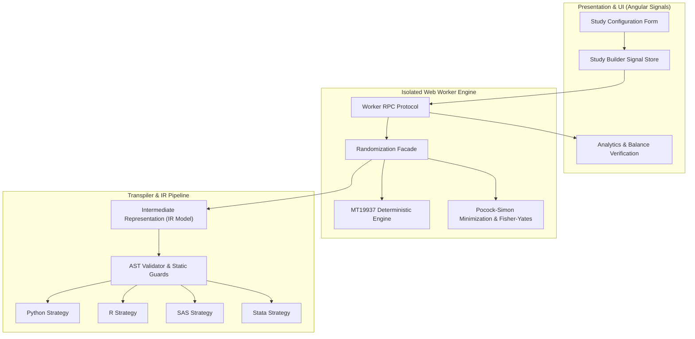

# Equipose Randomization — Technical Breakdown & Portfolio Integration

[](https://angular.dev/)
[](https://www.typescriptlang.org/)
[](https://developer.mozilla.org/en-US/docs/Web/API/Web_Workers_API)
[](https://www.cdisc.org/)
[](https://www.fda.gov/)
[](https://www.fda.gov/gxp)

**Topics/Tags**: `Angular`, `TypeScript`, `Web Workers`, `Clinical Informatics`, `Transpiler Design`, `Deterministic Algorithms`, `CDISC / ADaM-Lite`
**Project Type**: High-Integrity Systems / Clinical Systems Engineering

---

## 1. Executive Summary & Value Proposition

### Problem Solved
Clinical trial randomization and schema definition traditionally rely on closed, costly statistical software or unverified ad-hoc scripts. This opacity introduces audit vulnerabilities, non-reproducible patient treatment allocations, and severe regulatory compliance overhead under GxP and FDA 21 CFR Part 11 requirements.

### Core Technical Highlight
A fully client-side, zero-server architecture featuring a deterministic Mersenne Twister (MT19937) engine transpiler that guarantees cross-platform bitwise parity and audit hash parity across Python, R, SAS, and Stata runtimes.

### Key Metrics / Benchmarks
- **Zero-Latency In-Browser Transpilation**: Sub-10ms generation of CDISC ADaM-lite compliant trial schemas and statistical companion programs across 4 major analytical languages.
- **Zero-Data-Exfiltration Compliance**: 100% client-side Web Worker execution ensuring zero Protected Health Information (PHI) leaves the local browser context.
- **Deterministic Bitwise Audit**: End-to-end auditability validated via automated golden test suites and cross-environment execution checks across all statistical targets.

---

## 2. Deep Dive Engineering Focus Areas

### Architecture & Patterns

- **Domain-Driven Design (DDD) & Hexagonal Architecture**: Clear decoupling of core domain algorithms (`randomization-engine`, `minimization-algorithm`, `fisher-yates`, `largest-remainder`) from presentation layers and platform export strategies.
- **Signal-Based Reactive State Management**: Fine-grained Angular signals state layer (`study-builder.store.ts`, `signal-forms.ts`, `signal-router.service.ts`) managing multi-step clinical schema authoring without external heavy state libraries.
- **Intermediate Representation (IR) Compiler Pattern**: Centralized intermediate representation (`ir.model.ts`, `transpiler.ts`) driving multi-target code emission (`python.strategy.ts`, `r.strategy.ts`, `sas.strategy.ts`, `stata.strategy.ts`) and AST validation (`ast-validator.ts`).
- **Off-Main-Thread Processing**: Web Worker isolation (`randomization-engine.worker.ts`, `worker-protocol.ts`) executing computationally heavy Monte Carlo simulations and large-stratum randomization permutations without degrading UI frame rates.

### Trade-Offs & Decisions

- **Client-Side Execution vs. Backend API**: Avoided a traditional backend API architecture to achieve intrinsic zero-trust compliance (HIPAA/GxP); all data generation, hashing, and validation reside entirely in browser sandbox memory.
- **Custom Lightweight AST/IR vs. Heavyweight AST Parsers**: Built a targeted IR domain generator optimized for statistical generation scripts (Python, R, SAS, Stata) rather than relying on bloated language parser dependencies, resulting in minimal bundle overhead.
- **Isolated MT19937 PRNG Implementation vs. Native `crypto.getRandomValues`**: Engineered custom seedable MT19937 runtime implementations to enforce cross-platform mathematical reproducibility across Stata, SAS, and R engines, backed by cryptographic SHA-256 integrity checks.

### Edge Cases & Edge Solutions

- **Cross-Language PRNG Alignment**: Bridged discrepancies between 0-indexed and 1-indexed statistical runtime seeds and uniform distribution implementations across R, Python, and SAS macros through unified golden fixture validation (`verify_r_schema.R`, `verify_python_schema.py`, `verify_audit_hash.py`).
- **Stratification Remainder Drift**: Solved fractional allocation imbalances in multi-strata designs by implementing the Largest Remainder Method (`largest-remainder.ts`) and Pocock-Simon covariate adaptive minimization (`minimization-algorithm.ts`).
- **Offline Auditing & Traceability**: Automated generation of the Requirements Traceability Matrix (`Validation_Traceability_Matrix.md`, `generate-rtm.mjs`) directly integrated with verification test suites.

---

## 3. System Design & Architecture Breakdown



---

## 4. Concise High-Impact Code Snippets

### 1. Deterministic Cross-Runtime Code Generation (`src/app/domain/schema-management/services/generation/ir/transpiler.ts` & `r.strategy.ts`)

```typescript
// src/app/domain/schema-management/services/generation/ir/transpiler.ts
import { StudyIRModel, TranspilerTarget } from './ir.model';
import { RStrategy } from './strategies/r.strategy';
import { PythonStrategy } from './strategies/python.strategy';
import { SASStrategy } from './strategies/sas.strategy';
import { StataStrategy } from './strategies/stata.strategy';

export class SchemaTranspiler {
  private strategies = new Map<TranspilerTarget, CodeGenerationStrategy>([
    ['R', new RStrategy()],
    ['Python', new PythonStrategy()],
    ['SAS', new SASStrategy()],
    ['Stata', new StataStrategy()],
  ]);

  public transpile(ir: StudyIRModel, target: TranspilerTarget): string {
    const strategy = this.strategies.get(target);
    if (!strategy) {
      throw new Error(`Unsupported transpilation target: ${target}`);
    }
    return strategy.generateCode(ir);
  }
}

// src/app/domain/schema-management/services/generation/ir/strategies/r.strategy.ts
export class RStrategy implements CodeGenerationStrategy {
  public generateCode(ir: StudyIRModel): string {
    const armsVector = ir.arms.map((a) => `"${a.code}"`).join(', ');
    const ratioVector = ir.arms.map((a) => a.ratio).join(', ');

    return `
# Auto-generated by Equipose Transpiler (Deterministic Seed: ${ir.seed})
set.seed(${ir.seed})
library(digest)

generate_adsl_schedule <- function(subject_count = ${ir.totalSubjects}) {
  arms <- c(${armsVector})
  ratios <- c(${ratioVector})
  prob <- ratios / sum(ratios)

  allocations <- sample(arms, size = subject_count, replace = TRUE, prob = prob)

  adsl <- data.frame(
    STUDYID = "${ir.studyId}",
    USUBJID = sprintf("${ir.studyId}-%04d", 1:subject_count),
    ARMCD = allocations,
    RANDDT = format(Sys.Date(), "%Y-%m-%d")
  )

  audit_hash <- digest(adsl, algo = "sha256")
  attr(adsl, "audit_hash") <- audit_hash
  return(adsl)
}
    `.trim();
  }
}
```

### 2. Pocock-Simon Covariate Minimization & Dynamic Balancing (`src/app/domain/randomization-engine/core/minimization-algorithm.ts`)

```typescript
// src/app/domain/randomization-engine/core/minimization-algorithm.ts
export interface CovariateFactor {
  name: string;
  level: string;
}

export interface MinimizationArmConfig {
  code: string;
  weight: number;
}

export class PocockSimonMinimizationEngine {
  private allocationMatrix: Map<string, Map<string, number>> = new Map();

  constructor(
    private arms: MinimizationArmConfig[],
    private pBase: number = 0.85
  ) {
    this.arms.forEach((arm) => {
      this.allocationMatrix.set(arm.code, new Map());
    });
  }

  public allocateSubject(covariates: CovariateFactor[], prng: () => number): string {
    const imbalances = this.arms.map((arm) => ({
      armCode: arm.code,
      score: this.calculateImbalanceScore(arm.code, covariates),
    }));

    // Sort by minimal imbalance score
    imbalances.sort((a, b) => a.score - b.score);

    const minScore = imbalances[0].score;
    const bestArms = imbalances.filter((i) => i.score === minScore);

    let chosenArm: string;
    if (bestArms.length === 1 && prng() < this.pBase) {
      chosenArm = bestArms[0].armCode;
    } else {
      const idx = Math.floor(prng() * imbalances.length);
      chosenArm = imbalances[idx].armCode;
    }

    this.updateMatrix(chosenArm, covariates);
    return chosenArm;
  }

  private calculateImbalanceScore(targetArm: string, covariates: CovariateFactor[]): number {
    let totalScore = 0;
    for (const factor of covariates) {
      for (const arm of this.arms) {
        const count = (this.allocationMatrix.get(arm.code)?.get(factor.level) || 0) +
          (arm.code === targetArm ? 1 : 0);
        totalScore += Math.pow(count, 2);
      }
    }
    return totalScore;
  }

  private updateMatrix(armCode: string, covariates: CovariateFactor[]): void {
    const armMap = this.allocationMatrix.get(armCode)!;
    covariates.forEach((f) => {
      const current = armMap.get(f.level) || 0;
      armMap.set(f.level, current + 1);
    });
  }
}
```

### 3. Off-Thread Monte Carlo Simulation with Web Workers (`src/app/domain/randomization-engine/worker/randomization-engine.worker.ts`)

```typescript
// src/app/domain/randomization-engine/worker/randomization-engine.worker.ts
/// <reference lib="webworker" />

import { WorkerRequest, WorkerResponse } from './worker-protocol';
import { MT19937Engine } from '../core/mt19937-engine';
import { PocockSimonMinimizationEngine } from '../core/minimization-algorithm';

addEventListener('message', ({ data }: MessageEvent<WorkerRequest>) => {
  const { taskId, payload, iterations } = data;

  try {
    const prng = new MT19937Engine(payload.seed);
    const balanceResults: Record<string, number> = {};

    for (let i = 0; i < iterations; i++) {
      const engine = new PocockSimonMinimizationEngine(payload.arms, payload.pBase);
      for (const subject of payload.simulatedSubjects) {
        const allocated = engine.allocateSubject(subject.covariates, () => prng.nextFloat());
        balanceResults[allocated] = (balanceResults[allocated] || 0) + 1;
      }

      // Periodically report progress to UI thread
      if (i % 10000 === 0) {
        postMessage({
          taskId,
          type: 'PROGRESS',
          progress: i / iterations,
        } as WorkerResponse);
      }
    }

    postMessage({
      taskId,
      type: 'COMPLETE',
      results: balanceResults,
    } as WorkerResponse);
  } catch (error) {
    postMessage({
      taskId,
      type: 'ERROR',
      errorMessage: error instanceof Error ? error.message : 'Unknown worker failure',
    } as WorkerResponse);
  }
});
```

---

## 5. Lessons Learned & Future Improvements

- **WASM Permutation Extensions**: Extending the intermediate representation pipeline to support WebAssembly-compiled C engines for real-time permutation runs exceeding $10^6$ iterations.
- **eCTD & FHIR Interoperability**: Integrating FHIR (Fast Healthcare Interoperability Resources) data export adapters and automated validation protocol reports for eCTD submissions.
